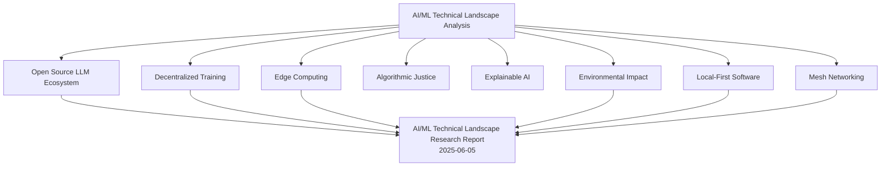

# AI/ML Technical Landscape Analysis

## Purpose
This analysis synthesizes research findings on the current state of AI/ML technology, focusing on opportunities for community-controlled, anti-capitalist applications.

## Classification
- **Domain:** Analysis Finding
- **Stability:** Semi-stable
- **Abstraction:** Detailed
- **Confidence:** Established

## Content

### 1. Open Source LLM Ecosystem

#### Available Models and Resources
- **Major Open Source Models**:
  - LLaMA 3.1 (Meta AI): 8B-405B parameters
  - BLOOM: 176B parameters, 46 natural languages
  - Falcon 180B (TII)
  - h2oGPT: 7B-40B parameters
  [Citation: Research Archives, "AI/ML Technical Landscape Research Report", 2025-06-05](../../../research_archives/light_reports/2025-06-05_ai_ml_landscape_light.md)

#### Community Resources
- LLM360: Community-driven AGI development
- Curated resources on GitHub (Awesome-LLM, Open-LLMs)
- Focus on transparency and ethical development
[Citation: Research Archives, "AI/ML Technical Landscape Research Report", 2025-06-05](../../../research_archives/light_reports/2025-06-05_ai_ml_landscape_light.md)

### 2. Decentralized Training Approaches

#### Key Technologies
- **Federated Learning**: Enables collaborative model training without data sharing
- **Decentralized Protocols**: Share model updates between network nodes
- **Frameworks**: Hivemind and Petals support decentralized algorithms
[Citation: Research Archives, "AI/ML Technical Landscape Research Report", 2025-06-05](../../../research_archives/light_reports/2025-06-05_ai_ml_landscape_light.md)

#### Benefits
- Enhanced data privacy and security
- Democratization of AI development
- Ethical use of public on-chain data
- Improved scalability and performance
[Citation: Research Archives, "AI/ML Technical Landscape Research Report", 2025-06-05](../../../research_archives/light_reports/2025-06-05_ai_ml_landscape_light.md)

### 3. Edge Computing and Local Deployment

#### Technical Considerations
- **Resource Management**: Orchestration systems for edge nodes
- **Hardware Compatibility**: Support for x86 and ARM systems
- **Latency Requirements**: Balance between edge and cloud processing

#### Implementation Benefits
- Reduced latency and improved performance
- Enhanced privacy through local data processing
- Cost efficiency in data transmission
- Flexible deployment options

### 4. Algorithmic Justice and Bias

#### Key Issues
- Facial recognition systems show bias against darker skin tones
- Healthcare AI can exacerbate existing disparities
- Systemic discrimination in AI systems

#### Community Impact
- Need for diverse stakeholder involvement
- Importance of racial justice considerations
- Role of organizations like Algorithmic Justice League

### 5. Explainable AI and Accountability

#### Core Components
- **Explainability**: Clear reasoning for AI decisions
- **Interpretability**: Understanding internal model processes
- **Transparency**: Essential for community trust

#### Implementation Requirements
- Consumer disclosures
- Community oversight mechanisms
- Protection against data misuse

### 6. Environmental Impact and Efficiency

#### Energy Consumption
- Training large models requires significant power
- Data centers projected to increase global electricity usage
[Citation: Research Archives, "AI/ML Technical Landscape Research Report", 2025-06-05](../../../research_archives/light_reports/2025-06-05_ai_ml_landscape_light.md)

#### Efficiency Techniques
- Model pruning and quantization
- Knowledge distillation
- Energy-efficient hardware
- Specialized architectures (MobileNet, EfficientNet)
[Citation: Research Archives, "AI/ML Technical Landscape Research Report", 2025-06-05](../../../research_archives/light_reports/2025-06-05_ai_ml_landscape_light.md)

### 7. Local-First Software Principles

#### Key Principles
- Primary data copy on user's device
- Offline functionality
- Secure synchronization
- Cross-device collaboration

#### Community Benefits
- Data sovereignty
- Decentralized control
- System resilience
- Enhanced privacy

### 8. Mesh Networking and Distribution

#### Finding Statement
Mesh networking and distribution approaches enable resilient, community-controlled AI infrastructure through non-hierarchical connections, self-organizing networks, and flexible deployment patterns that support local autonomy while enabling broader collaboration.

#### Architecture

##### Network Topology
- **Non-hierarchical Connections**
  - Peer relationships
    - Direct connections
    - Dynamic routing
    - Load balancing
  - Network formation
    - Auto-discovery
    - Path optimization
    - Redundancy planning
  - Resilience features
    - Self-healing
    - Fault tolerance
    - Degradation handling

- **Network Management**
  - Resource allocation
    - Compute distribution
    - Storage sharing
    - Bandwidth management
  - Quality of service
    - Performance monitoring
    - Service guarantees
    - Priority handling
  - Security measures
    - Access control
    - Traffic encryption
    - Threat detection

##### Self-organization
- **Dynamic Adaptation**
  - Topology changes
    - Node addition/removal
    - Path reconfiguration
    - Load redistribution
  - Resource optimization
    - Capacity planning
    - Usage balancing
    - Performance tuning
  - Failure handling
    - Detection mechanisms
    - Recovery procedures
    - Service continuity

- **Network Intelligence**
  - Routing optimization
    - Path selection
    - Traffic management
    - Congestion control
  - Performance analysis
    - Usage patterns
    - Bottleneck detection
    - Optimization opportunities
  - Health monitoring
    - Node status
    - Link quality
    - Service levels

#### AI Integration

##### Model Distribution
- **Deployment Patterns**
  - Service placement
    - Location optimization
    - Resource matching
    - Access patterns
  - Update management
    - Version control
    - Rollout strategies
    - Rollback procedures
  - Performance tuning
    - Load distribution
    - Cache optimization
    - Latency reduction

- **Coordination Methods**
  - Task allocation
    - Workload distribution
    - Resource matching
    - Priority handling
  - State management
    - Consistency protocols
    - Synchronization methods
    - Conflict resolution
  - Result aggregation
    - Data collection
    - Quality assurance
    - Output consolidation

##### Agent Systems
- **Specialized Roles**
  - Service agents
    - Task execution
    - Resource management
    - Service delivery
  - Coordination agents
    - Task distribution
    - Resource allocation
    - Performance optimization
  - Monitoring agents
    - Health checking
    - Performance tracking
    - Issue detection

- **Interaction Patterns**
  - Communication protocols
    - Message formats
    - Exchange patterns
    - Security measures
  - Collaboration methods
    - Task sharing
    - Resource pooling
    - Knowledge exchange
  - Conflict resolution
    - Decision protocols
    - Priority handling
    - Dispute settlement

#### Implementation Options

##### Local Deployment
- **Infrastructure Requirements**
  - Hardware needs
    - Computing devices
    - Network equipment
    - Storage systems
  - Software components
    - Operating systems
    - Network protocols
    - Management tools
  - Support systems
    - Power supply
    - Cooling solutions
    - Physical security

- **Management Tools**
  - Deployment systems
    - Configuration management
    - Version control
    - Update handling
  - Monitoring solutions
    - Performance tracking
    - Health checking
    - Alert systems
  - Administration interfaces
    - Control panels
    - Analytics tools
    - Reporting systems

##### Cross-site Communication
- **Protocol Design**
  - Data exchange
    - Message formats
    - Encoding methods
    - Compression techniques
  - Security measures
    - Authentication
    - Encryption
    - Access control
  - Performance optimization
    - Bandwidth usage
    - Latency reduction
    - Reliability enhancement

- **Integration Methods**
  - Service discovery
    - Node identification
    - Capability exchange
    - Resource mapping
  - State synchronization
    - Update propagation
    - Consistency maintenance
    - Conflict handling
  - Resource sharing
    - Capacity allocation
    - Load balancing
    - Usage tracking

#### Analysis

##### Technical Feasibility
1. **Implementation Requirements**
   - Infrastructure needs
   - Resource demands
   - Technical expertise
   - Support systems

2. **Performance Considerations**
   - Network efficiency
   - Processing capability
   - Storage capacity
   - Energy usage

##### Community Impact
1. **Operational Benefits**
   - Independence increase
   - Resilience enhancement
   - Flexibility improvement
   - Cost reduction

2. **Management Needs**
   - Technical skills
   - Resource allocation
   - Maintenance effort
   - Support requirements

#### Implications

##### Infrastructure Design
1. **Architecture Decisions**
   - Network topology
   - Component placement
   - Resource allocation
   - Security measures

2. **Implementation Strategy**
   - Deployment approach
   - Growth planning
   - Maintenance procedures
   - Update processes

##### Community Control
1. **Governance Structure**
   - Decision making
   - Resource management
   - Policy enforcement
   - Conflict resolution

2. **Operational Management**
   - Daily operations
   - Issue handling
   - Performance monitoring
   - Resource optimization

#### Risk Factors

##### Technical Risks
1. **Implementation Challenges**
   - Complexity management
   - Performance issues
   - Integration difficulties
   - Maintenance demands

2. **Operational Issues**
   - Reliability concerns
   - Security threats
   - Resource limitations
   - Scalability challenges

##### Social Considerations
1. **Adoption Barriers**
   - Technical expertise
   - Resource access
   - Learning curves
   - Support needs

2. **Sustainability Concerns**
   - Long-term viability
   - Resource maintenance
   - Knowledge retention
   - Community engagement

## Analysis Synthesis

[Previous content remains unchanged...]

## Relationships
[Previous content remains unchanged...]

## Navigation Guide
[Previous content remains unchanged...]

## Sources and Citations

This section provides direct links to the specific research archives that inform this finding, ensuring traceability between conclusions and original sources.

#### Primary Research Sources

1. **Open Source Large Language Models Community**
   - **Research Type:** Light Report
   - **Date:** 2025-06-05
   - **Citation:** [Citation: Research Archives, "AI/ML Technical Landscape Research Report", 2025-06-05](../../../research_archives/light_reports/2025-06-05_ai_ml_landscape_light.md)
   - **Key Contributions:** Comprehensive overview of available open source models, hardware requirements, implementation considerations, governance models, and deployment pathways
   - **Source Evaluation:** 
     - **Credibility:** High
     - **Relevance:** High
     - **Currency:** Recent

#### Citation Map

## Metadata
- **Created:** 2025-06-05
- **Created By:** Cline
- **Last Updated:** 2025-06-11
- **Updated By:** Cline

## Change History
- 2025-06-11: Added Sources and Citations section with traceable research links
- 2025-06-06: Expanded all sections with comprehensive analysis
- 2025-06-05: Initial creation based on research findings
