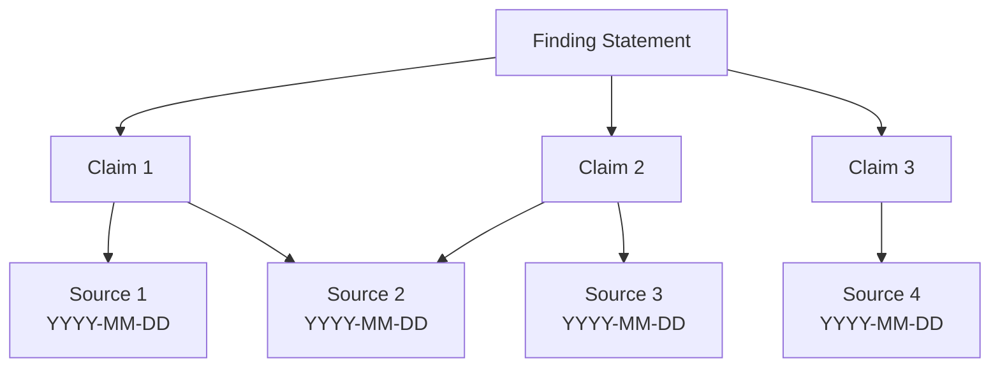

# [Finding Name]

## Purpose
This document presents a finding derived from the analysis of source materials, including the evidence supporting it and its implications.

## Classification
- **Domain:** Finding
- **Source Type:** [Document/Repository/Log/Dataset/Mixed]
- **Analysis Stage:** Synthesized
- **Stability:** [Static/Semi-stable/Dynamic]
- **Abstraction:** [Conceptual/Structural/Detailed]
- **Confidence:** [Established/Evolving/Speculative]
- **Relevance:** [Critical/High/Medium/Low]

## Content

### Finding Statement

[Concise statement of the finding]

### Summary

[Brief summary of the finding, its context, and its significance]

### Supporting Evidence

#### Evidence 1
**Type:** [Entity/Pattern/Relationship/Direct Observation]
**Source:** [Reference to specific source material or analysis document]
**Description:** [Description of the evidence]
**Strength:** [Strong/Moderate/Weak]
**Notes:** [Any notes on the quality or interpretation of this evidence]

#### Evidence 2
**Type:** [Entity/Pattern/Relationship/Direct Observation]
**Source:** [Reference to specific source material or analysis document]
**Description:** [Description of the evidence]
**Strength:** [Strong/Moderate/Weak]
**Notes:** [Any notes on the quality or interpretation of this evidence]

#### Evidence 3
**Type:** [Entity/Pattern/Relationship/Direct Observation]
**Source:** [Reference to specific source material or analysis document]
**Description:** [Description of the evidence]
**Strength:** [Strong/Moderate/Weak]
**Notes:** [Any notes on the quality or interpretation of this evidence]

### Sources and Citations

This section provides direct links to the specific research archives that inform this finding, ensuring traceability between conclusions and original sources.

#### Primary Research Sources

1. **[Topic of Research]**
   - **Research Type:** [Web Search/Light Report/Medium Report/Deep Report/URL Capture]
   - **Date:** YYYY-MM-DD
   - **Citation:** [Citation: Research Archives, "Title of Research", YYYY-MM-DD](../../../research_archives/type/YYYY-MM-DD_topic_type.md)
   - **Key Contributions:** [Brief description of what this source contributed to the finding]
   - **Source Evaluation:** 
     - **Credibility:** [High/Medium/Low]
     - **Relevance:** [High/Medium/Low]
     - **Currency:** [Recent/Somewhat current/Outdated]

2. **[Topic of Research]**
   - **Research Type:** [Web Search/Light Report/Medium Report/Deep Report/URL Capture]
   - **Date:** YYYY-MM-DD
   - **Citation:** [Citation: Research Archives, "Title of Research", YYYY-MM-DD](../../../research_archives/type/YYYY-MM-DD_topic_type.md)
   - **Key Contributions:** [Brief description of what this source contributed to the finding]
   - **Source Evaluation:** 
     - **Credibility:** [High/Medium/Low]
     - **Relevance:** [High/Medium/Low]
     - **Currency:** [Recent/Somewhat current/Outdated]

#### Secondary Sources

*Sources cited within primary research that significantly informed this finding*

1. **[Name of Source]**
   - **Cited In:** [Citation: Research Archives, "Title of Research", YYYY-MM-DD](../../../research_archives/type/YYYY-MM-DD_topic_type.md)
   - **Original Publication:** [Publication details]
   - **Key Contributions:** [Brief description of what this source contributed to the finding]
   - **Note:** This is a secondary citation. Efforts [were/were not] made to locate and archive the primary source.

#### Citation Map

*Diagram showing the relationship between claims in this finding and their supporting sources*

### Analysis

[Detailed analysis of the finding, including:
- How the evidence supports the finding
- The reasoning process that led to the finding
- Alternative interpretations considered
- Limitations or caveats to the finding]

### Implications

[Discussion of the implications of this finding, including:
- What it reveals about the source materials
- How it answers or relates to key analysis questions
- Its significance for understanding the subject matter
- Potential actions or decisions it might inform]

### Confidence Assessment

**Overall Confidence:** [High/Medium/Low]

**Factors Affecting Confidence:**
- **Evidence Quality:** [Strong/Mixed/Weak]
- **Evidence Consistency:** [Consistent/Partially Consistent/Inconsistent]
- **Alternative Explanations:** [Few/Some/Many]
- **Assumptions Made:** [Few/Some/Many]
- **Methodology Robustness:** [Strong/Moderate/Weak]

### Related Findings

| Related Finding | Relationship Type | Description of Relationship |
|-----------------|-------------------|----------------------------|
| [Finding Name] | [supports/contradicts/extends/etc.] | [Brief description of how the findings relate] |
| [Finding Name] | [supports/contradicts/extends/etc.] | [Brief description of how the findings relate] |

### Next Steps

[Recommendations for further analysis or actions based on this finding, such as:
- Additional evidence to gather
- Further analysis to perform
- Tool requirements to develop
- Decisions to make]

## Relationships
- **Parent Nodes:** 
  - [analysis/frameworks/[relevant framework]] - applies - Framework that guided this finding
- **Child Nodes:** 
  - [tools/requirements/[derived requirement]] - informs - Tool requirement derived from this finding
- **Related Nodes:** 
  - [analysis/entities/[related entity]] - involves - Entity related to this finding
  - [analysis/patterns/[related pattern]] - builds-on - Pattern that supports this finding
  - [analysis/relationships/[related relationship]] - considers - Relationship considered in this finding
  - [analysis/findings/[related finding]] - relates-to - Finding that relates to this one
  - [research_archives/[type]/YYYY-MM-DD_topic_type.md] - cites - Primary research source for this finding

## Navigation Guidance
- **Access Context:** Use this document when developing tool requirements or related findings
- **Common Next Steps:** After reviewing this finding, typically explore related findings or tool requirements
- **Related Tasks:** Finding synthesis, requirement development, decision making
- **Update Patterns:** This document should be updated when new evidence affects the finding or its confidence assessment

## Metadata
- **Created:** [Date]
- **Last Updated:** [Date]
- **Updated By:** [Role/Agent]

## Change History
- [Date]: Initial documentation of finding
- [Date]: Added Sources and Citations section with traceable research links
