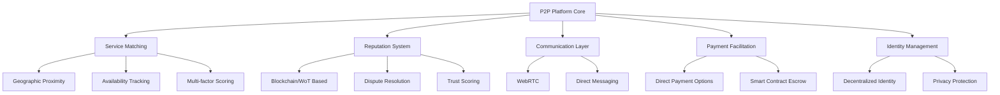

# P2P Community Platform Architecture Analysis

## Purpose
This document analyzes the architectural approaches and implementation strategies for building a peer-to-peer community platform using TypeScript, focusing on decentralized service matching, reputation management, and payment facilitation.

## Classification
- **Domain:** Technical Architecture
- **Stability:** Semi-stable
- **Abstraction:** Detailed
- **Confidence:** Established

## Content

### Core Architecture Overview

The platform architecture is designed around five primary components that enable secure P2P transactions while maintaining decentralization:

1. Service Matching Engine
2. Reputation System
3. Communication Layer
4. Payment Facilitation
5. Identity Management

### Key Architectural Decisions

#### 1. Decentralization Approach
- Platform acts as facilitator rather than intermediary
- Users maintain control over data and transactions
- Network effects achieved through trust mechanisms
- Choice between blockchain and non-blockchain approaches available

#### 2. Service Matching Strategy
- Geographic proximity using spatial databases
- Multi-factor scoring algorithms
- Machine learning for preference matching
- Real-time availability tracking
- Service-specific matching criteria

#### 3. Trust and Reputation
Two possible approaches detailed:

##### Blockchain-Based
- Smart contracts for immutable records
- Automated reputation calculation
- Weighted recent transactions
- Service-specific reputation tracking

##### Non-Blockchain Alternatives
- Web of Trust (WoT) models
- EigenTrust algorithm implementation
- Gossip-based reputation aggregation
- Privacy-preserving computation

#### 4. Payment Integration
- Support for both crypto and traditional P2P payments
- Direct payment facilitation without processing
- Optional smart contract escrow
- Multi-signature wallet support

### Implementation Considerations

#### Technical Stack
- Frontend: React with TypeScript
- Backend: Node.js with TypeScript
- Real-time: WebRTC, Socket.io
- Storage: Combined RDBMS and distributed solutions
- Optional: Blockchain integration (Ethereum/Polygon)

#### Security Measures
- End-to-end encryption for communications
- Rate limiting and input validation
- Regular security audits
- Smart contract verification
- Privacy-preserving reputation computation

#### Regulatory Compliance
- GDPR considerations for data handling
- AML/KYC requirements
- Multi-jurisdictional operation support
- Transaction neutrality maintenance

### Performance Characteristics
- O(n log n) scalability
- Constant-time per-peer operations
- Support for networks exceeding 10^6 nodes
- Geographic optimization for local matching

## Relationships
- **Parent Nodes:** 
  - [analysis/findings/finding_template.md] - Base template
  - [foundation/project_definition.md] - Project context
- **Child Nodes:**
  - [patterns/p2p_platform_patterns.md] - Implementation patterns
  - [frameworks/p2p_typescript_framework.md] - Technical framework
- **Related Nodes:**
  - [findings/ai_ml_landscape_analysis.md] - AI/ML integration
  - [findings/case_studies/platform_coops.md] - Related implementations
  - [planning/high_leverage_projects.md] - Implementation opportunities

## Navigation Guide
- **When to Use:** Reference when designing P2P platforms or implementing decentralized systems
- **Next Steps:** 
  - Review implementation patterns for specific components
  - Consult technical framework for TypeScript implementation details
  - Explore case studies for real-world examples
- **Related Tasks:** Platform architecture design, decentralization strategy, technical stack selection

## Metadata
- **Created:** 2025-06-07
- **Last Updated:** 2025-06-07
- **Updated By:** Cline

## Change History
- 2025-06-07: Initial creation from research report integration
