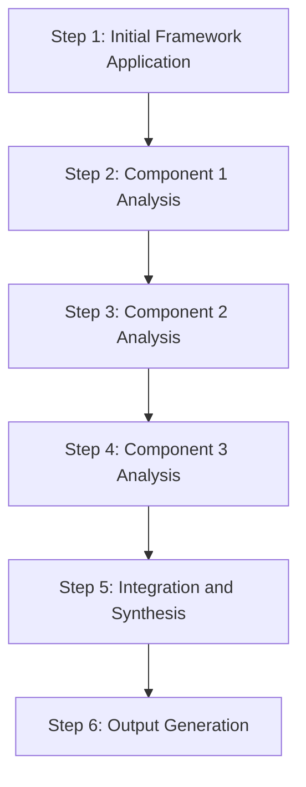

# [Framework Name]

## Purpose
This document describes an analysis framework used to examine source materials and extract meaningful insights.

## Classification
- **Domain:** Analysis Framework
- **Source Type:** [Document/Repository/Log/Dataset/Mixed]
- **Analysis Stage:** [Raw/Processed/Analyzed/Synthesized]
- **Stability:** [Static/Semi-stable/Dynamic]
- **Abstraction:** [Conceptual/Structural/Detailed]
- **Confidence:** [Established/Evolving/Speculative]
- **Relevance:** [Critical/High/Medium/Low]

## Content

### Framework Overview

[Provide a clear, concise description of the framework, including:
- The core purpose and focus of the framework
- Key concepts and principles it employs
- Types of insights it helps generate
- When and why to use this framework]

### Framework Components

#### Component 1: [Component Name]
**Purpose:** [What this component helps analyze or understand]
**Methodology:** [How this component is applied]
**Outputs:** [What insights or artifacts this component produces]

#### Component 2: [Component Name]
**Purpose:** [What this component helps analyze or understand]
**Methodology:** [How this component is applied]
**Outputs:** [What insights or artifacts this component produces]

#### Component 3: [Component Name]
**Purpose:** [What this component helps analyze or understand]
**Methodology:** [How this component is applied]
**Outputs:** [What insights or artifacts this component produces]

### Application Process

#### Step 1: Initial Framework Application
[Description of how to begin applying the framework, including:
- Prerequisites and preparation
- Initial data gathering
- Setting up the analysis environment]

#### Step 2-4: Component Analysis
[Description of how to apply each component of the framework, including:
- Specific techniques and methods
- Tools or templates to use
- Common challenges and how to address them]

#### Step 5: Integration and Synthesis
[Description of how to integrate insights from different components, including:
- Cross-component analysis techniques
- Resolving conflicting insights
- Identifying patterns across components]

#### Step 6: Output Generation
[Description of how to generate outputs from the framework, including:
- Types of outputs produced
- Documentation formats
- Quality criteria for outputs]

### Framework Strengths

[Description of the framework's strengths, including:
- Types of insights it is particularly good at generating
- Source material types it works well with
- Analysis questions it effectively addresses]

### Framework Limitations

[Description of the framework's limitations, including:
- Types of insights it may miss
- Source material types it struggles with
- Analysis questions it is less effective at addressing
- Potential biases or blind spots]

### Framework Adaptation

[Guidance on how to adapt the framework for specific needs, including:
- How to scale the framework for different project sizes
- How to modify components for different source material types
- How to integrate with other frameworks]

### Example Applications

#### Example 1
**Source Material:** [Description of source material]
**Analysis Question:** [Question being addressed]
**Application Process:** [How the framework was applied]
**Insights Generated:** [Key insights produced]
**Challenges Encountered:** [Challenges and how they were addressed]

#### Example 2
**Source Material:** [Description of source material]
**Analysis Question:** [Question being addressed]
**Application Process:** [How the framework was applied]
**Insights Generated:** [Key insights produced]
**Challenges Encountered:** [Challenges and how they were addressed]

## Relationships
- **Parent Nodes:** 
  - [foundation/analysis_approach.md] - implements - Overall analysis methodology
- **Child Nodes:** 
  - [analysis/patterns/[related pattern]] - identifies - Pattern identified using this framework
  - [analysis/findings/[related finding]] - produces - Finding generated using this framework
- **Related Nodes:** 
  - [analysis/frameworks/[related framework]] - complements - Framework that works well with this one
  - [processes/analysis.md] - applies - Process that uses this framework
  - [tools/requirements/[related requirement]] - supports - Tool requirement related to this framework

## Navigation Guidance
- **Access Context:** Use this document when planning analysis approaches or selecting frameworks
- **Common Next Steps:** After reviewing this framework, typically explore related patterns or findings
- **Related Tasks:** Framework selection, analysis planning, methodology development
- **Update Patterns:** This document should be updated when the framework is refined or new applications are discovered

## Metadata
- **Created:** [Date]
- **Last Updated:** [Date]
- **Updated By:** [Role/Agent]

## Change History
- [Date]: Initial documentation of framework
