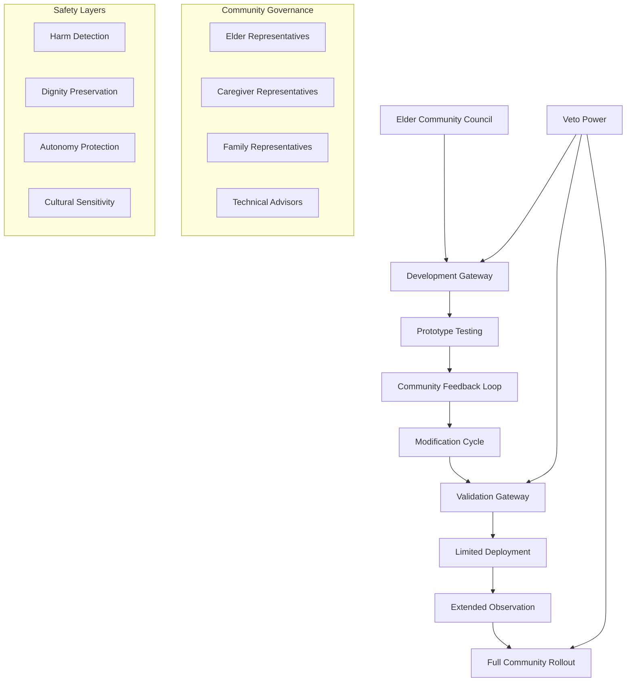
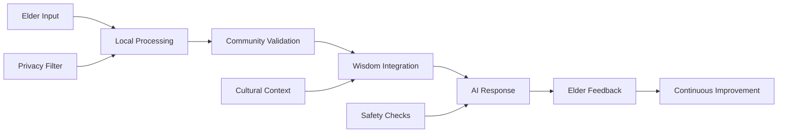

# Careful AI Development for Elder Care Technical Specification

## Overview
A community-governed AI system for elder care that prioritizes careful, iterative development with continuous elder and caregiver participation, implementing veto powers and slow deployment cycles that build trust through demonstrated respect for community wisdom.

## Classification
- **Domain:** Technical Specification
- **Source Opportunity:** [Cannae AI Opportunities - Innovation Speed Cult](../../findings/cannae_ai_opportunities.md#6-the-innovation-speed-cult)
- **Stability:** Evolving
- **Abstraction:** Detailed
- **Confidence:** Evolving

## Strategic Foundation

### Cannae Vulnerability Exploited
**Mental Model**: "Move fast and break things"

**Vulnerability**: 
- Cannot compete with careful, community-centered design
- Dismisses "slow" iterative approaches as inefficient
- Blind to harm from rapid deployment
- Cannot value building trust through patience

**Exploitation Strategy**: Build AI systems through radically slow, careful processes where elder communities have continuous veto power, creating trust and effectiveness that rapid deployment can never achieve.

### Community Need Addressed
**Problem Statement**: Elder communities need supportive AI tools but are harmed by rapidly-deployed systems that don't understand their needs, contexts, or concerns.

**Current Capitalist "Solution"**: Quickly-deployed elder care AI that treats elders as passive recipients, optimizes for efficiency over dignity, and changes rapidly without community input.

**Community Alternative**: Elder-led AI development with mandatory slow deployment, continuous community feedback loops, and veto powers at every stage, ensuring AI serves rather than disrupts elder communities.

## System Architecture

### High-Level Architecture


### Core Components

#### Component 1: Community Development Gateway
- **Purpose**: Ensures all AI development passes through community approval before proceeding
- **Anti-Capitalist Features**: 
  - Community has absolute veto power over any feature
  - Development speed determined by community comfort, not market pressure
  - Prioritizes relationship building over feature delivery
  - Values elder wisdom over technical efficiency
- **Technical Requirements**: 
  - Consensus tracking system for community decisions
  - Feature proposal management with clear explanations
  - Impact assessment tools for proposed changes
  - Rollback capabilities for any deployed feature
- **Community Control Points**: 
  - Initial approval for any new development
  - Setting pace of development cycles
  - Defining success metrics beyond efficiency
  - Determining which features to prioritize

#### Component 2: Iterative Testing Framework
- **Purpose**: Enables careful, staged testing with continuous community involvement
- **Anti-Capitalist Features**:
  - Testing periods measured in months, not sprints
  - Success defined by community wellbeing, not metrics
  - Failures seen as learning opportunities, not setbacks
  - Patience valued over speed
- **Technical Requirements**:
  - Staged deployment system with granular control
  - Comprehensive monitoring of community impact
  - Feedback collection through multiple channels
  - A/B testing with community consent
- **Community Control Points**:
  - Defining testing groups and methods
  - Setting observation periods
  - Interpreting results through community lens
  - Deciding when to proceed or pause

#### Component 3: Elder Wisdom Integration System
- **Purpose**: Captures and integrates elder knowledge and preferences into AI behavior
- **Anti-Capitalist Features**:
  - Values traditional knowledge equally with data
  - Preserves rather than replaces human judgment
  - Respects cultural and individual differences
  - Builds on existing community practices
- **Technical Requirements**:
  - Knowledge capture interfaces accessible to elders
  - Story and wisdom preservation systems
  - Cultural context modeling
  - Preference learning without surveillance
- **Community Control Points**:
  - What knowledge to share with the system
  - How AI should interpret and apply wisdom
  - Which cultural practices to preserve
  - How to handle individual differences

### Data Architecture

#### Data Models
```
ElderProfile {
    id: community-generated-id
    preferences: {
        communication_style: elder-defined
        privacy_level: elder-controlled
        assistance_areas: explicitly-consented
        cultural_context: community-validated
    }
    wisdom_contributions: [
        {
            type: story|advice|practice
            sharing_level: personal|community|federation
            context: situational-metadata
        }
    ]
    interaction_history: locally-stored-only
}

CommunityGovernance {
    decisions: [
        {
            proposal: detailed-description
            discussion_period: minimum-30-days
            elder_council_vote: required
            caregiver_input: included
            outcome: approved|vetoed|modified
            implementation_timeline: community-set
        }
    ]
    veto_history: transparent-record
    pace_agreements: binding-timelines
}
```

#### Data Ownership
- **Elder Data**: Individually owned with granular sharing controls
- **Community Wisdom**: Collectively owned by elder community
- **Interaction Patterns**: Anonymized and community-controlled
- **Care Insights**: Shared only with explicit consent

#### Data Flow


### Federation Architecture

#### Local Nodes
- **Purpose**: Serve specific elder communities with their unique needs
- **Autonomy**: Complete control over deployment pace and features
- **Resource Requirements**: 
  - Low-power devices suitable for care facilities
  - Simple interfaces for non-technical operation
  - Redundant systems for reliability

#### Federation Protocol
- **Interconnection**: Optional sharing of successful patterns
- **Shared Standards**: Common safety and dignity protocols
- **Local Adaptation**: Each community's cultural needs respected
- **Conflict Resolution**: Elder councils mediate differences

## Technical Requirements

### Functional Requirements
1. **Careful Development Process**
   - Minimum 30-day community review for any changes
   - Multi-stage testing with pause points
   - Rollback capability for any feature
   - Community veto implementation

2. **Elder-Centered Interfaces**
   - Large, clear visual elements
   - Multiple input modalities (voice, touch, gesture)
   - Consistent, predictable behaviors
   - Patience with response time

3. **Safety and Dignity Features**
   - Continuous dignity assessment
   - Autonomy preservation checks
   - Cultural sensitivity validation
   - Harm prevention protocols

### Non-Functional Requirements

#### Performance
- **Scale**: Individual communities (10-500 elders)
- **Response Time**: Patience-oriented (no time pressure)
- **Throughput**: Quality over quantity of interactions
- **Resource Usage**: Minimal, suitable for care facilities

#### Security & Privacy
- **Threat Model**: Protection from data exploitation and surveillance
- **Privacy Guarantees**: Local-first with optional sharing
- **Community Security**: Protection from external pressure
- **Data Sovereignty**: Elder and community controlled

#### Resilience
- **Crisis Operation**: Graceful degradation to human care
- **Fault Tolerance**: Never leave elders without support
- **Degraded Mode**: Core safety features always available
- **Recovery Procedures**: Community-managed restoration

### Technology Stack

#### Core Technologies
- **Backend**: Python with careful error handling
- **Frontend**: Accessible web technologies (WCAG AAA)
- **Communication**: Local-first with optional federation
- **Data Storage**: Encrypted local storage

#### Community Technology Requirements
- **Accessibility**: Designed for limited technical knowledge
- **Maintenance**: Manageable by care facility staff
- **Deployment**: Gradual rollout with training
- **Updates**: Community-controlled pace

## Community Governance Integration

### Decision-Making Interfaces
- **Development Proposals**: Clear, non-technical explanations
- **Testing Participation**: Voluntary with full consent
- **Feature Toggles**: Elder-controllable preferences
- **Evolution Votes**: Regular community gatherings

### Community Administration
- **Elder Council**: Primary decision-making body
- **Caregiver Input**: Advisory and operational feedback
- **Family Participation**: Configurable involvement
- **Technical Support**: Community-embedded helpers

## Integration Requirements

### Existing Systems
- **Care Facilities**: Integration with existing care protocols
- **Medical Systems**: Optional health record connections
- **Community Centers**: Support for group activities
- **Family Networks**: Controlled information sharing

### Federation Standards
- **Identity**: Elder-controlled portable profiles
- **Reputation**: Community vouching for quality
- **Resource Sharing**: Wisdom and pattern sharing
- **Conflict Resolution**: Elder council mediation

## Implementation Phases

### Phase 1: Community Formation (6 months)
- **Duration**: 6 months minimum
- **Features**: Community governance structure
- **Community Involvement**: Elder council formation
- **Success Criteria**: Established decision-making process

### Phase 2: Careful Prototyping (12 months)
- **Duration**: 12 months with pause points
- **Features**: Basic assistance features
- **Community Involvement**: Continuous feedback loops
- **Success Criteria**: Elder approval and trust

### Phase 3: Gradual Deployment (18 months)
- **Duration**: 18 months staged rollout
- **Features**: Full assistance capabilities
- **Community Involvement**: Active participation in refinement
- **Success Criteria**: Improved quality of life metrics

## Resource Requirements

### Development Resources
- **Technical Skills**: Patient developers with elder care experience
- **Time Investment**: 3-year minimum commitment
- **Infrastructure**: Community-embedded development
- **Community Coordination**: Full-time community liaisons

### Deployment Resources
- **Hardware**: Simple, reliable devices
- **Network**: Local-first with optional connectivity
- **Technical Support**: Embedded community helpers
- **Training**: Extensive, patient-paced programs

### Sustainability
- **Funding Model**: Community/grant supported
- **Maintenance**: Shared responsibility model
- **Community Capacity**: Gradual skill building
- **Evolution**: Elder-led adaptation

## Risk Assessment

### Technical Risks
- **Complexity**: Mitigated by keeping systems simple
- **Reliability**: Addressed through redundancy
- **Accessibility**: Continuous testing with elders

### Community Risks
- **Adoption**: Addressed through patient introduction
- **Trust**: Built through demonstrated respect
- **Dependency**: Avoided through augmentation focus
- **Isolation**: Prevented by strengthening human connections

### Political Risks
- **Efficiency Pressure**: Resisted through community governance
- **Standardization**: Prevented by local control
- **Commercialization**: Blocked by ownership structure
- **Speed Demands**: Rejected by development philosophy

## Success Metrics

### Community Impact
- **Dignity Preservation**: Elder-reported autonomy
- **Connection Strengthening**: Increased human interaction
- **Wisdom Preservation**: Captured community knowledge
- **Trust Building**: Elder confidence in system

### Technical Success
- **Reliability**: System availability when needed
- **Usability**: Elder-reported ease of use
- **Adaptability**: Successful local customizations
- **Safety**: Zero dignity violations

### Anti-Capitalist Success
- **Pace Resistance**: Development speed set by community
- **Extraction Prevention**: No data monetization
- **Community Control**: Active governance participation
- **Care Priority**: Human wellbeing over efficiency

## Next Steps
1. **Elder Community Engagement**: Form initial governance councils
2. **Trust Building**: Establish relationships before technology
3. **Resource Assembly**: Secure patient funding
4. **Partnership Development**: Connect with elder care organizations

## Relationships
- **Parent Nodes:**
  - [Cannae AI Opportunities](../../findings/cannae_ai_opportunities.md) - implements - Careful AI Development opportunity
- **Child Nodes:**
  - [Elder Care Design Document] - leads-to - Detailed design phase
- **Related Nodes:**
  - [Anti-Capitalist Framework](../../frameworks/anti_capitalist_framework.md) - applies - Core principles
  - [Community Governance Patterns] - uses - Decision-making structures

## Metadata
- **Created:** 2025-01-23
- **Last Updated:** 2025-01-23
- **Updated By:** AI Assistant
- **Community Input:** Awaiting elder community sessions

## Change History
- 2025-01-23: Initial specification created based on Cannae opportunity analysis