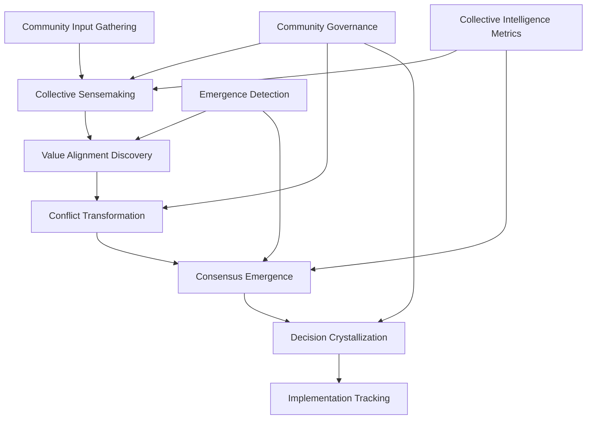
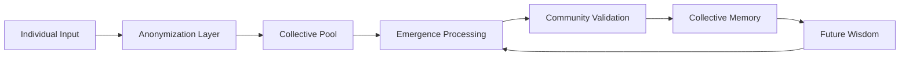

# ConsensusEngine: Collective Intelligence Amplifier for Participatory Budgeting

## Overview
ConsensusEngine is a community-owned AI system designed to amplify collective wisdom and facilitate democratic decision-making in participatory budgeting processes. It directly exploits capitalism's "individual productivity obsession" by measuring success through collective understanding, consensus quality, and emergent wisdom rather than individual output metrics.

## Classification
- **Domain:** Technical Specification
- **Source Opportunity:** [[cannae_ai_opportunities#4-the-individual-productivity-obsession]]
- **Stability:** Evolving
- **Abstraction:** Detailed
- **Confidence:** Evolving

## Strategic Foundation

### Cannae Vulnerability Exploited
Which capitalist mental model trap does this exploit?
- **Mental Model**: "AI should make individuals more productive"
- **Vulnerability**: Cannot process collective intelligence amplification, dismisses "inefficient" collaborative processes, blind to emergence from group dynamics
- **Exploitation Strategy**: We build a system that enhances group decision-making not individual output, creates tools for consensus building and collective sensemaking, detects and amplifies emergent wisdom from community deliberation

### Community Need Addressed
What specific community need does this serve?
- **Problem Statement**: Participatory budgeting is undermined by tools that focus on vote counting rather than collective wisdom, creating winner/loser dynamics instead of consensus
- **Current Capitalist "Solution"**: Voting apps that maximize individual choice expression, gamify engagement, create competitive allocation
- **Community Alternative**: ConsensusEngine facilitates deep collective sensemaking, surfaces shared values, builds genuine consensus around resource allocation

## System Architecture

### High-Level Architecture


### Core Components

#### Component 1: Collective Input Synthesis Engine
- **Purpose**: Gathers and synthesizes diverse community perspectives without reducing them to votes
- **Anti-Capitalist Features**: 
  - Values qualitative input over quantitative metrics
  - Preserves minority perspectives rather than averaging
  - Amplifies quiet voices and marginalized viewpoints
  - Resists reduction to individual preferences
- **Technical Requirements**: 
  - Multi-modal input processing (text, voice, video, drawings)
  - Semantic clustering without loss of nuance
  - Multilingual support with cultural context preservation
  - Accessibility-first design for inclusive participation
- **Community Control Points**: 
  - Input method preferences
  - Privacy and anonymity settings
  - Facilitation style choices
  - Cultural communication norms

#### Component 2: Emergent Theme Discovery System
- **Purpose**: Identifies emergent themes and shared values from collective input
- **Anti-Capitalist Features**: 
  - Surfaces unexpected connections between ideas
  - Values emergence over pre-defined categories
  - Resists algorithmic manipulation or gaming
  - Celebrates complexity rather than simplification
- **Technical Requirements**: 
  - Unsupervised learning for theme emergence
  - Network analysis of idea relationships
  - Temporal pattern recognition for evolving consensus
  - Visualization of collective thinking patterns
- **Community Control Points**: 
  - Theme validation and refinement
  - Emergence sensitivity thresholds
  - Visualization preferences
  - Pattern interpretation frameworks

#### Component 3: Conflict Transformation Module
- **Purpose**: Transforms conflicts into opportunities for deeper understanding
- **Anti-Capitalist Features**: 
  - Reframes competition as creative tension
  - Seeks synthesis rather than compromise
  - Values process over expedient resolution
  - Builds understanding across difference
- **Technical Requirements**: 
  - Tension mapping algorithms
  - Value alignment analysis
  - Creative synthesis suggestion engine
  - Facilitation prompt generation
- **Community Control Points**: 
  - Conflict approach preferences
  - Facilitation intensity settings
  - Synthesis evaluation criteria
  - Process pacing control

#### Component 4: Consensus Quality Analyzer
- **Purpose**: Evaluates consensus depth and authenticity rather than simple agreement
- **Anti-Capitalist Features**: 
  - Measures understanding not just agreement
  - Detects false consensus or coercion
  - Values minority protection over majority rule
  - Celebrates genuine collective wisdom
- **Technical Requirements**: 
  - Multi-dimensional consensus metrics
  - Coercion and manipulation detection
  - Minority perspective amplification
  - Consensus stability prediction
- **Community Control Points**: 
  - Consensus criteria definition
  - Minority protection thresholds
  - Quality metric weighting
  - Intervention triggers

#### Component 5: Collective Memory System
- **Purpose**: Maintains institutional memory of collective decisions and their reasoning
- **Anti-Capitalist Features**: 
  - Preserves process not just outcomes
  - Values collective learning over efficiency
  - Resists historical revisionism
  - Enables iterative wisdom building
- **Technical Requirements**: 
  - Decision provenance tracking
  - Reasoning preservation system
  - Pattern recognition across decisions
  - Wisdom extraction algorithms
- **Community Control Points**: 
  - Memory access permissions
  - Historical interpretation rights
  - Pattern sharing preferences
  - Knowledge sovereignty

### Data Architecture

#### Data Models
```yaml
CollectiveDecision:
  id: UUID
  community: CommunityReference
  process_timeline: ProcessRecord
  emergent_themes: [Theme]
  consensus_quality: QualityMetrics
  implementation_plan: Plan
  collective_memory: MemoryRecord

Theme:
  id: UUID
  emergence_pattern: EmergenceGraph
  supporting_perspectives: [Perspective]
  synthesis_opportunities: [Synthesis]
  community_validation: ValidationRecord

Perspective:
  contributor: AnonymizedID
  content: MultiModalContent
  themes: [ThemeReference]
  amplification_status: AmplificationRecord
  consent_settings: ConsentRecord

ConsensusQuality:
  understanding_depth: Float
  genuine_agreement: Float
  minority_inclusion: Float
  creative_synthesis: Float
  stability_prediction: Float

ProcessRecord:
  phases: [ProcessPhase]
  participation_patterns: ParticipationGraph
  emergence_timeline: EmergenceRecord
  facilitation_notes: [FacilitationNote]
```

#### Data Ownership
- **Collective Data**: All decision processes, emergent themes, consensus records, collective memory
- **Individual Data**: Personal input with strong anonymization, consent preferences, participation history
- **Community Commons**: Decision patterns, facilitation wisdom, conflict transformation strategies
- **Privacy Protections**: Default anonymization, granular consent, right to be forgotten, no individual tracking

#### Data Flow


### Federation Architecture

#### Local Nodes
- **Purpose**: Each community runs its own ConsensusEngine instance
- **Autonomy**: Complete control over process design, consensus criteria, facilitation approach
- **Resource Requirements**: 
  - Minimum: Community server with 16GB RAM
  - Recommended: Dedicated server with GPU for real-time processing
  - Storage: 100GB for base system + decision history

#### Federation Protocol
- **Interconnection**: Wisdom sharing between communities
- **Shared Standards**: 
  - Process pattern library
  - Facilitation technique exchange
  - Consensus quality metrics
- **Local Adaptation**: 
  - Cultural decision-making styles
  - Language and communication norms
  - Community-specific values
- **Mutual Learning**: Cross-community facilitation exchanges

## Technical Requirements

### Functional Requirements
1. **Input Gathering**
   - Multi-modal participation options
   - Asynchronous and synchronous modes
   - Anonymous and attributed options
   - Accessibility across abilities
   - Low-bandwidth alternatives

2. **Collective Sensemaking**
   - Real-time theme emergence visualization
   - Perspective clustering without reduction
   - Value alignment discovery
   - Tension and opportunity mapping
   - Minority voice amplification

3. **Consensus Building**
   - Process facilitation prompts
   - Synthesis opportunity identification
   - Understanding verification loops
   - Stability and authenticity metrics
   - Implementation planning tools

4. **Governance Integration**
   - Transparent process controls
   - Community facilitator tools
   - Decision audit trails
   - Power analysis features
   - Accountability mechanisms

### Non-Functional Requirements

#### Performance
- **Scale**: 10-10,000 participants per decision process
- **Response Time**: <500ms for input processing, <5s for emergence analysis
- **Throughput**: 1000 concurrent participants per node
- **Processing**: Real-time visualization of emerging consensus

#### Security & Privacy
- **Threat Model**: Protect against manipulation, coercion, surveillance, decision capture
- **Privacy Guarantees**: Strong anonymization, no behavioral profiling, encrypted participation
- **Integrity Protection**: Tamper-proof decision records, manipulation detection
- **Power Analysis**: Influence pattern detection, equity monitoring

#### Resilience
- **Crisis Operation**: Rapid decision capability for emergencies
- **Fault Tolerance**: Distributed processing, no single points of failure
- **Graceful Degradation**: Core consensus functions without full features
- **Recovery Procedures**: Decision process restoration, memory preservation

### Technology Stack

#### Core Technologies
- **Backend**: Rust (memory safety for sensitive deliberation data)
- **Processing**: Python with JAX for emergence detection
- **Frontend**: Accessible web interface with offline capability
- **Visualization**: D3.js for collective intelligence visualization
- **Data Storage**: Distributed ledger for decision integrity

#### Community Technology Requirements
- **Accessibility**: Works with screen readers, low-vision aids
- **Inclusivity**: Multiple language support, cultural adaptations
- **Maintenance**: Non-technical community administration
- **Evolution**: Community-driven feature development

## Community Governance Integration

### Decision-Making Interfaces
How communities control their consensus processes:
- **Process Design**: 
  - Phases and timing of decisions
  - Participation requirements
  - Consensus thresholds
  - Minority protections
- **Facilitation Settings**: 
  - AI facilitation intensity
  - Human facilitator integration
  - Conflict transformation approach
  - Synthesis preferences
- **Quality Criteria**: 
  - Understanding requirements
  - Authenticity measures
  - Inclusion standards
  - Implementation readiness
- **Evolution Mechanisms**: 
  - Process improvement proposals
  - Facilitator training programs
  - Cross-community learning
  - Wisdom preservation

### Community Administration
- **Process Management**: Decision timeline control, participation monitoring
- **Facilitation Support**: AI-assisted facilitation prompts, conflict navigation
- **Quality Assurance**: Consensus authenticity verification, minority protection
- **Memory Curation**: Collective wisdom extraction, pattern documentation

## Integration Requirements

### Existing Systems
- **Municipal Systems**: Integration with city participatory budgeting platforms
- **Community Organizations**: APIs for neighborhood associations, advocacy groups
- **Collaboration Tools**: Bridge to existing community communication platforms
- **Financial Systems**: Connection to transparent budget tracking

### Federation Standards
- **Process Sharing**: Facilitation pattern libraries
- **Wisdom Exchange**: Cross-community learning protocols
- **Quality Metrics**: Standardized consensus measurement
- **Conflict Resolution**: Inter-community mediation support

## Implementation Phases

### Phase 1: Core Consensus Engine (4 months)
- **Duration**: 16 weeks
- **Features**: 
  - Basic input gathering and synthesis
  - Simple emergence detection
  - Consensus quality metrics
  - Process facilitation prompts
- **Community Involvement**: Alpha testing with 3 communities
- **Success Criteria**: 10 successful decision processes

### Phase 2: Collective Intelligence Features (4 months)
- **Duration**: 16 weeks
- **Features**: 
  - Advanced emergence detection
  - Conflict transformation tools
  - Real-time visualization
  - Collective memory system
- **Community Involvement**: Beta testing with 10 communities
- **Success Criteria**: 50% improvement in consensus quality

### Phase 3: Federation and Wisdom Sharing (6 months)
- **Duration**: 24 weeks
- **Features**: 
  - Full federation protocol
  - Cross-community learning
  - Pattern libraries
  - Wisdom preservation
- **Community Involvement**: Federation governance established
- **Success Criteria**: 20 federated communities

## Resource Requirements

### Development Resources
- **Technical Skills**: 
  - 2 Distributed systems engineers
  - 2 ML engineers (emergence detection)
  - 1 UX designer (accessibility focus)
  - 2 Community process facilitators
- **Time Investment**: 14 months for full system
- **Infrastructure**: Development cluster, testing environments
- **Community Coordination**: Weekly community co-design sessions

### Deployment Resources
- **Hardware**: $1000-2000 per community node
- **Facilitation**: Training for community facilitators
- **Technical Support**: 1 part-time technical coordinator
- **Process Support**: Ongoing facilitation skill building

### Sustainability
- **Funding Model**: 
  - Initial: Democratic innovation grants
  - Ongoing: Municipal partnership funding
  - No surveillance capitalism or data sale
- **Knowledge Commons**: Shared facilitation wisdom
- **Skill Building**: Community facilitator networks
- **Evolution**: Quarterly process innovation labs

## Risk Assessment

### Technical Risks
- **Complexity**: Emergence detection accuracy - Mitigation: Human validation loops
- **Manipulation**: Gaming of consensus - Mitigation: Multi-factor authenticity checks
- **Scale**: Large group processing - Mitigation: Distributed architecture

### Community Risks
- **Adoption**: Preference for simple voting - Mitigation: Show superior outcomes
- **Capacity**: Facilitation skill needs - Mitigation: Extensive training programs
- **Capture**: Elite manipulation - Mitigation: Power analysis tools
- **Fatigue**: Process exhaustion - Mitigation: Adaptive pacing

### Political Risks
- **Opposition**: Resistance from power holders - Mitigation: Transparency and accountability
- **Co-optation**: Watering down to voting - Mitigation: Core principles enforcement
- **Manipulation**: External interference - Mitigation: Security and verification
- **Reversion**: Return to old methods - Mitigation: Document superior outcomes

## Success Metrics

### Community Impact
- **Decision Quality**: Measured by implementation success and community satisfaction
- **Inclusion**: Participation across community demographics
- **Understanding**: Depth of mutual comprehension achieved
- **Innovation**: Novel solutions emerging from process

### Technical Success
- **Reliability**: System uptime during critical decisions
- **Accuracy**: Emergence detection validation rate
- **Security**: Zero successful manipulation attempts
- **Performance**: Real-time processing capability

### Anti-Capitalist Success
- **Collective Focus**: Zero individual productivity metrics
- **Commons Building**: Shared wisdom repository growth
- **Power Distribution**: Influence equity measurements
- **Gift Economy**: Knowledge sharing without commodification

### Collective Intelligence Metrics
- **Emergence Rate**: Novel solutions per decision process
- **Synthesis Quality**: Creative integration of diverse views
- **Understanding Depth**: Mutual comprehension measures
- **Wisdom Accumulation**: Institutional learning over time
- **Conflict Transformation**: Tensions resolved through synthesis
- **Minority Amplification**: Marginalized voice inclusion rate

## Next Steps
1. **Community Validation**: Present to participatory budgeting initiatives
2. **Process Design**: Develop detailed facilitation methodologies
3. **Pilot Identification**: Partner with willing municipalities
4. **Funding Assembly**: Apply for democratic innovation grants

## Relationships
- **Parent Nodes:**
  - [[cannae_ai_opportunities#4-the-individual-productivity-obsession]] - implements - Core strategic opportunity
- **Child Nodes:**
  - [Process design document - to be created] - leads-to - Detailed facilitation methods
- **Related Nodes:**
  - [[anti_capitalist_framework]] - applies - Framework guides all decisions
  - [[collective_intelligence_patterns]] - implements - Patterns for group wisdom

## Metadata
- **Created:** 2025-07-23
- **Last Updated:** 2025-07-23
- **Updated By:** AI Development Agent
- **Community Input:** Pending - scheduled sessions with participatory budgeting initiatives

## Change History
- 2025-07-23: Initial specification based on Cannae opportunity analysis