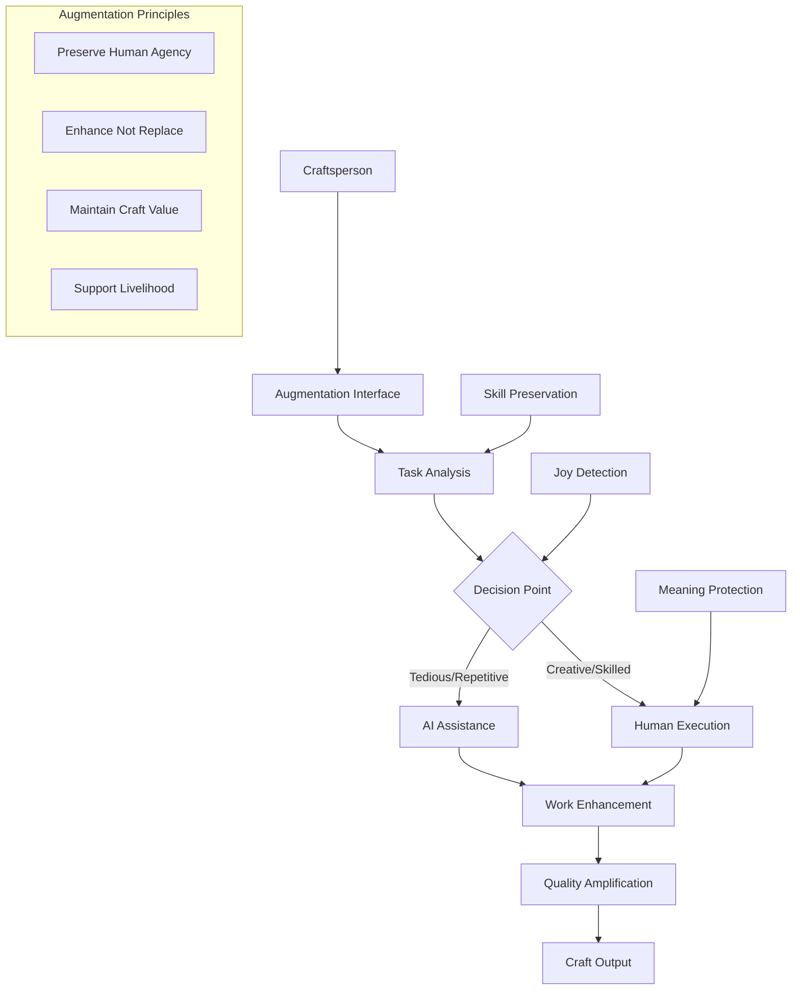
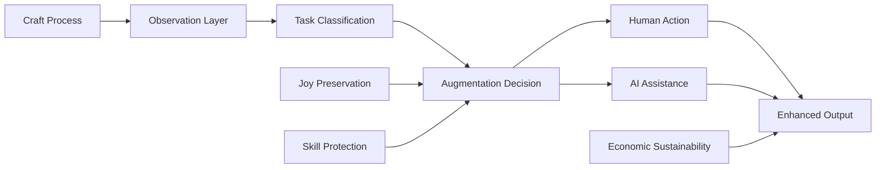

# Craft Augmentation AI Technical Specification

## Overview
An AI system designed to enhance human craftsmanship without replacing it, preserving the joy, meaning, and livelihood of craft work while providing tools that amplify human creativity and skill rather than automating it away.

## Classification
- **Domain:** Technical Specification
- **Source Opportunity:** [Cannae AI Opportunities - Automation Absolutism](../../findings/cannae_ai_opportunities.md#8-the-automation-absolutism)
- **Stability:** Evolving
- **Abstraction:** Detailed
- **Confidence:** Evolving

## Strategic Foundation

### Cannae Vulnerability Exploited
**Mental Model**: "Automate everything possible"

**Vulnerability**: 
- Cannot value human judgment preservation
- Dismisses "inefficiency" of human-in-the-loop as waste
- Blind to wisdom in selective non-automation
- Cannot understand value beyond efficiency metrics

**Exploitation Strategy**: Build AI that explicitly preserves and enhances human craft, making human judgment central rather than peripheral, creating value through human-AI collaboration that automation-focused systems cannot replicate.

### Community Need Addressed
**Problem Statement**: Craftspeople need tools that help them create better work and reach audiences without losing the essence of craft - the human touch, creative decision-making, and meaningful labor.

**Current Capitalist "Solution"**: AI that seeks to automate craft production, reducing costs by eliminating skilled workers, turning craft into commodity manufacturing.

**Community Alternative**: AI that acts as an intelligent apprentice, handling tedious tasks while preserving creative control, amplifying rather than replacing human skill, and maintaining craft as meaningful work.

## System Architecture

### High-Level Architecture


### Core Components

#### Component 1: Human-Centered Task Analyzer
- **Purpose**: Identifies which aspects of craft should remain human and which benefit from assistance
- **Anti-Capitalist Features**: 
  - Prioritizes preserving meaningful work over efficiency
  - Protects tasks that bring joy and satisfaction
  - Maintains human control over creative decisions
  - Values craft tradition and skill development
- **Technical Requirements**: 
  - Task decomposition with human-value weighting
  - Joy and satisfaction detection algorithms
  - Skill development tracking
  - Creative decision identification
- **Community Control Points**: 
  - Craftspeople define what remains human
  - Communities set automation boundaries
  - Individual override on any assistance
  - Collective wisdom shapes classifications

#### Component 2: Intelligent Apprentice System
- **Purpose**: Provides assistance that enhances rather than replaces craft skill
- **Anti-Capitalist Features**:
  - Never makes creative decisions autonomously
  - Enhances human capability without dependency
  - Preserves and transmits craft knowledge
  - Supports economic sustainability of craft
- **Technical Requirements**:
  - Context-aware suggestion systems
  - Skill-appropriate assistance levels
  - Learning from master craftspeople
  - Non-invasive integration with craft process
- **Community Control Points**:
  - Level of assistance customization
  - Disable any automated features
  - Knowledge sharing permissions
  - Economic model participation

#### Component 3: Craft Knowledge Preservation
- **Purpose**: Captures and preserves traditional techniques while supporting innovation
- **Anti-Capitalist Features**:
  - Respects master-apprentice relationships
  - Prevents knowledge commodification
  - Supports intergenerational transmission
  - Values indigenous and traditional methods
- **Technical Requirements**:
  - Technique documentation systems
  - Pattern recognition for craft methods
  - Story and context preservation
  - Innovation tracking without extraction
- **Community Control Points**:
  - What knowledge to document
  - Sharing permissions and access
  - Traditional knowledge protection
  - Innovation attribution

### Data Architecture

#### Data Models
```
CraftProfile {
    id: craftsperson-controlled
    craft_type: self-defined
    skill_areas: {
        mastery_level: self-assessed
        joy_indicators: task-specific
        preservation_priority: human-defined
        assistance_preferences: granular-control
    }
    boundaries: {
        never_automate: [task-list]
        welcome_assistance: [task-list]
        experimental: [conditional-list]
    }
    economic_model: livelihood-supporting
}

AugmentationTask {
    type: enhancement|preparation|documentation
    human_value: {
        creativity_involved: scaled
        joy_factor: measured
        skill_expression: assessed
        meaning_content: evaluated
    }
    assistance_model: {
        suggestion_only: boolean
        human_triggered: required
        reversible: always
        skill_building: integrated
    }
}

CraftKnowledge {
    technique: {
        human_description: required
        video_documentation: optional
        context_stories: valued
        cultural_significance: preserved
    }
    sharing: {
        permission_level: craftsperson-set
        attribution: maintained
        modification_rights: controlled
        commercialization: prohibited
    }
}
```

#### Data Ownership
- **Craft Knowledge**: Owned by creating craftsperson
- **Technique Documentation**: Community stewardship
- **Innovation Patterns**: Shared commons with attribution
- **Economic Data**: Private and protected

#### Data Flow


### Federation Architecture

#### Local Nodes
- **Purpose**: Serve specific craft communities
- **Autonomy**: Complete control over augmentation boundaries
- **Resource Requirements**: 
  - Craft-appropriate computing devices
  - Integration with existing tools
  - Minimal infrastructure needs

#### Federation Protocol
- **Interconnection**: Technique sharing with consent
- **Shared Standards**: Craft preservation principles
- **Local Adaptation**: Respect for regional traditions
- **Conflict Resolution**: Craft guild mediation

## Technical Requirements

### Functional Requirements
1. **Augmentation Intelligence**
   - Task value assessment algorithms
   - Joy and satisfaction detection
   - Skill development tracking
   - Creative boundary respect

2. **Craft Enhancement Tools**
   - Pattern suggestion without imposition
   - Material optimization with waste reduction
   - Client communication assistance
   - Portfolio documentation support

3. **Economic Sustainability Features**
   - Fair pricing calculators
   - Market connection without commodification
   - Cooperative formation support
   - Direct sales facilitation

### Non-Functional Requirements

#### Performance
- **Scale**: Individual to small cooperative
- **Response Time**: Craft-rhythm appropriate
- **Throughput**: Quality over quantity
- **Resource Usage**: Modest and sustainable

#### Security & Privacy
- **Threat Model**: Protection from design theft
- **Privacy Guarantees**: Technique confidentiality
- **Community Security**: Economic protection
- **Data Sovereignty**: Craftsperson controlled

#### Resilience
- **Crisis Operation**: Maintains human capability
- **Fault Tolerance**: Graceful degradation
- **Degraded Mode**: Human craft continues
- **Recovery Procedures**: Simple restoration

### Technology Stack

#### Core Technologies
- **Backend**: Rust for efficiency and safety
- **Frontend**: Native craft tool integration
- **Communication**: Local-first architecture
- **Data Storage**: Encrypted local storage

#### Community Technology Requirements
- **Accessibility**: Works with existing craft practices
- **Maintenance**: Craftsperson manageable
- **Deployment**: Simple tool integration
- **Updates**: User-controlled timing

## Community Governance Integration

### Decision-Making Interfaces
- **Augmentation Boundaries**: Craft guild decisions
- **Feature Development**: Practitioner-led design
- **Economic Models**: Cooperative governance
- **Knowledge Sharing**: Consent-based systems

### Community Administration
- **Guild Formation**: Traditional and new crafts
- **Skill Certification**: Peer recognition
- **Economic Cooperation**: Mutual support
- **Conflict Resolution**: Craft-specific mediation

## Integration Requirements

### Existing Systems
- **Craft Guilds**: Formal integration support
- **Maker Spaces**: Tool library connections
- **Craft Markets**: Ethical sales channels
- **Educational Programs**: Apprenticeship support

### Federation Standards
- **Identity**: Portable craft reputation
- **Reputation**: Peer validation system
- **Resource Sharing**: Tool and knowledge exchange
- **Conflict Resolution**: Guild-based mediation

## Implementation Phases

### Phase 1: Craft Community Engagement (4 months)
- **Duration**: Season of relationship building
- **Features**: Understanding craft needs deeply
- **Community Involvement**: Master craftsperson leadership
- **Success Criteria**: Trust and vision alignment

### Phase 2: Augmentation Prototyping (8 months)
- **Duration**: Two craft cycles
- **Features**: Basic enhancement tools
- **Community Involvement**: Active co-creation
- **Success Criteria**: Preserved craft joy

### Phase 3: Economic Integration (12 months)
- **Duration**: Full business cycle
- **Features**: Livelihood support tools
- **Community Involvement**: Cooperative development
- **Success Criteria**: Sustainable craft income

## Resource Requirements

### Development Resources
- **Technical Skills**: Developers who understand craft
- **Time Investment**: Patient, craft-paced development
- **Infrastructure**: Integration with craft tools
- **Community Coordination**: Embedded craft organizers

### Deployment Resources
- **Hardware**: Craft-appropriate devices
- **Network**: Local operation capability
- **Technical Support:** Peer support networks
- **Training**: Master-apprentice model

### Sustainability
- **Funding Model**: Craft cooperative supported
- **Maintenance**: Community maintenance
- **Community Capacity**: Skill sharing circles
- **Evolution**: Craft-driven adaptation

## Risk Assessment

### Technical Risks
- **Over-automation**: Prevented by design principles
- **Complexity**: Managed through simplicity
- **Integration**: Careful tool compatibility

### Community Risks
- **Skill Loss**: Actively prevented by design
- **Economic Pressure**: Addressed through cooperation
- **Tradition Loss**: Preserved through documentation
- **Market Competition**: Differentiated by human value

### Political Risks
- **Efficiency Demands**: Resisted by value system
- **Automation Pressure**: Technically prevented
- **Commodification**: Blocked by ownership
- **Deskilling**: Reversed by design

## Success Metrics

### Community Impact
- **Craft Preservation**: Active practitioners maintained
- **Skill Development**: New apprentices trained
- **Economic Viability**: Living wages achieved
- **Joy Maintenance**: Satisfaction in craft work

### Technical Success
- **Adoption**: Voluntary enthusiastic use
- **Enhancement**: Measurable quality improvement
- **Efficiency**: Appropriate to craft rhythms
- **Reliability**: Consistent support provided

### Anti-Capitalist Success
- **Automation Resistance**: Human work preserved
- **Value Redefinition**: Beyond efficiency metrics
- **Community Control**: Craft guild governance
- **Livelihood Protection**: Sustainable craft economy

## Next Steps
1. **Craft Community Selection**: Identify initial partners
2. **Value Mapping**: Document what matters in craft
3. **Prototype Development**: Co-create with craftspeople
4. **Economic Planning**: Design sustainability model

## Relationships
- **Parent Nodes:**
  - [Cannae AI Opportunities](../../findings/cannae_ai_opportunities.md) - implements - Augmentation Not Automation
- **Child Nodes:**
  - [Craft Augmentation Design] - leads-to - Detailed design phase
- **Related Nodes:**
  - [Anti-Capitalist Framework](../../frameworks/anti_capitalist_framework.md) - applies - Core principles
  - [Worker Cooperative Models] - uses - Economic structures

## Metadata
- **Created:** 2025-01-23
- **Last Updated:** 2025-01-23
- **Updated By:** AI Assistant
- **Community Input:** Awaiting craft guild sessions

## Change History
- 2025-01-23: Initial specification created based on Cannae opportunity analysis