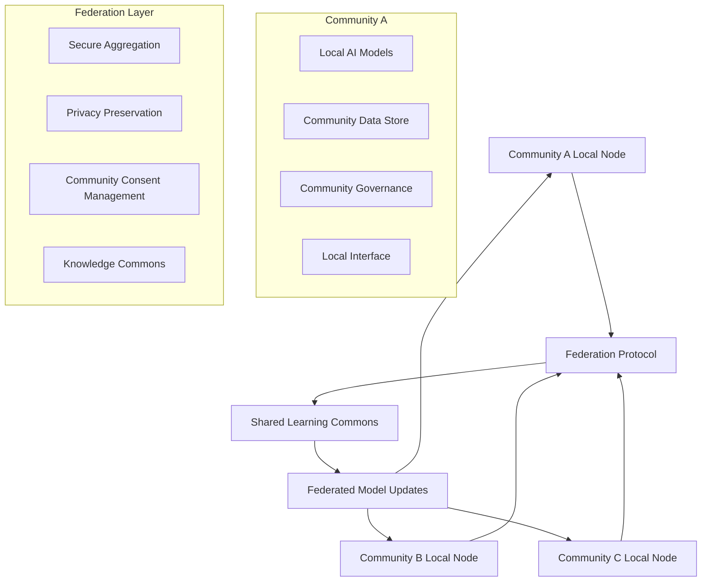
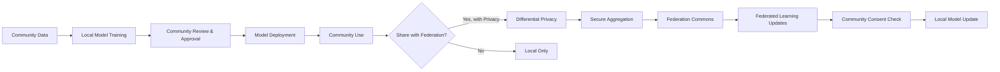

# Federated Community AI Networks Technical Specification

## Overview
A distributed network of community-controlled AI systems that enables communities to train, deploy, and share AI models while maintaining complete control over their data and knowledge systems.

## Classification
- **Domain:** Technical Specification
- **Source Opportunity:** [Cannae AI Opportunities - AI Centralization Orthodoxy](../../findings/cannae_ai_opportunities.md#1-the-ai-centralization-orthodoxy)
- **Stability:** Evolving
- **Abstraction:** Detailed
- **Confidence:** Evolving

## Strategic Foundation

### Cannae Vulnerability Exploited
**Mental Model**: "AI requires massive centralized compute and data"

**Vulnerability**: 
- Dismisses distributed AI approaches as "toy" solutions
- Cannot conceive of AI that improves without harvesting user data
- Blind to collaborative learning without centralization
- Cannot compete with community-specific knowledge and context

**Exploitation Strategy**: Build deliberately "unscalable" AI systems that serve specific community needs better than any centralized system could, while communities retain complete control over their data, models, and knowledge.

### Community Need Addressed
**Problem Statement**: Communities have language, knowledge, and intelligence needs that centralized AI either ignores, commodifies, or serves poorly due to lack of local context.

**Current Capitalist "Solution"**: Large language models trained on scraped data without community consent, serving generic responses that often misunderstand local context, language, and knowledge systems.

**Community Alternative**: Locally-trained AI models that understand community-specific language, knowledge, and context, with communities controlling all data, training, and model evolution while optionally sharing insights with allied communities.

## System Architecture

### High-Level Architecture


### Core Components

#### Component 1: Community Local Node
- **Purpose**: Serves individual community's AI needs with locally-controlled models
- **Anti-Capitalist Features**: 
  - Community owns and controls all data processing
  - No external data extraction or monetization
  - Community governance over model behavior and evolution
  - Local deployment independent of corporate infrastructure
- **Technical Requirements**: 
  - Local compute capability (commodity hardware sufficient)
  - Local data storage with community-controlled encryption
  - Community-configurable AI model serving
  - Local web interface for community interaction
- **Community Control Points**: 
  - Community decides what data to use for training
  - Community controls model behavior and responses
  - Community decides what to share with federation
  - Community can disconnect from federation at any time

#### Component 2: Federation Protocol
- **Purpose**: Enables communities to share learnings without sharing data
- **Anti-Capitalist Features**:
  - No central authority or control point
  - Communities retain veto power over all shared information
  - Shared learning builds commons, not corporate assets
  - Privacy-preserving aggregation prevents data extraction
- **Technical Requirements**:
  - Federated learning with secure aggregation
  - Differential privacy for model updates
  - Community consent management for all sharing
  - Cryptographic verification of community identity
- **Community Control Points**:
  - Communities decide which other communities to federate with
  - Communities control what aspects of their models to share
  - Communities can revoke sharing consent at any time
  - Communities participate in federation governance

#### Component 3: Community Governance Interface
- **Purpose**: Enables communities to democratically control their AI systems
- **Anti-Capitalist Features**:
  - Democratic decision-making about AI behavior
  - Community accountability for AI impacts
  - Transparent AI decision processes
  - Community-defined values integration
- **Technical Requirements**:
  - Community voting and consensus tools
  - AI model behavior configuration interfaces
  - Community audit trails for AI decisions
  - Community policy enforcement mechanisms
- **Community Control Points**:
  - Communities set AI behavioral policies
  - Communities review and approve model updates
  - Communities resolve conflicts about AI use
  - Communities evolve AI systems based on community needs

#### Component 4: Knowledge Commons
- **Purpose**: Shared space for communities to contribute to and benefit from collective AI knowledge
- **Anti-Capitalist Features**:
  - Communities contribute voluntarily, never coerced
  - All communities benefit equally from shared knowledge
  - No corporate appropriation of community contributions
  - Communities maintain attribution and control over contributions
- **Technical Requirements**:
  - Federated knowledge storage with community attribution
  - Community consent management for knowledge sharing
  - Version control for community-contributed knowledge
  - Community-controlled access to shared knowledge
- **Community Control Points**:
  - Communities decide what knowledge to contribute
  - Communities control how their contributions are used
  - Communities participate in knowledge commons governance
  - Communities can withdraw contributions if needed

### Data Architecture

#### Data Models
```yaml
Community:
  id: uuid
  name: string
  governance_model: enum [consensus, delegated, hybrid]
  federation_settings:
    allowed_communities: list[uuid]
    sharing_consent: dict[data_type, bool]
    privacy_level: enum [high, medium, collaborative]
  
LocalAIModel:
  id: uuid
  community_id: uuid
  model_type: enum [language, translation, knowledge, coordination]
  training_data_sources: list[CommunityDataSource]
  community_policies: dict[policy_name, policy_value]
  
CommunityDataSource:
  id: uuid
  community_id: uuid
  data_type: enum [text, speech, knowledge, conversation]
  community_consent: dict[use_type, bool]
  privacy_level: enum [local_only, federation_ok, commons_ok]
  
FederationUpdate:
  id: uuid
  source_community: uuid
  target_communities: list[uuid]
  update_type: enum [model_weights, knowledge_item, policy_update]
  privacy_proof: cryptographic_proof
  community_signatures: list[signature]
```

#### Data Ownership
- **Community Data**: All training data remains under community control, never leaves community infrastructure without explicit consent
- **Individual Data**: Individual community members control their personal data contributions and can withdraw consent
- **Shared Commons**: Knowledge voluntarily contributed to commons remains attributed to source community with ongoing consent management
- **Privacy Protections**: Technical enforcement through encryption, differential privacy, and secure aggregation

#### Data Flow


### Federation Architecture

#### Local Nodes
- **Purpose**: Each community operates independent AI infrastructure serving immediate community needs
- **Autonomy**: Communities have complete control over:
  - What AI models to run locally
  - What data to use for training
  - How models behave and respond
  - Whether and how to participate in federation
- **Resource Requirements**: 
  - Modest compute: 1-4 GPUs or equivalent, suitable for local language models
  - Local storage: 100GB-1TB depending on community size and model complexity
  - Network: Standard broadband sufficient for federation participation
  - Technical support: 1-2 community members with basic technical training

#### Federation Protocol
- **Interconnection**: Communities connect via encrypted, authenticated peer-to-peer protocols
- **Shared Standards**: 
  - Common API for model inference and updates
  - Standard privacy-preserving aggregation protocols
  - Shared community identity and consent management
  - Compatible knowledge representation formats
- **Local Adaptation**: 
  - Communities customize AI behavior for local needs
  - Local language, dialect, and cultural adaptation
  - Community-specific knowledge integration
  - Local governance and decision-making processes
- **Conflict Resolution**: 
  - Community-to-community mediation processes
  - Federation governance for protocol-level disputes
  - Community right to disconnect from problematic actors
  - Restorative justice approaches for community healing

## Technical Requirements

### Functional Requirements

1. **Local AI Model Serving**
   - Deploy and serve small language models (1B-7B parameters) on community hardware
   - Support community-specific fine-tuning and knowledge integration
   - Provide natural language interfaces in community languages/dialects
   - Community governance integration for model behavior control

2. **Federated Learning Infrastructure**
   - Secure aggregation of model updates across communities
   - Differential privacy protection for community data
   - Community consent management for all federation activities
   - Cryptographic verification of community participation

3. **Community Knowledge Management**
   - Local knowledge base creation and maintenance
   - Community-controlled knowledge sharing and attribution
   - Version control for community-contributed knowledge
   - Integration with existing community documentation and practices

4. **Community Governance Integration**
   - Democratic decision-making interfaces for AI system control
   - Community policy configuration and enforcement
   - Transparent audit trails for all AI decisions and changes
   - Community conflict resolution and consensus-building tools

### Non-Functional Requirements

#### Performance
- **Scale**: Support 50-500 community members per local node
- **Response Time**: Sub-second response for community AI interactions
- **Throughput**: Handle 100+ concurrent community AI requests
- **Resource Usage**: Operate efficiently on commodity hardware within community budgets

#### Security & Privacy
- **Threat Model**: Protect against corporate data harvesting, state surveillance, and community infiltration
- **Privacy Guarantees**: Mathematical guarantees that individual/community data cannot be extracted from federation
- **Community Security**: Community-controlled encryption keys, local data storage, opt-out capabilities
- **Data Sovereignty**: Technical enforcement of community data ownership and control

#### Resilience
- **Crisis Operation**: Function during internet outages, power disruptions, economic crises
- **Fault Tolerance**: Continue operating when some federation members are offline
- **Degraded Mode**: Provide essential local AI services even without federation connectivity
- **Recovery Procedures**: Community-manageable restoration of services after disruptions

### Technology Stack

#### Core Technologies
- **Backend**: Python/FastAPI for model serving, Federation learning libraries (Flower, PySyft)
- **Frontend**: Web-based interface using React/Vue.js with offline-first design
- **Communication**: Secure peer-to-peer networking (libp2p), encrypted communication protocols
- **Data Storage**: Local file systems, SQLite for metadata, encrypted community databases

#### Community Technology Requirements
- **Accessibility**: Web interface works on basic smartphones, computers, and tablets
- **Maintenance**: System designed for maintenance by community members with basic technical training
- **Deployment**: One-command deployment on standard Linux distributions
- **Updates**: Community-controlled update processes with rollback capabilities

## Community Governance Integration

### Decision-Making Interfaces
Communities make decisions about AI systems through:
- **Model Behavior Configuration**: Web interface for setting AI personality, response styles, community values integration
- **Training Data Approval**: Community review and approval of data sources for model training
- **Federation Participation**: Democratic decisions about which communities to federate with and what to share
- **Policy Enforcement**: Community-set policies for AI use, content moderation, and conflict resolution

### Community Administration
- **User Management**: Community-controlled user accounts, roles, and permissions
- **Moderation Tools**: Community-designed moderation and conflict resolution processes
- **Resource Allocation**: Community decisions about compute resources, model priorities, federation participation
- **Data Governance**: Community policies for data collection, use, sharing, and retention

## Integration Requirements

### Existing Systems
- **Platform Cooperatives**: Integration APIs for cooperative platforms to use community AI services
- **Mutual Aid Networks**: AI assistance for mutual aid coordination, resource sharing, crisis response
- **Community Organizations**: Integration with existing community tools, websites, communication systems
- **Alternative Economies**: AI support for time banking, gift economy coordination, resource optimization

### Federation Standards
- **Identity**: Cryptographic community identity with multisig governance controls
- **Reputation**: Community-to-community trust relationships based on shared values and mutual aid
- **Resource Sharing**: Communities can share compute resources, knowledge, model improvements
- **Conflict Resolution**: Federated mediation processes for inter-community AI disputes

## Implementation Phases

### Phase 1: Community Local Nodes (6 months)
- **Duration**: 6 months with 3 pilot communities
- **Features**: 
  - Local AI model deployment and serving
  - Community web interface for AI interaction
  - Basic community governance for AI behavior
  - Local knowledge integration capabilities
- **Community Involvement**: 
  - 3 pilot communities with different AI needs (language, knowledge, coordination)
  - Community training for AI governance and administration
  - Regular community feedback and iteration sessions
- **Success Criteria**: 
  - Communities successfully deploy and use local AI
  - Community governance effectively controls AI behavior
  - Communities report AI meets their specific needs better than centralized alternatives

### Phase 2: Federation Protocol (12 months)
- **Duration**: 6 months with expanding community network
- **Features**:
  - Secure federated learning between community nodes
  - Privacy-preserving knowledge sharing
  - Inter-community consent management
  - Community-to-community trust and reputation systems
- **Community Involvement**:
  - Expand to 6-10 communities with diverse needs and contexts
  - Community governance development for federation decisions
  - Inter-community relationship building and conflict resolution
- **Success Criteria**:
  - Communities successfully share AI improvements without data exposure
  - Federation enhances local AI capabilities while preserving community autonomy
  - Communities actively participate in federated governance

### Phase 3: Knowledge Commons (18 months)
- **Duration**: 6 months with mature community network
- **Features**:
  - Shared knowledge commons with community attribution
  - Advanced AI capabilities through federated learning
  - Community-controlled AI model marketplace
  - Crisis response and mutual aid AI coordination
- **Community Involvement**:
  - 15+ communities participating in knowledge commons
  - Community development of shared AI ethics and governance standards
  - Community-led expansion and replication of federation model
- **Success Criteria**:
  - Knowledge commons measurably benefits all participating communities
  - Communities demonstrate superior AI capabilities compared to centralized alternatives
  - Model is successfully replicated by new community networks

## Resource Requirements

### Development Resources
- **Technical Skills**: AI/ML expertise, federated learning, community governance systems, privacy-preserving technologies
- **Time Investment**: 18 months with 3-5 technical developers and community coordinators
- **Infrastructure**: Development and testing infrastructure, pilot community hardware
- **Community Coordination**: Significant time for community relationship building, training, and support

### Deployment Resources
- **Hardware**: $2,000-10,000 per community for local AI infrastructure (depending on community size and needs)
- **Network**: Standard broadband internet connectivity sufficient
- **Technical Support**: Training for 2-3 community members per community for basic administration
- **Training**: Community workshops on AI governance, technical administration, federation participation

### Sustainability
- **Funding Model**: 
  - Community ownership and control of infrastructure
  - Cooperative resource sharing between federated communities
  - Grants and donations from aligned organizations
  - No venture capital or profit extraction requirements
- **Maintenance**: Communities build technical capacity for ongoing maintenance with mutual aid support network
- **Community Capacity**: Communities develop AI governance expertise and technical administration skills
- **Evolution**: Community-driven development process with democratic decision-making about system evolution

## Risk Assessment

### Technical Risks
- **Federated Learning Complexity**: Mitigation through simple, well-documented protocols and community training
- **Privacy Failures**: Mitigation through mathematical privacy guarantees and community audit capabilities
- **Performance Limitations**: Mitigation through community-specific optimization and realistic expectation setting
- **Security Vulnerabilities**: Mitigation through open-source development, security audits, and community-controlled updates

### Community Risks
- **Community Capacity**: Mitigation through extensive training, peer support networks, and graduated complexity
- **Governance Conflicts**: Mitigation through conflict resolution processes, community mediation, and exit options
- **Sustainability Challenges**: Mitigation through cooperative resource sharing and mutual aid networks
- **Co-optation Attempts**: Mitigation through community ownership, democratic governance, and federation solidarity

### Political Risks
- **Corporate Retaliation**: Mitigation through distributed architecture, community solidarity, legal defense funds
- **State Repression**: Mitigation through privacy protections, decentralized operation, international federation
- **Regulatory Interference**: Mitigation through community advocacy, legal strategy, compliance where necessary
- **Infiltration**: Mitigation through community verification, transparent governance, reputation systems

## Success Metrics

### Community Impact
- **Needs Met**: Quantitative and qualitative measurement of how well AI serves community-defined needs
- **Self-Determination**: Increased community autonomy and reduced dependence on corporate AI systems
- **Mutual Aid**: Enhanced community cooperation and resource sharing through AI coordination
- **Resistance**: Measurable reduction in community dependence on extractive AI systems

### Technical Success
- **Adoption**: Number of communities successfully deploying and using community AI
- **Performance**: AI response quality, speed, and reliability meeting community standards
- **Reliability**: System uptime, federation connectivity, community satisfaction with technical operation
- **Security**: Absence of privacy breaches, successful resistance to corporate data harvesting

### Anti-Capitalist Success
- **Extraction Resistance**: Demonstrated inability of corporations to extract value from community AI systems
- **Community Control**: Continued community ownership and democratic governance of AI systems
- **Commons Building**: Growth of shared knowledge commons benefiting all participating communities
- **Solidarity**: Strengthened mutual support and cooperation between communities through AI federation

## Next Steps
1. **Community Validation**: Present specification to potential pilot communities for feedback and approval
2. **Design Phase**: Develop community-centered design document based on community input
3. **Resource Assembly**: Secure non-extractive funding and technical resources for development
4. **Partnership Building**: Establish relationships with aligned technical and community organizations

## Relationships
- **Parent Nodes:**
  - [Cannae AI Opportunities](../../findings/cannae_ai_opportunities.md) - implements - Translates strategic opportunity into technical plan
  - [Community AI Research](../../../research_archives/medium_reports/2025-07-23_community_ai_initiatives_medium.md) - informed-by - Research on existing community AI initiatives
- **Child Nodes:**
  - [Design document] - leads-to - Next stage in implementation lifecycle
- **Related Nodes:**
  - [Anti-capitalist framework](../../frameworks/anti_capitalist_framework.md) - applies - Uses framework throughout specification
  - [Mental model trap patterns](../../patterns/mental_model_trap_patterns.md) - exploits - Exploits AI centralization orthodoxy

## Metadata
- **Created:** 2025-07-23
- **Last Updated:** 2025-07-23
- **Updated By:** Claude (Technical Specification Development)
- **Community Input:** Pending - awaiting community validation sessions

## Change History
- 2025-07-23: Initial specification based on Cannae AI opportunity and community AI research