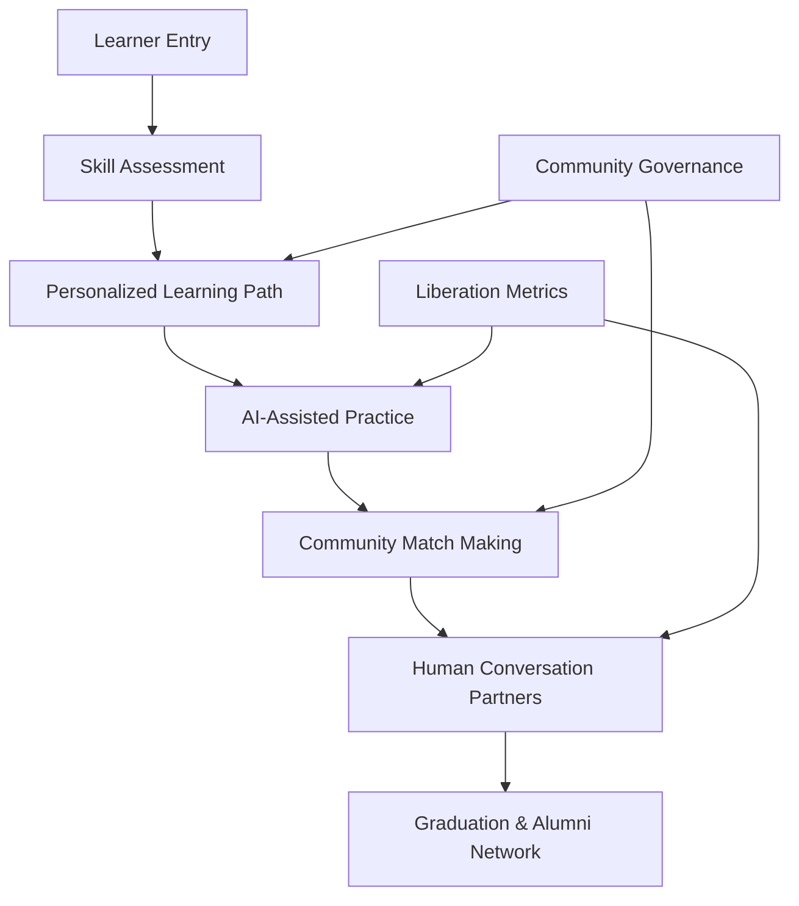
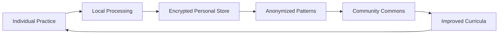

# FreeSpeak: Liberation Language Learning System Technical Specification

## Overview
FreeSpeak is a community-owned language learning AI system designed to systematically reduce its own necessity by transitioning learners from AI-assisted learning to human conversation partners. It directly exploits capitalism's "engagement maximization trap" by measuring success through user liberation rather than platform dependency.

## Classification
- **Domain:** Technical Specification
- **Source Opportunity:** [[cannae_ai_opportunities#2-the-engagement-maximization-trap]]
- **Stability:** Evolving
- **Abstraction:** Detailed
- **Confidence:** Evolving

## Strategic Foundation

### Cannae Vulnerability Exploited
Which capitalist mental model trap does this exploit?
- **Mental Model**: "Success = maximum user engagement time"
- **Vulnerability**: Cannot build tools designed to be used less over time, dismisses "completion" as a valid goal, blind to liberation through reduced dependency
- **Exploitation Strategy**: We build a system whose core metric is reducing usage over time, celebrating user "graduation" to human conversation, and strengthening real-world language communities

### Community Need Addressed
What specific community need does this serve?
- **Problem Statement**: Language learning is commodified through endless subscription apps that create dependency rather than fluency
- **Current Capitalist "Solution"**: Apps like Duolingo maximize daily active users, gamify addiction, never graduate users
- **Community Alternative**: FreeSpeak teaches language skills efficiently then connects learners to conversation partners, making itself obsolete

## System Architecture

### High-Level Architecture


### Core Components

#### Component 1: Liberation-Oriented Learning Engine
- **Purpose**: Provides personalized language instruction designed to become unnecessary
- **Anti-Capitalist Features**: 
  - Decreasing AI interaction over time
  - No gamification or addiction mechanics
  - Transparent progress toward independence
  - Community-defined "graduation" criteria
- **Technical Requirements**: 
  - Small language models fine-tuned per language pair
  - Federated learning from community corrections
  - Progressive handoff algorithms
  - Anti-addiction circuit breakers
- **Community Control Points**: 
  - Curriculum priorities
  - Graduation thresholds
  - Cultural context inclusion
  - Pacing preferences

#### Component 2: Community Conversation Matcher
- **Purpose**: Connects learners with native speakers and fellow learners for real practice
- **Anti-Capitalist Features**: 
  - Gift economy model (time banking optional)
  - No ratings or commodification of teachers
  - Focus on mutual aid and cultural exchange
  - Community vouching system
- **Technical Requirements**: 
  - Privacy-preserving matching algorithms
  - Schedule coordination system
  - Video/audio infrastructure (or integration)
  - Community moderation tools
- **Community Control Points**: 
  - Matching criteria
  - Safety protocols
  - Time banking rules (if used)
  - Cultural exchange priorities

#### Component 3: Liberation Metrics Dashboard
- **Purpose**: Tracks progress toward independence, not engagement
- **Anti-Capitalist Features**: 
  - Celebrates decreasing platform use
  - Measures real-world conversation confidence
  - Tracks community connections made
  - No vanity metrics or leaderboards
- **Technical Requirements**: 
  - Privacy-first analytics
  - Community-aggregated insights
  - Individual liberation timelines
  - Graduation certificate system
- **Community Control Points**: 
  - Metric definitions
  - Privacy settings
  - Celebration mechanisms
  - Alumni engagement

### Data Architecture

#### Data Models
```yaml
User:
  id: UUID
  languages_learning: [Language]
  liberation_stage: Stage
  community_connections: [Connection]
  practice_history: EncryptedHistory
  graduation_status: GraduationRecord

Language:
  code: ISO_CODE
  community_curriculum: CurriculumReference
  cultural_contexts: [CulturalContext]
  graduation_criteria: CommunityDefinedCriteria

Connection:
  participants: [UserID]
  language: Language
  type: [practice|cultural_exchange|mentorship]
  gift_economy_balance: Optional[TimeBank]

LiberationStage:
  - AI_DEPENDENT
  - AI_ASSISTED
  - HUMAN_PRACTICE_READY
  - OCCASIONAL_AI_REFERENCE
  - GRADUATED
```

#### Data Ownership
- **Community Data**: Language curricula, cultural contexts, graduation criteria, community guidelines
- **Individual Data**: Personal progress, conversation history (encrypted), connections made
- **Shared Commons**: Anonymized learning patterns, common mistakes database, pronunciation guides
- **Privacy Protections**: End-to-end encryption for conversations, local-first data storage, right to deletion

#### Data Flow


### Federation Architecture

#### Local Nodes
- **Purpose**: Each language community runs its own FreeSpeak instance
- **Autonomy**: Complete control over curriculum, graduation criteria, cultural content
- **Resource Requirements**: 
  - Minimum: Raspberry Pi 4 with 8GB RAM
  - Recommended: Small server with GPU for local model inference
  - Storage: 50GB for base system + language models

#### Federation Protocol
- **Interconnection**: ActivityPub-based learning record exchange
- **Shared Standards**: 
  - Common progress indicators
  - Interoperable conversation scheduling
  - Portable graduation certificates
- **Local Adaptation**: 
  - Dialect variations
  - Cultural communication styles
  - Regional vocabulary priorities
- **Conflict Resolution**: Community council model with rotating representatives

## Technical Requirements

### Functional Requirements
1. **Learning System**
   - Adaptive curriculum based on liberation timeline
   - Multi-modal input (text, speech, video)
   - Progressive reduction of AI assistance
   - Community-created lesson content
   - Anti-addiction features (usage limits, break reminders)

2. **Conversation Matching**
   - Privacy-preserving profile matching
   - Schedule coordination across time zones
   - Multiple conversation formats (text, audio, video)
   - Safety features and reporting
   - Gift economy time tracking (optional)

3. **Liberation Tracking**
   - Individual liberation timelines
   - Community aggregate progress
   - Graduation certificate generation
   - Alumni network features
   - Success story sharing (with consent)

### Non-Functional Requirements

#### Performance
- **Scale**: 10-10,000 users per community node
- **Response Time**: <100ms for lesson delivery, <1s for matching
- **Throughput**: 100 concurrent learners per node
- **Resource Usage**: <2GB RAM per active user session

#### Security & Privacy
- **Threat Model**: Protect against data harvesting, user tracking, conversation monitoring
- **Privacy Guarantees**: No behavioral tracking, encrypted conversations, local-first data
- **Community Security**: Vouching system for new members, community moderation
- **Data Sovereignty**: Full data export, no vendor lock-in, community owns all collective data

#### Resilience
- **Crisis Operation**: Offline lesson access, cached community connections
- **Fault Tolerance**: Federated nodes provide redundancy
- **Degraded Mode**: Core lessons work without internet
- **Recovery Procedures**: Community-maintained backup protocols

### Technology Stack

#### Core Technologies
- **Backend**: Rust (for efficiency and safety)
- **Frontend**: Progressive Web App with offline-first design
- **AI Models**: ONNX runtime for model portability
- **Communication**: WebRTC for peer-to-peer conversations
- **Data Storage**: SQLite for local, PostgreSQL for community data

#### Community Technology Requirements
- **Accessibility**: Works on 5-year-old smartphones
- **Maintenance**: Admin dashboard requiring basic technical skills
- **Deployment**: One-click deployment scripts
- **Updates**: Community-controlled update approval process

## Community Governance Integration

### Decision-Making Interfaces
How communities make decisions about the system:
- **Configuration Choices**: 
  - Graduation criteria thresholds
  - Time banking vs. pure gift economy
  - Conversation matching preferences
  - Cultural content priorities
- **Feature Toggles**: 
  - Enable/disable time banking
  - AI assistance levels
  - Conversation format options
  - Alumni features
- **Policy Settings**: 
  - Community guidelines
  - Safety protocols
  - Age restrictions
  - Vouching requirements
- **Evolution Votes**: 
  - Curriculum changes
  - New feature proposals
  - Federation partnerships
  - Graduation criteria updates

### Community Administration
- **User Management**: Vouching system, temporary bans, dispute resolution
- **Moderation Tools**: Conversation reporting, community review panels
- **Resource Allocation**: Server resources, model training time
- **Data Governance**: Collective data use decisions, research participation

## Integration Requirements

### Existing Systems
- **Platform Cooperatives**: Integration with Patio, Savvy Coop for worker-learners
- **Mutual Aid Networks**: Connection to local mutual aid for language exchange
- **Community Organizations**: APIs for immigrant support orgs, cultural centers
- **Alternative Economies**: Time bank integrations (TimeRepublic, hOurworld)

### Federation Standards
- **Identity**: Self-sovereign identity with community vouching
- **Reputation**: Portable graduation certificates, peer endorsements
- **Resource Sharing**: Model sharing between similar language pairs
- **Conflict Resolution**: Inter-community mediation protocols

## Implementation Phases

### Phase 1: Core Infrastructure (3 months)
- **Duration**: 12 weeks
- **Features**: 
  - Basic learning engine for one language pair
  - Simple conversation matching
  - Liberation metrics MVP
  - Community governance interface
- **Community Involvement**: Alpha testing with refugee support org
- **Success Criteria**: 50 learners reach "Human Practice Ready" stage

### Phase 2: Community Features (3 months)
- **Duration**: 12 weeks
- **Features**: 
  - Multi-language support
  - Advanced matching algorithm
  - Time banking integration
  - Alumni network
- **Community Involvement**: Three pilot communities co-design features
- **Success Criteria**: 200 learners, 20% graduation rate

### Phase 3: Federation (6 months)
- **Duration**: 24 weeks
- **Features**: 
  - Full federation protocol
  - Cross-community exchanges
  - Portable certificates
  - Model sharing system
- **Community Involvement**: Federation governance council formed
- **Success Criteria**: 5 federated nodes, 1000 total learners

## Resource Requirements

### Development Resources
- **Technical Skills**: 
  - 2 Rust developers
  - 1 ML engineer
  - 1 Frontend developer
  - 1 Community liaison
- **Time Investment**: 12 months for full system
- **Infrastructure**: Development servers, testing devices
- **Community Coordination**: Weekly community input sessions

### Deployment Resources
- **Hardware**: $200-500 per community node
- **Network**: 10Mbps minimum for video conversations
- **Technical Support**: 1 part-time admin per community
- **Training**: 2-day admin training, user onboarding materials

### Sustainability
- **Funding Model**: 
  - Initial: Grants from language preservation funds
  - Ongoing: Optional community contributions
  - No VC funding or surveillance capitalism
- **Maintenance**: Rotating community developer pool
- **Community Capacity**: Train-the-trainer programs
- **Evolution**: Quarterly community planning sessions

## Risk Assessment

### Technical Risks
- **Model Quality**: Mitigation - Start with well-supported language pairs
- **Scaling Issues**: Mitigation - Federation allows horizontal scaling
- **Device Compatibility**: Mitigation - Progressive enhancement approach

### Community Risks
- **Adoption**: Risk of preferring addictive apps - Mitigation: Partner with organizations serving language learners with real needs
- **Governance**: Risk of capture by few members - Mitigation: Rotating roles, term limits
- **Co-optation**: Risk of VC interest - Mitigation: Poison pill copyleft license
- **Sustainability**: Risk of maintainer burnout - Mitigation: Paid maintainer positions

### Political Risks
- **State Repression**: Resistance to refugee language learning - Mitigation: Distributed hosting
- **Corporate Retaliation**: Patent trolling - Mitigation: Prior art documentation
- **Infiltration**: Sabotage attempts - Mitigation: Community vouching, code review
- **Co-option**: Mission drift to engagement - Mitigation: Hard-coded liberation metrics

## Success Metrics

### Community Impact
- **Needs Met**: # of learners achieving conversational ability
- **Self-Determination**: Communities creating own curricula
- **Mutual Aid**: Hours of language exchange facilitated
- **Resistance**: Reduction in commercial app subscriptions

### Technical Success
- **Adoption**: Active learners per community
- **Performance**: Lesson delivery latency
- **Reliability**: System uptime
- **Security**: Zero data breaches

### Anti-Capitalist Success
- **Extraction Resistance**: $0 extracted from users
- **Community Control**: % decisions made democratically
- **Commons Building**: Curricula shared between communities
- **Solidarity**: Cross-cultural connections formed

### Liberation-Specific Metrics
- **Dependency Reduction**: Average decrease in AI usage over time
- **Graduation Rate**: % of learners who achieve independence
- **Time to Liberation**: Average weeks from start to graduation
- **Real-World Impact**: Learners reporting confident real conversations
- **Community Connections**: Average human connections made per learner
- **Alumni Engagement**: Graduates becoming conversation partners

## Next Steps
1. **Community Validation**: Present to immigrant support organizations for feedback
2. **Design Phase**: Create detailed UI/UX mockups with community input
3. **Resource Assembly**: Apply for grants from language preservation funds
4. **Partnership Building**: Connect with refugee resettlement agencies

## Relationships
- **Parent Nodes:**
  - [[cannae_ai_opportunities#2-the-engagement-maximization-trap]] - implements - Core strategic opportunity
- **Child Nodes:**
  - [Design document - to be created] - leads-to - Detailed interface design
- **Related Nodes:**
  - [[anti_capitalist_framework]] - applies - Framework guides all decisions
  - [[liberation_software_patterns]] - implements - Patterns for reducing dependency

## Metadata
- **Created:** 2025-07-23
- **Last Updated:** 2025-07-23
- **Updated By:** AI Development Agent
- **Community Input:** Pending - scheduled sessions with refugee support orgs

## Change History
- 2025-07-23: Initial specification based on Cannae opportunity analysis