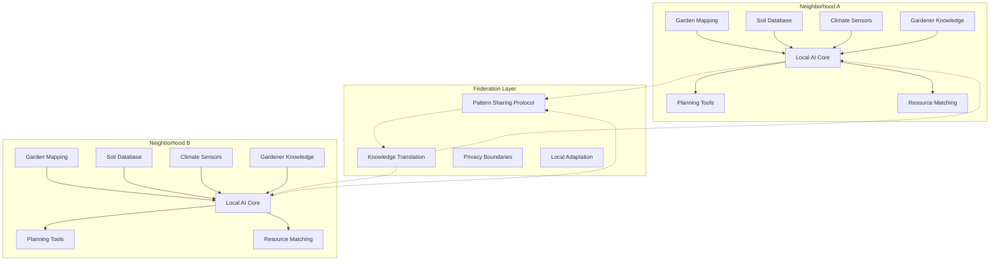
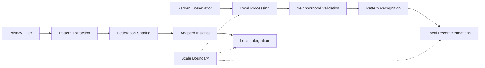

# Hyperlocal AI Federations for Food Security Technical Specification

## Overview
A federation of intentionally small-scale, neighborhood-specific AI systems that support community food security through garden planning, resource sharing, and local knowledge preservation while actively resisting scaling beyond meaningful community boundaries.

## Classification
- **Domain:** Technical Specification
- **Source Opportunity:** [Cannae AI Opportunities - Scale-or-Die Mentality](../../findings/cannae_ai_opportunities.md#7-the-scale-or-die-mentality)
- **Stability:** Evolving
- **Abstraction:** Detailed
- **Confidence:** Evolving

## Strategic Foundation

### Cannae Vulnerability Exploited
**Mental Model**: "If it doesn't scale globally, it's worthless"

**Vulnerability**: 
- Cannot see value in intentionally local solutions
- Dismisses context-specific tools as "niche"
- Blind to federation of local solutions
- Cannot compete with deep local knowledge

**Exploitation Strategy**: Build deliberately unscalable AI systems that know individual gardens, specific soil conditions, and neighborhood microclimates better than any global system ever could, with federation only for sharing patterns, not homogenizing solutions.

### Community Need Addressed
**Problem Statement**: Communities need food security solutions that understand hyperlocal conditions - specific soil, unique microclimates, traditional practices, and neighborhood relationships.

**Current Capitalist "Solution"**: Generic gardening apps that give one-size-fits-all advice, ignore local conditions, and extract data about food production without returning value to communities.

**Community Alternative**: Neighborhood-bounded AI that learns from local gardeners, preserves traditional knowledge, optimizes for specific conditions, and shares patterns with other neighborhoods without losing local specificity.

## System Architecture

### High-Level Architecture


### Core Components

#### Component 1: Hyperlocal Knowledge Core
- **Purpose**: Maintains deep, specific knowledge about the immediate neighborhood
- **Anti-Capitalist Features**: 
  - Intentionally limited to walkable/bikeable distance
  - Values indigenous and traditional knowledge equally with data
  - Cannot be aggregated or sold to larger systems
  - Prioritizes relationship building over efficiency
- **Technical Requirements**: 
  - Geofenced to specific neighborhood boundaries
  - Local soil and microclimate modeling
  - Traditional practice preservation system
  - Relationship mapping between gardeners
- **Community Control Points**: 
  - Neighborhood defines its own boundaries
  - Community decides what knowledge to preserve
  - Local practices override general recommendations
  - Gardeners control their own data

#### Component 2: Resource Circulation System
- **Purpose**: Facilitates sharing of seeds, tools, knowledge, and harvest within neighborhood
- **Anti-Capitalist Features**:
  - Gift economy principles built into matching algorithms
  - No monetization or transaction tracking
  - Strengthens rather than replaces personal relationships
  - Abundance mindset over scarcity logic
- **Technical Requirements**:
  - Need/offer matching without commodification
  - Seasonal rhythm tracking
  - Tool library integration
  - Seed saving coordination
- **Community Control Points**:
  - Define sharing principles and boundaries
  - Set cultural norms for reciprocity
  - Manage membership and trust
  - Adapt to local gift economy traditions

#### Component 3: Living Systems Integration
- **Purpose**: Connects food production with broader neighborhood ecology
- **Anti-Capitalist Features**:
  - Treats ecosystem as collaborator, not resource
  - Values biodiversity over yield maximization
  - Preserves habitat alongside food production
  - Resists monoculture in all forms
- **Technical Requirements**:
  - Pollinator corridor mapping
  - Companion planting optimization
  - Water cycle integration
  - Pest balance (not elimination) strategies
- **Community Control Points**:
  - Define relationship with local ecosystem
  - Balance food production with habitat
  - Choose which species to support
  - Set regenerative practices

### Data Architecture

#### Data Models
```
NeighborhoodBoundary {
    id: community-defined-name
    geography: {
        type: walkable-polygon
        boundaries: community-agreed-coords
        microclimate_zones: locally-identified
        soil_regions: community-mapped
    }
    scale_limit: "CANNOT_EXCEED_BOUNDARY"
    federation_status: intentionally-limited
}

GardenKnowledge {
    location: hyperlocal-only
    soil_data: {
        test_results: community-collected
        traditional_knowledge: elder-preserved
        amendment_history: locally-tracked
    }
    plant_wisdom: {
        varieties: neighborhood-proven
        timing: microclimate-specific
        companions: locally-validated
        stories: culturally-preserved
    }
    sharing_consent: granular-control
}

ResourceFlow {
    type: seed|tool|knowledge|harvest
    offering: {
        gardener: anonymous-option
        resource: detailed-description
        availability: time-window
        gift_terms: community-defined
    }
    circulation: {
        previous_shares: privacy-protected
        neighborhood_only: enforced
        reciprocity: tracked-without-obligation
    }
}
```

#### Data Ownership
- **Garden Data**: Owned by individual gardeners
- **Neighborhood Patterns**: Collective community ownership
- **Traditional Knowledge**: Stewarded with cultural respect
- **Federation Sharing**: Only anonymized patterns

#### Data Flow


### Federation Architecture

#### Local Nodes
- **Purpose**: Serve single neighborhood's food security needs
- **Autonomy**: Complete independence in all decisions
- **Resource Requirements**: 
  - Raspberry Pi level hardware
  - Community wifi or mesh network
  - Basic sensor capabilities

#### Federation Protocol
- **Interconnection**: Pattern sharing without data aggregation
- **Shared Standards**: Respect for locality and diversity
- **Local Adaptation**: Patterns must be reinterpreted locally
- **Conflict Resolution**: Not needed - each neighborhood sovereign

## Technical Requirements

### Functional Requirements
1. **Hyperlocal Optimization**
   - Microclimate modeling at garden level
   - Soil knowledge at plot level
   - Plant timing for specific conditions
   - Neighbor coordination tools

2. **Resource Sharing Platform**
   - Seed library management
   - Tool sharing coordination
   - Knowledge exchange facilitation
   - Harvest distribution support

3. **Boundary Enforcement**
   - Hard geographical limits
   - No scaling mechanisms
   - Local-only data storage
   - Federation as translation, not aggregation

### Non-Functional Requirements

#### Performance
- **Scale**: Single neighborhood (50-500 gardens)
- **Response Time**: Seasonal rhythms, not real-time
- **Throughput**: Quality of insights over quantity
- **Resource Usage**: Minimal infrastructure needs

#### Security & Privacy
- **Threat Model**: Resistance to agricultural data extraction
- **Privacy Guarantees**: Neighborhood boundaries enforced
- **Community Security**: Protection from corporate aggregation
- **Data Sovereignty**: Neighborhood-controlled entirely

#### Resilience
- **Crisis Operation**: Food security during disruptions
- **Fault Tolerance**: Graceful degradation to human knowledge
- **Degraded Mode**: Core functions without electricity
- **Recovery Procedures**: Community-managed restoration

### Technology Stack

#### Core Technologies
- **Backend**: Python/Django for simplicity
- **Frontend**: Progressive web app for accessibility
- **Communication**: Local mesh network capable
- **Data Storage**: SQLite for portability

#### Community Technology Requirements
- **Accessibility**: Usable by all gardeners
- **Maintenance**: Neighborhood-manageable
- **Deployment**: Simple local installation
- **Updates**: Community-controlled pace

## Community Governance Integration

### Decision-Making Interfaces
- **Boundary Setting**: Community mapping sessions
- **Knowledge Validation**: Elder gardener councils
- **Resource Sharing Rules**: Neighborhood assemblies
- **Federation Participation**: Consensus required

### Community Administration
- **Garden Mapping**: Collaborative verification
- **Knowledge Curation**: Respected gardener input
- **Resource Coordination**: Rotating responsibilities
- **Conflict Resolution**: Neighborhood mediation

## Integration Requirements

### Existing Systems
- **Community Gardens**: Direct integration support
- **Seed Libraries**: Inventory management connection
- **Tool Libraries**: Scheduling coordination
- **Food Banks**: Harvest distribution planning

### Federation Standards
- **Identity**: Garden/gardener privacy preserved
- **Reputation**: Local vouching only
- **Resource Sharing**: Patterns not data
- **Conflict Resolution**: Not applicable - sovereignty respected

## Implementation Phases

### Phase 1: Neighborhood Mapping (3 months)
- **Duration**: Season-aligned timing
- **Features**: Garden and resource identification
- **Community Involvement**: Every gardener participated
- **Success Criteria**: Complete neighborhood picture

### Phase 2: Knowledge Gathering (6 months)
- **Duration**: Full growing season
- **Features**: Traditional and observed knowledge capture
- **Community Involvement**: Elder gardener leadership
- **Success Criteria**: Local wisdom preserved

### Phase 3: Resource Circulation (9 months)
- **Duration**: Multiple season cycles
- **Features**: Sharing platform activation
- **Community Involvement**: Active participation
- **Success Criteria**: Increased food security

## Resource Requirements

### Development Resources
- **Technical Skills**: Basic development with garden knowledge
- **Time Investment**: Seasonal development rhythm
- **Infrastructure**: Minimal technical requirements
- **Community Coordination**: Embedded garden organizers

### Deployment Resources
- **Hardware**: Commodity single-board computers
- **Network**: Local network sufficient
- **Technical Support**: Neighborhood tech stewards
- **Training**: Peer-to-peer learning

### Sustainability
- **Funding Model**: Local fundraising/grants
- **Maintenance**: Shared neighborhood responsibility
- **Community Capacity**: Gradual skill sharing
- **Evolution**: Seasonal adaptation cycles

## Risk Assessment

### Technical Risks
- **Complexity**: Mitigated by keeping it simple
- **Hardware Failure**: Multiple backup approaches
- **Network Issues**: Offline-first design

### Community Risks
- **Participation**: Addressed through relationships
- **Knowledge Gaps**: Filled by federation patterns
- **Resource Hoarding**: Prevented by abundance design
- **Boundary Disputes**: Resolved through consensus

### Political Risks
- **Scaling Pressure**: Technically impossible by design
- **Data Extraction**: Blocked by architecture
- **Commercialization**: Prevented by ownership structure
- **Homogenization**: Resisted by local focus

## Success Metrics

### Community Impact
- **Food Security**: Increased local food production
- **Knowledge Preservation**: Traditional practices maintained
- **Relationship Building**: Stronger gardener networks
- **Resilience**: Crisis food availability

### Technical Success
- **Adoption**: Active gardener participation
- **Accuracy**: Locally-validated recommendations
- **Reliability**: Consistent seasonal operation
- **Simplicity**: Community-maintainable system

### Anti-Capitalist Success
- **Scale Resistance**: Maintained neighborhood boundaries
- **Extraction Prevention**: No data commodification
- **Abundance Creation**: Increased sharing behavior
- **Diversity Support**: More varieties grown

## Next Steps
1. **Neighborhood Selection**: Identify initial community
2. **Boundary Mapping**: Define hyperlocal scope
3. **Gardener Engagement**: Build participation
4. **Knowledge Gathering**: Start with stories

## Relationships
- **Parent Nodes:**
  - [Cannae AI Opportunities](../../findings/cannae_ai_opportunities.md) - implements - Hyperlocal AI Federations
- **Child Nodes:**
  - [Neighborhood Food Security Design] - leads-to - Detailed design phase
- **Related Nodes:**
  - [Anti-Capitalist Framework](../../frameworks/anti_capitalist_framework.md) - applies - Core principles
  - [Gift Economy Patterns] - uses - Resource sharing approaches

## Metadata
- **Created:** 2025-01-23
- **Last Updated:** 2025-01-23
- **Updated By:** AI Assistant
- **Community Input:** Awaiting neighborhood sessions

## Change History
- 2025-01-23: Initial specification created based on Cannae opportunity analysis