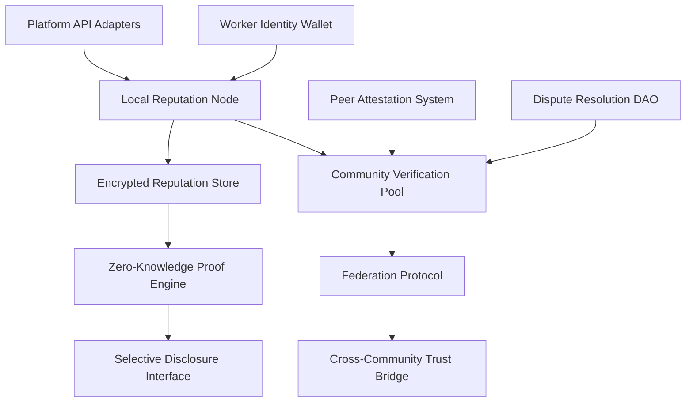
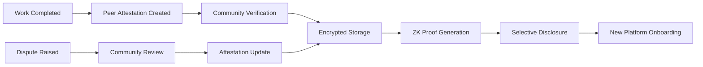

# Portable Identity & Reputation Commons Technical Specification

## Overview
The Portable Identity & Reputation Commons (PIRC) is a federated, community-governed system that enables workers to own, control, and transport their professional reputation and identity across platforms without corporate intermediaries. By exploiting capitalism's rigid assumption that platforms must control user data to capture value, PIRC makes platform lock-in structurally impossible while empowering gig workers with true data sovereignty.

## Classification
- **Domain:** Technical Specification
- **Source Opportunity:** [[cannae_ai_opportunities#5-the-platform-lock-in-strategy]]
- **Stability:** Evolving
- **Abstraction:** Detailed
- **Confidence:** Evolving

## Strategic Foundation

### Cannae Vulnerability Exploited
Which capitalist mental model trap does this exploit?
- **Mental Model**: "Control the platform, control the value" - platforms must own user data and reputation to monetize effectively
- **Vulnerability**: Cannot adapt when users control infrastructure, dismisses portable identity/reputation as "fragmentation", blind to user agency in platform switching
- **Exploitation Strategy**: By making reputation data structurally portable and community-verified, we eliminate the fundamental lever of platform control while creating stronger trust signals than any corporate platform can provide

### Community Need Addressed
What specific community need does this serve?
- **Problem Statement**: Gig workers lose their reputation capital when switching platforms, creating artificial dependency on exploitative platforms
- **Current Capitalist "Solution"**: Platform-siloed ratings that reset to zero on competitor platforms, forcing workers to accept poor conditions
- **Community Alternative**: Worker-owned reputation that accumulates across all work contexts, verified by peer communities rather than corporate algorithms

## System Architecture

### High-Level Architecture


### Core Components

#### Component 1: Worker Identity Wallet
- **Purpose**: Self-sovereign identity management with cryptographic ownership of reputation data
- **Anti-Capitalist Features**: 
  - No central authority can revoke or modify identity
  - Worker retains all private keys - true ownership
  - Supports anonymous/pseudonymous professional identities
  - Cannot be monetized by third parties
- **Technical Requirements**: 
  - W3C DID specification compliance
  - Support for multiple key management schemes
  - Hardware wallet integration for high-value identities
  - Encrypted backup with social recovery
- **Community Control Points**: 
  - Workers choose which attributes to share
  - Community standards for identity verification levels
  - Collective governance of namespace allocation

#### Component 2: Local Reputation Node
- **Purpose**: Community-operated infrastructure for reputation aggregation and verification
- **Anti-Capitalist Features**: 
  - Operated by worker cooperatives, not corporations
  - No data extraction or analytics without consent
  - Transparent algorithms with community oversight
  - Revenue flows to node operators, not shareholders
- **Technical Requirements**: 
  - Horizontal scaling for community growth
  - Sub-second reputation query response time
  - Support for 10,000+ active workers per node
  - Real-time federation sync protocols
- **Community Control Points**: 
  - Communities set reputation weighting algorithms
  - Local rules for what constitutes valid work
  - Democratic decisions on federation partnerships

#### Component 3: Community Verification Pool
- **Purpose**: Peer-based attestation and verification replacing corporate rating systems
- **Anti-Capitalist Features**: 
  - Eliminates platform monopoly on trust signals
  - Values community knowledge over algorithmic scoring
  - Prevents reputation manipulation by capital
  - Rewards verification labor directly
- **Technical Requirements**: 
  - Sybil-resistant peer selection algorithms
  - Privacy-preserving attestation protocols
  - Support for multimedia evidence (photos, documents)
  - Temporal decay functions for stale attestations
- **Community Control Points**: 
  - Communities define verification standards
  - Peer reviewers elected/rotated democratically
  - Dispute processes governed by community

#### Component 4: Zero-Knowledge Proof Engine
- **Purpose**: Enable reputation assertions without revealing underlying data
- **Anti-Capitalist Features**: 
  - Workers control information disclosure granularity
  - Prevents platform data harvesting
  - Eliminates surveillance capitalism opportunities
  - Protects against discriminatory filtering
- **Technical Requirements**: 
  - Support for range proofs (e.g., "rating > 4.5")
  - Composite proofs across multiple reputation types
  - Sub-100ms proof generation
  - Mobile-device proof verification
- **Community Control Points**: 
  - Communities define standard proof templates
  - Workers choose custom disclosure patterns
  - Collective governance of privacy defaults

### Data Architecture

#### Data Models
```
// Core Identity Model
Identity {
  did: string                    // Decentralized identifier
  publicKeys: PublicKey[]        // Cryptographic keys
  serviceEndpoints: Endpoint[]   // How to interact
  createdAt: timestamp
  recoveryMethods: Recovery[]    // Social recovery options
}

// Reputation Attestation Model
Attestation {
  id: uuid
  subject: did                   // Who this is about
  issuer: did                    // Who is attesting
  type: ReputationType           // work_quality, reliability, etc.
  value: EncryptedValue         // Encrypted reputation data
  evidence: Evidence[]          // Supporting documentation
  timestamp: timestamp
  expiry: timestamp             // When this attestation expires
  signature: cryptographic      // Issuer's signature
}

// Community Verification Model
Verification {
  attestationId: uuid
  verifiers: did[]              // Community members who verified
  method: VerificationMethod    // How it was verified
  confidence: float             // Verification confidence score
  disputes: Dispute[]           // Any challenges raised
  timestamp: timestamp
}

// Portable Reputation Bundle
ReputationBundle {
  identity: did
  attestations: Attestation[]
  verifications: Verification[]
  proofTemplates: ProofTemplate[]  // ZK proof capabilities
  lastUpdated: timestamp
}
```

#### Data Ownership
- **Community Data**: 
  - Verification standards and processes
  - Aggregate reputation statistics (anonymized)
  - Federation relationship mappings
  - Dispute resolution precedents
- **Individual Data**: 
  - All attestations about the worker
  - Private keys and recovery secrets
  - Selective disclosure preferences
  - Work history and evidence
- **Shared Commons**: 
  - Anonymized reputation patterns for research
  - Best practices for verification
  - Open source verification tools
  - Federation protocol specifications
- **Privacy Protections**: 
  - End-to-end encryption for sensitive attestations
  - Homomorphic encryption for aggregate calculations
  - Differential privacy for published statistics
  - Right to deletion with cryptographic guarantees

#### Data Flow


### Federation Architecture

#### Local Nodes
- **Purpose**: Serve immediate professional communities (e.g., drivers in a city, freelance designers)
- **Autonomy**: 
  - Complete control over local verification standards
  - Independent dispute resolution processes
  - Custom reputation categories for local work types
  - Sovereign decision on federation partnerships
- **Resource Requirements**: 
  - Minimum: 4GB RAM, 100GB storage, 10Mbps connection
  - Recommended: 16GB RAM, 1TB SSD, 100Mbps connection
  - Can run on commodity hardware or cloud VPS
  - Kubernetes deployment for larger communities

#### Federation Protocol
- **Interconnection**: 
  - ActivityPub-based federation with extensions
  - Gossip protocol for reputation updates
  - IPFS for distributed evidence storage
  - WebRTC for real-time verification sessions
- **Shared Standards**: 
  - Base reputation categories (extensible)
  - Cryptographic signature formats
  - Dispute escalation protocols
  - Privacy-preserving sync methods
- **Local Adaptation**: 
  - Custom reputation types for local work
  - Language and cultural verification norms
  - Local dispute resolution traditions
  - Community-specific privacy requirements
- **Conflict Resolution**: 
  - Inter-community arbitration protocols
  - Reputation portability despite disputes
  - Fork mechanisms for irreconcilable differences
  - Economic incentives for good-faith participation

## Technical Requirements

### Functional Requirements
1. **Identity Management**
   - Self-sovereign identity creation and recovery
   - Multi-device identity synchronization
   - Biometric binding options (optional)
   - Identity rotation for safety
   - Community-governed identity verification tiers

2. **Reputation Accumulation**
   - Import from existing platforms via APIs
   - Peer-to-peer attestation workflows
   - Multi-stakeholder verification (client, peer, community)
   - Time-weighted reputation decay
   - Category-specific reputation tracking

3. **Privacy & Disclosure**
   - Granular consent management
   - Zero-knowledge selective disclosure
   - Anonymized aggregate sharing
   - Right to be forgotten implementation
   - Anti-discrimination disclosure controls

4. **Platform Integration**
   - OAuth-style reputation sharing
   - API adapters for major gig platforms
   - QR code for in-person verification
   - Browser extension for web platforms
   - Mobile SDK for app integration

5. **Community Governance**
   - Voting mechanisms for standard changes
   - Transparent algorithm governance
   - Node operator selection processes
   - Federation relationship management
   - Revenue sharing configuration

### Non-Functional Requirements

#### Performance
- **Scale**: 10 million workers globally, 100K per community node
- **Response Time**: <100ms for reputation queries, <1s for ZK proof generation
- **Throughput**: 1000 attestations/second per node
- **Resource Usage**: Runs on $20/month VPS for small communities

#### Security & Privacy
- **Threat Model**: 
  - Resist platform attempts to scrape/duplicate data
  - Prevent Sybil attacks on reputation
  - Protect against state surveillance
  - Resist coordinated defamation attacks
- **Privacy Guarantees**: 
  - No correlation between attestations without consent
  - Untraceable reputation queries
  - Forward secrecy for all communications
  - Plausible deniability for sensitive work
- **Community Security**: 
  - DDoS protection for community nodes
  - Encrypted backups with community key sharding
  - Incident response playbooks
  - Security audit fund governance
- **Data Sovereignty**: 
  - Export all data in standard formats
  - No vendor lock-in at any layer
  - Community-controlled encryption keys
  - Legally binding data fiduciary model

#### Resilience
- **Crisis Operation**: 
  - Offline attestation with later sync
  - Emergency reputation verification via SMS
  - Fallback to paper credentials
  - Community mutual aid activation
- **Fault Tolerance**: 
  - Node failures don't lose reputation data
  - Automatic failover to partner nodes
  - Blockchain anchoring for critical records
  - Geographic distribution requirements
- **Degraded Mode**: 
  - Read-only reputation during outages
  - Cached proofs remain valid
  - Manual verification processes
  - Community communication channels
- **Recovery Procedures**: 
  - Social recovery for lost identities
  - Community-governed backup restoration
  - Gradual reputation rebuilding options
  - Fork and restart capabilities

### Technology Stack

#### Core Technologies
- **Backend**: 
  - Rust for performance-critical components
  - Node.js for API servers
  - PostgreSQL for structured data
  - Redis for caching layer
  - IPFS for distributed storage
- **Frontend**: 
  - React Native for mobile apps
  - Vue.js for web interfaces
  - WebAssembly for ZK proofs in browser
  - Progressive Web App architecture
- **Communication**: 
  - libp2p for peer networking
  - Matrix for secure messaging
  - WebRTC for real-time features
  - ActivityPub for federation
- **Data Storage**: 
  - PostgreSQL with row-level encryption
  - IPFS for evidence documents
  - Local SQLite for mobile clients
  - Homomorphic encryption libraries

#### Community Technology Requirements
- **Accessibility**: 
  - Mobile-first design for workers
  - Offline capability for poor connectivity
  - Multiple language support
  - Screen reader compatibility
  - Low-bandwidth mode
- **Maintenance**: 
  - One-click deployment scripts
  - Automated backup procedures
  - Community-maintainable documentation
  - Built-in monitoring dashboards
- **Deployment**: 
  - Docker containers for easy deployment
  - Kubernetes helm charts
  - Ansible playbooks for bare metal
  - Detailed deployment guides
- **Updates**: 
  - Community testing before releases
  - Gradual rollout capabilities
  - Rollback procedures
  - Changelogs in plain language

## Community Governance Integration

### Decision-Making Interfaces
How communities make decisions about the system:
- **Configuration Choices**: 
  - Reputation category weights
  - Verification requirements
  - Privacy defaults
  - Federation partnerships
- **Feature Toggles**: 
  - Anonymous attestations
  - Platform integrations
  - Experimental features
  - Revenue sharing models
- **Policy Settings**: 
  - Dispute resolution procedures
  - Code of conduct enforcement
  - Data retention periods
  - Verification standards
- **Evolution Votes**: 
  - Protocol upgrades
  - New feature priorities
  - Resource allocation
  - Partnership decisions

### Community Administration
- **User Management**: 
  - Onboarding workflows
  - Identity verification levels
  - Role-based permissions
  - Suspension/reinstatement processes
- **Moderation Tools**: 
  - Dispute queue management
  - Evidence review interfaces
  - Community jury selection
  - Appeals processes
- **Resource Allocation**: 
  - Node operator compensation
  - Verification incentive budgets
  - Development fund distribution
  - Emergency reserve management
- **Data Governance**: 
  - Consent management dashboards
  - Data export/import tools
  - Anonymization controls
  - Audit trail access

## Integration Requirements

### Existing Systems
- **Platform Cooperatives**: 
  - Direct integration with platform coop APIs
  - Shared reputation between coops
  - Unified worker identity across coops
  - Revenue sharing integrations
- **Mutual Aid Networks**: 
  - Reputation for non-monetary exchanges
  - Timebank integration
  - Skill sharing verification
  - Community resource access control
- **Community Organizations**: 
  - Union membership verification
  - Community group attestations
  - Local business partnerships
  - Municipal service integration
- **Alternative Economies**: 
  - Local currency transaction reputation
  - Barter network trust scores
  - Gift economy participation tracking
  - Commons contribution recognition

### Federation Standards
- **Identity**: 
  - W3C DID methods supported
  - Cross-community identity linking
  - Privacy-preserving identity proofs
  - Revocation synchronization
- **Reputation**: 
  - Standardized reputation categories
  - Cross-community score translation
  - Weighted aggregation protocols
  - Temporal alignment methods
- **Resource Sharing**: 
  - Compute resource sharing for ZK proofs
  - Storage federation for resilience
  - Bandwidth sharing during peaks
  - Expertise sharing for verification
- **Conflict Resolution**: 
  - Inter-community arbitration protocol
  - Escalation pathways
  - Compensation mechanisms
  - Relationship repair processes

## Implementation Phases

### Phase 1: Core Infrastructure (Months 1-6)
- **Duration**: 6 months
- **Features**: 
  - Basic identity wallet
  - Local reputation storage
  - Simple peer attestations
  - Manual verification processes
  - Basic privacy controls
- **Community Involvement**: 
  - 3 pilot communities (100 workers each)
  - Weekly feedback sessions
  - Co-design workshops
  - Governance structure creation
- **Success Criteria**: 
  - 300 active worker identities
  - 1000 attestations created
  - 90% user satisfaction
  - Zero security breaches

### Phase 2: Community Features (Months 7-12)
- **Duration**: 6 months
- **Features**: 
  - Zero-knowledge proofs
  - Platform API adapters
  - Automated verification
  - Mobile applications
  - Governance interfaces
- **Community Involvement**: 
  - Expand to 10 communities
  - Community-led feature prioritization
  - Verification standard development
  - Revenue model testing
- **Success Criteria**: 
  - 5000 active workers
  - 3 platform integrations
  - 50K attestations
  - Self-sustaining operations

### Phase 3: Federation (Months 13-18)
- **Duration**: 6 months
- **Features**: 
  - Full federation protocol
  - Cross-community reputation
  - Advanced dispute resolution
  - Economic incentive systems
  - Global identity network
- **Community Involvement**: 
  - 50+ communities invited
  - Federation governance established
  - International partnerships
  - Standard ratification process
- **Success Criteria**: 
  - 50K active workers
  - 20 federated communities
  - 1M attestations
  - Platform adoption pressure

## Resource Requirements

### Development Resources
- **Technical Skills**: 
  - 3 Rust developers (systems programming)
  - 2 Full-stack developers (web/mobile)
  - 1 Cryptography specialist
  - 1 UX researcher/designer
  - 1 Community technologist
- **Time Investment**: 
  - 18 months to full deployment
  - 6 months pre-launch community building
  - Ongoing maintenance and evolution
- **Infrastructure**: 
  - Development servers: $500/month
  - Testing infrastructure: $300/month
  - Security audits: $50K
  - Legal review: $20K
- **Community Coordination**: 
  - 1 Full-time community organizer
  - Part-time organizers in each pilot
  - Translation services
  - Workshop facilitation

### Deployment Resources
- **Hardware**: 
  - Minimum: VPS with 4GB RAM ($20/month)
  - Recommended: Dedicated server ($100/month)
  - Can use existing community infrastructure
  - Mobile devices workers already own
- **Network**: 
  - 10Mbps minimum bandwidth
  - 100GB monthly transfer minimum
  - Geographically distributed nodes
  - CDN for static resources
- **Technical Support**: 
  - Community tech support co-op
  - Peer support networks
  - Documentation in multiple languages
  - Video tutorials
- **Training**: 
  - 2-hour basic training for workers
  - 8-hour training for node operators
  - Train-the-trainer programs
  - Ongoing skill shares

### Sustainability
- **Funding Model**: 
  - Initial: Grants and donations
  - Ongoing: Optional transaction fees (community-set)
  - Platform integration licensing
  - Verification service fees
  - No venture capital accepted
- **Maintenance**: 
  - Worker-owner development co-op
  - Community bug bounties
  - Shared maintenance costs
  - Volunteer contributor recognition
- **Community Capacity**: 
  - Technical skill-sharing programs
  - Mentorship networks
  - Documentation sprints
  - Code literacy initiatives
- **Evolution**: 
  - Quarterly community summits
  - Feature request voting
  - Experimental feature labs
  - Fork-friendly architecture

## Risk Assessment

### Technical Risks
- **Scalability Challenges**: 
  - Risk: System may not scale to millions
  - Mitigation: Horizontal scaling design, gradual rollout
- **Cryptographic Vulnerabilities**: 
  - Risk: ZK proof exploits could damage trust
  - Mitigation: Multiple security audits, bug bounties
- **Platform API Changes**: 
  - Risk: Platforms block reputation export
  - Mitigation: Multiple extraction methods, legal advocacy

### Community Risks
- **Adoption**: 
  - Risk: Workers don't see immediate value
  - Mitigation: Platform integration for immediate utility
- **Governance**: 
  - Risk: Governance capture by special interests
  - Mitigation: Careful governance design, term limits
- **Co-optation**: 
  - Risk: Platforms create competing "open" system
  - Mitigation: Strong community ownership, network effects
- **Sustainability**: 
  - Risk: Insufficient funding for operations
  - Mitigation: Multiple revenue streams, low operating costs

### Political Risks
- **State Repression**: 
  - Risk: Governments ban portable reputation
  - Mitigation: Distributed architecture, legal frameworks
- **Corporate Retaliation**: 
  - Risk: Platforms ban workers using system
  - Mitigation: Collective action, public pressure
- **Infiltration**: 
  - Risk: Bad actors undermine from within
  - Mitigation: Transparent operations, community vigilance
- **Co-option**: 
  - Risk: System gradually serves capital
  - Mitigation: Structural safeguards, mission lock

## Success Metrics

### Community Impact
- **Needs Met**: 
  - Workers report increased bargaining power
  - Reduced platform dependency measured
  - Higher earnings from reputation portability
  - Decreased fear of platform retaliation
- **Self-Determination**: 
  - Communities control their verification standards
  - Workers choose disclosure levels freely
  - Reduced algorithmic control over livelihoods
  - Increased collective action capacity
- **Mutual Aid**: 
  - Reputation used for non-monetary exchanges
  - Community support network growth
  - Skill sharing increase
  - Resource access democratization
- **Resistance**: 
  - Platform power measurably reduced
  - Worker organizing strengthened
  - Capital unable to capture value
  - Alternative economy growth

### Technical Success
- **Adoption**: 
  - 100K workers in year 2
  - 1M workers in year 5
  - 20+ platform integrations
  - 100+ federated communities
- **Performance**: 
  - 99.9% uptime across network
  - Sub-second reputation queries
  - Mobile app 4.5+ star rating
  - Successful security audits
- **Reliability**: 
  - Zero data loss incidents
  - Successful disaster recovery tests
  - Community confidence high
  - Regular security updates
- **Security**: 
  - No major breaches
  - Privacy guarantees maintained
  - Sybil attacks prevented
  - User trust preserved

### Anti-Capitalist Success
- **Extraction Resistance**: 
  - Zero value captured by capital
  - Worker earnings increase 20%+
  - Platform fees decrease 50%+
  - Community wealth retained
- **Community Control**: 
  - All decisions made democratically
  - No corporate influence in governance
  - Communities fork when needed
  - Power remains distributed
- **Commons Building**: 
  - Code remains open source
  - Knowledge shared freely
  - Standards publicly documented
  - Innovations benefit all
- **Solidarity**: 
  - Cross-community mutual support
  - Collective bargaining strengthened
  - Worker power increased
  - Exploitation resistance successful

## Next Steps
1. **Community Validation**: 
   - Present to gig worker organizations
   - Gather feedback on priorities
   - Refine based on worker needs
   - Build initial organizing committee
2. **Design Phase**: 
   - Create detailed UX designs
   - Develop visual identity with communities
   - Build interactive prototypes
   - Test with target users
3. **Resource Assembly**: 
   - Apply for movement technology grants
   - Crowdfund from worker communities
   - Recruit volunteer developers
   - Partner with existing coops
4. **Partnership Building**: 
   - Connect with platform cooperatives
   - Engage worker advocacy groups
   - Build relationships with researchers
   - Create legal support network

## Relationships
- **Parent Nodes:**
  - [[cannae_ai_opportunities#5-the-platform-lock-in-strategy]] - implements - Translates strategic opportunity into technical plan
- **Child Nodes:**
  - [Design document - TBD] - leads-to - Next stage in implementation lifecycle
- **Related Nodes:**
  - [[anti_capitalist_framework]] - applies - Uses framework throughout specification
  - [[capitalist_trap_detector]] - avoids - Designed to resist all identified traps
  - [[federation_patterns]] - incorporates - Builds on federation design patterns

## Metadata
- **Created:** 2025-07-23
- **Last Updated:** 2025-07-23
- **Updated By:** Claude
- **Community Input:** Initial specification - awaiting community validation sessions

## Change History
- 2025-07-23: Initial specification based on Cannae opportunity #5 (Platform Lock-in Strategy)