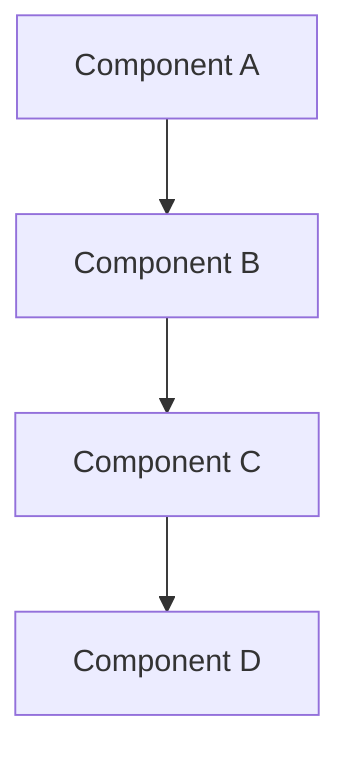
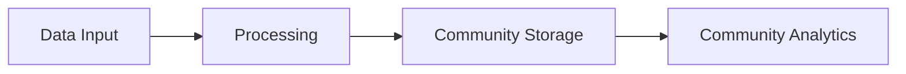

# [Project Name] Technical Specification

## Overview
Brief description of the project and its strategic importance in exploiting capitalist mental model vulnerabilities.

## Classification
- **Domain:** Technical Specification
- **Source Opportunity:** [Link to strategic opportunity document]
- **Stability:** Evolving
- **Abstraction:** Detailed
- **Confidence:** [Established/Evolving/Speculative]

## Strategic Foundation

### Cannae Vulnerability Exploited
Which capitalist mental model trap does this exploit?
- **Mental Model**: [The rigid capitalist assumption]
- **Vulnerability**: [How this creates blind spots]
- **Exploitation Strategy**: [How our approach turns their strength into weakness]

### Community Need Addressed
What specific community need does this serve?
- **Problem Statement**: [Community-defined problem]
- **Current Capitalist "Solution"**: [How capitalism fails to address this]
- **Community Alternative**: [How our approach serves the need better]

## System Architecture

### High-Level Architecture


### Core Components

#### Component 1: [Name]
- **Purpose**: [What this component does]
- **Anti-Capitalist Features**: [How this prevents extraction/commodification]
- **Technical Requirements**: [Specific tech specs]
- **Community Control Points**: [Where communities have control]

#### Component 2: [Name]
- **Purpose**: [What this component does]
- **Anti-Capitalist Features**: [How this prevents extraction/commodification]
- **Technical Requirements**: [Specific tech specs]
- **Community Control Points**: [Where communities have control]

### Data Architecture

#### Data Models
```
[Database schema or data structure definitions]
```

#### Data Ownership
- **Community Data**: [What data belongs to communities]
- **Individual Data**: [What data belongs to individuals]
- **Shared Commons**: [What data benefits from sharing]
- **Privacy Protections**: [How privacy is technically enforced]

#### Data Flow


### Federation Architecture

#### Local Nodes
- **Purpose**: [How local instances serve immediate communities]
- **Autonomy**: [What decisions each node controls]
- **Resource Requirements**: [Technical needs for local deployment]

#### Federation Protocol
- **Interconnection**: [How nodes communicate]
- **Shared Standards**: [What must be compatible]
- **Local Adaptation**: [What can vary by community]
- **Conflict Resolution**: [How federation disputes are handled]

## Technical Requirements

### Functional Requirements
1. **[Requirement Category]**
   - [Specific requirement 1]
   - [Specific requirement 2]
   - [Community governance integration requirement]

2. **[Requirement Category]**
   - [Specific requirement 1]
   - [Specific requirement 2]
   - [Anti-extraction safeguard requirement]

### Non-Functional Requirements

#### Performance
- **Scale**: [Expected user/community scale]
- **Response Time**: [Performance requirements]
- **Throughput**: [Volume requirements]
- **Resource Usage**: [Hardware/network requirements]

#### Security & Privacy
- **Threat Model**: [What attacks this must resist]
- **Privacy Guarantees**: [What privacy protections are built-in]
- **Community Security**: [How communities are protected]
- **Data Sovereignty**: [How communities control their data]

#### Resilience
- **Crisis Operation**: [How this works during emergencies]
- **Fault Tolerance**: [How this handles failures]
- **Degraded Mode**: [What works when parts fail]
- **Recovery Procedures**: [How communities restore service]

### Technology Stack

#### Core Technologies
- **Backend**: [Language, framework, database]
- **Frontend**: [Framework, libraries]
- **Communication**: [Protocols, networking]
- **Data Storage**: [Database, file systems]

#### Community Technology Requirements
- **Accessibility**: [How this works for diverse technical capacity]
- **Maintenance**: [What technical skills communities need]
- **Deployment**: [How communities can self-host]
- **Updates**: [How communities control software evolution]

## Community Governance Integration

### Decision-Making Interfaces
How communities make decisions about the system:
- **Configuration Choices**: [What communities can configure]
- **Feature Toggles**: [What functionality communities can enable/disable]
- **Policy Settings**: [What behavioral rules communities set]
- **Evolution Votes**: [How communities decide on changes]

### Community Administration
- **User Management**: [How communities manage membership]
- **Moderation Tools**: [How communities handle conflicts]
- **Resource Allocation**: [How communities manage system resources]
- **Data Governance**: [How communities control data use]

## Integration Requirements

### Existing Systems
- **Platform Cooperatives**: [How this integrates with existing coops]
- **Mutual Aid Networks**: [How this supports existing mutual aid]
- **Community Organizations**: [How this serves existing groups]
- **Alternative Economies**: [How this connects with time banks, etc.]

### Federation Standards
- **Identity**: [How identity works across communities]
- **Reputation**: [How reputation travels between communities]
- **Resource Sharing**: [How communities share with each other]
- **Conflict Resolution**: [How inter-community disputes are handled]

## Implementation Phases

### Phase 1: Core Infrastructure
- **Duration**: [Estimated timeline]
- **Features**: [Minimal viable features]
- **Community Involvement**: [How communities participate in phase 1]
- **Success Criteria**: [How we know phase 1 succeeded]

### Phase 2: Community Features
- **Duration**: [Estimated timeline]
- **Features**: [Community-specific functionality]
- **Community Involvement**: [How communities shape phase 2]
- **Success Criteria**: [How we know phase 2 succeeded]

### Phase 3: Federation
- **Duration**: [Estimated timeline]
- **Features**: [Inter-community functionality]
- **Community Involvement**: [How communities decide on federation]
- **Success Criteria**: [How we know phase 3 succeeded]

## Resource Requirements

### Development Resources
- **Technical Skills**: [What expertise is needed]
- **Time Investment**: [Estimated development time]
- **Infrastructure**: [Development infrastructure needs]
- **Community Coordination**: [Community engagement requirements]

### Deployment Resources
- **Hardware**: [What communities need to run this]
- **Network**: [Connectivity requirements]
- **Technical Support**: [What ongoing technical help is needed]
- **Training**: [What communities need to learn]

### Sustainability
- **Funding Model**: [How this is funded without extraction]
- **Maintenance**: [How ongoing development is sustained]
- **Community Capacity**: [How communities build needed skills]
- **Evolution**: [How this adapts to changing needs]

## Risk Assessment

### Technical Risks
- **[Risk Category]**: [Specific risks and mitigation strategies]
- **[Risk Category]**: [Specific risks and mitigation strategies]

### Community Risks
- **Adoption**: [Risks to community adoption and mitigation]
- **Governance**: [Risks to democratic governance and mitigation]
- **Co-optation**: [Risks of capitalist capture and mitigation]
- **Sustainability**: [Risks to long-term viability and mitigation]

### Political Risks
- **State Repression**: [How this resists government interference]
- **Corporate Retaliation**: [How this handles corporate attacks]
- **Infiltration**: [How this prevents sabotage]
- **Co-option**: [How this prevents mission drift]

## Success Metrics

### Community Impact
- **Needs Met**: [How we measure community needs being served]
- **Self-Determination**: [How we measure increased community autonomy]
- **Mutual Aid**: [How we measure strengthened mutual aid]
- **Resistance**: [How we measure reduced dependence on capitalist systems]

### Technical Success
- **Adoption**: [Technical metrics for successful adoption]
- **Performance**: [Technical performance indicators]
- **Reliability**: [System reliability metrics]
- **Security**: [Security and privacy success indicators]

### Anti-Capitalist Success
- **Extraction Resistance**: [How we measure prevention of value extraction]
- **Community Control**: [How we measure democratic governance]
- **Commons Building**: [How we measure contribution to commons]
- **Solidarity**: [How we measure strengthened mutual support]

## Next Steps
1. **Community Validation**: [How to validate this spec with affected communities]
2. **Design Phase**: [Transition to design document development]
3. **Resource Assembly**: [How to gather needed resources]
4. **Partnership Building**: [What collaborations are needed]

## Relationships
- **Parent Nodes:**
  - [Strategic opportunity document] - implements - Translates strategic opportunity into technical plan
- **Child Nodes:**
  - [Design document] - leads-to - Next stage in implementation lifecycle
- **Related Nodes:**
  - [Anti-capitalist framework] - applies - Uses framework throughout specification
  - [Community case studies] - informs - Learning from existing community technology

## Metadata
- **Created:** [Date]
- **Last Updated:** [Date]
- **Updated By:** [Role/Agent]
- **Community Input:** [Record of community input sessions]

## Change History
- [Date]: Initial specification based on strategic opportunity
- [Date]: Updated based on community feedback
- [Date]: Revised based on technical feasibility assessment