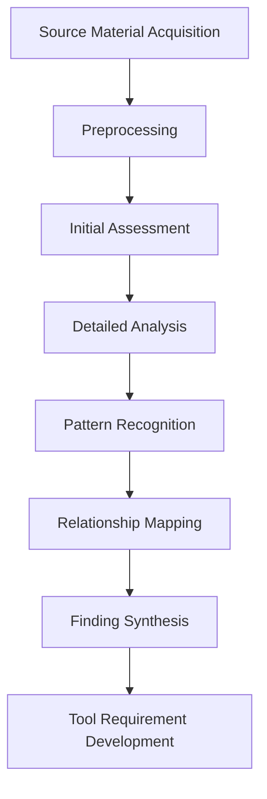

# Analysis Approach

## Purpose
This document outlines the overall methodology and approach for analyzing source materials in this project.

## Classification
- **Domain:** Core Concept
- **Source Type:** N/A (Methodology)
- **Analysis Stage:** N/A (Methodology)
- **Stability:** Semi-stable
- **Abstraction:** Conceptual
- **Confidence:** Established
- **Relevance:** Critical

## Content

### Analysis Philosophy

[Describe the fundamental philosophy guiding the analysis approach, such as:
- Whether the analysis is exploratory or hypothesis-driven
- If the approach is bottom-up (data-driven) or top-down (theory-driven)
- The balance between quantitative and qualitative methods
- The role of human judgment versus automated analysis]

### General Analysis Workflow

1. **Source Material Acquisition**: [Description of how source materials are identified and acquired]
2. **Preprocessing**: [Description of how materials are prepared for analysis]
3. **Initial Assessment**: [Description of the first-pass review to identify key elements]
4. **Detailed Analysis**: [Description of the in-depth analysis process]
5. **Pattern Recognition**: [Description of how patterns are identified across materials]
6. **Relationship Mapping**: [Description of how relationships between entities are established]
7. **Finding Synthesis**: [Description of how findings are synthesized from the analysis]
8. **Tool Requirement Development**: [Description of how tool requirements are derived from findings]

### Analysis Frameworks

The project employs the following analysis frameworks:

1. **[Framework Name]**
   - **Purpose**: [Brief description of what this framework helps analyze]
   - **When to Use**: [Conditions under which this framework is most applicable]
   - **Key Components**: [Main elements of the framework]

2. **[Framework Name]**
   - **Purpose**: [Brief description of what this framework helps analyze]
   - **When to Use**: [Conditions under which this framework is most applicable]
   - **Key Components**: [Main elements of the framework]

### Analysis Tools and Techniques

[Description of key tools and techniques used in the analysis process, such as:
- Text analysis tools
- Pattern recognition algorithms
- Visualization techniques
- Collaborative analysis methods
- LLM-assisted analysis approaches]

### Quality Assurance

[Description of methods used to ensure analysis quality, such as:
- Validation procedures
- Cross-checking methods
- Peer review processes
- Confidence assessment frameworks]

### Ethical Considerations

[Description of ethical considerations in the analysis process, such as:
- Privacy and confidentiality
- Bias mitigation
- Transparency in methods
- Responsible use of findings]

## Relationships
- **Parent Nodes:** 
  - [foundation/project_definition.md] - defines - Project goals that guide analysis approach
- **Child Nodes:** 
  - [processes/analysis.md] - implements - Detailed procedures for this approach
  - [processes/ingestion.md] - details - Specific steps for source material acquisition
  - [processes/synthesis.md] - details - Specific steps for finding synthesis
- **Related Nodes:** 
  - [foundation/principles.md] - guides - Principles that inform analysis approach
  - [analysis/frameworks/] - implements - Specific frameworks used in analysis
  - [tools/requirements/] - derives-from - Tool needs based on analysis approach

## Navigation Guidance
- **Access Context:** Use this document when planning a new analysis project or onboarding new team members
- **Common Next Steps:** After reviewing this approach, typically explore processes/analysis.md for detailed procedures
- **Related Tasks:** Analysis planning, methodology selection, process development
- **Update Patterns:** This document should be updated when there are significant changes to the analysis methodology

## Metadata
- **Created:** [Date]
- **Last Updated:** [Date]
- **Updated By:** [Role/Agent]

## Change History
- [Date]: Initial creation of analysis approach document
