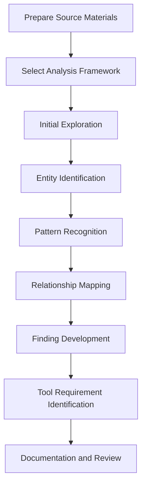

# Analysis Process

## Purpose
This document outlines the process for analyzing source materials to extract insights, identify patterns, and develop findings.

## Classification
- **Domain:** Process
- **Source Type:** Mixed
- **Analysis Stage:** All
- **Stability:** Semi-stable
- **Abstraction:** Structural
- **Confidence:** Established
- **Relevance:** Critical

## Content

### Overview

The analysis process provides a structured approach to examining source materials, identifying patterns and entities, mapping relationships, and synthesizing findings. This process ensures consistency, thoroughness, and traceability in the analysis.

### Step 1: Prepare Source Materials

Before beginning analysis:

1. Ensure all source materials are properly ingested following the process in `processes/ingestion.md`
2. Verify that necessary preprocessing has been completed
3. Review the source material inventory to understand the scope of materials
4. Identify any gaps in the source materials that might affect the analysis
5. Prepare analysis tools and environments needed for the specific material types

### Step 2: Select Analysis Framework

Choose appropriate analysis frameworks:

1. Review available frameworks in `analysis/frameworks/`
2. Consider the source material types and analysis goals
3. Select one or more frameworks that align with the analysis objectives
4. Adapt frameworks as needed for the specific context
5. Document the selected frameworks and any adaptations

### Step 3: Initial Exploration

Conduct an initial exploration of the source materials:

1. Perform a high-level review of all materials to understand their content and structure
2. Identify key themes, concepts, and potential areas of interest
3. Note initial observations and questions
4. Develop preliminary hypotheses to guide further analysis
5. Create a plan for more detailed analysis based on initial findings

### Step 4: Entity Identification

Identify and document entities within the source materials:

1. Apply the selected framework(s) to identify significant entities
2. Document each entity using the template in `analysis/entities/entity_template.md`
3. Capture key properties, instances, and behaviors of each entity
4. Assign appropriate identifiers and classifications
5. Cross-reference entities across different source materials

### Step 5: Pattern Recognition

Identify and document patterns within the source materials:

1. Look for recurring structures, behaviors, or characteristics
2. Document each pattern using the template in `analysis/patterns/pattern_template.md`
3. Provide multiple examples of each pattern from different contexts
4. Analyze the significance and implications of each pattern
5. Note variations and adaptations of patterns across different contexts

### Step 6: Relationship Mapping

Identify and document relationships between entities:

1. Analyze how entities interact, depend on, or relate to each other
2. Document each relationship using the template in `analysis/relationships/relationship_template.md`
3. Classify relationships by type, strength, and directionality
4. Provide examples of each relationship from the source materials
5. Create visual maps of complex relationship networks when helpful

### Step 7: Finding Development

Synthesize insights into coherent findings:

1. Integrate observations from entities, patterns, and relationships
2. Develop findings that address key analysis questions
3. Document each finding using the template in `analysis/findings/finding_template.md`
4. Assess the confidence level for each finding based on supporting evidence
5. Identify implications and next steps for each finding

### Step 8: Tool Requirement Identification

Identify requirements for tools based on analysis:

1. Consider how findings might inform tool development
2. Identify opportunities for automation, visualization, or analysis support
3. Document tool requirements using the template in `tools/requirements/requirement_template.md`
4. Prioritize requirements based on potential impact and feasibility
5. Link requirements to specific findings and evidence

### Step 9: Documentation and Review

Finalize analysis documentation and conduct review:

1. Ensure all entities, patterns, relationships, and findings are properly documented
2. Verify that all relationships between documents are bidirectional
3. Review the analysis for completeness, consistency, and quality
4. Identify any gaps or areas requiring further investigation
5. Update the meta/updates.md file with a summary of the analysis work

### Quality Assurance

Throughout the analysis process, maintain quality through:

1. **Evidence Traceability**: Ensure all findings can be traced back to specific source materials
2. **Confidence Assessment**: Clearly indicate the confidence level for all observations and findings
3. **Bias Awareness**: Acknowledge and mitigate potential biases in the analysis
4. **Alternative Explanations**: Consider and document alternative interpretations of the evidence
5. **Peer Review**: Have analysis reviewed by others when possible
6. **Consistency Checking**: Verify that findings are consistent with each other and the evidence

### Handling Challenges

#### Conflicting Evidence
1. Document both sides of the conflict
2. Assess the reliability and relevance of each piece of evidence
3. Consider contextual factors that might explain the conflict
4. Develop findings that acknowledge the conflict and its implications

#### Incomplete Information
1. Clearly document what is known and unknown
2. Assess the impact of gaps on confidence in findings
3. Develop strategies to address critical information gaps
4. Frame findings appropriately given the limitations

#### Complex Relationships
1. Break down complexity into manageable components
2. Use visualization techniques to map complex relationships
3. Focus on the most significant relationships first
4. Consider multiple perspectives on the relationships

## Relationships
- **Parent Nodes:** 
  - [foundation/analysis_approach.md] - implements - Overall analysis methodology
- **Child Nodes:** None
- **Related Nodes:** 
  - [processes/ingestion.md] - follows - Process for ingesting source materials
  - [processes/synthesis.md] - precedes - Process for synthesizing findings
  - [analysis/frameworks/] - applies - Frameworks used in analysis
  - [meta/updates.md] - records - Documentation of analysis activities

## Navigation Guidance
- **Access Context:** Use this document when planning or conducting analysis of source materials
- **Common Next Steps:** After reviewing this process, typically explore specific frameworks or begin with source material preparation
- **Related Tasks:** Framework selection, entity identification, pattern recognition, finding development
- **Update Patterns:** This process may be refined based on experience with different material types and analysis goals

## Metadata
- **Created:** [Date]
- **Last Updated:** [Date]
- **Updated By:** [Role/Agent]

## Change History
- [Date]: Initial creation of analysis process document
