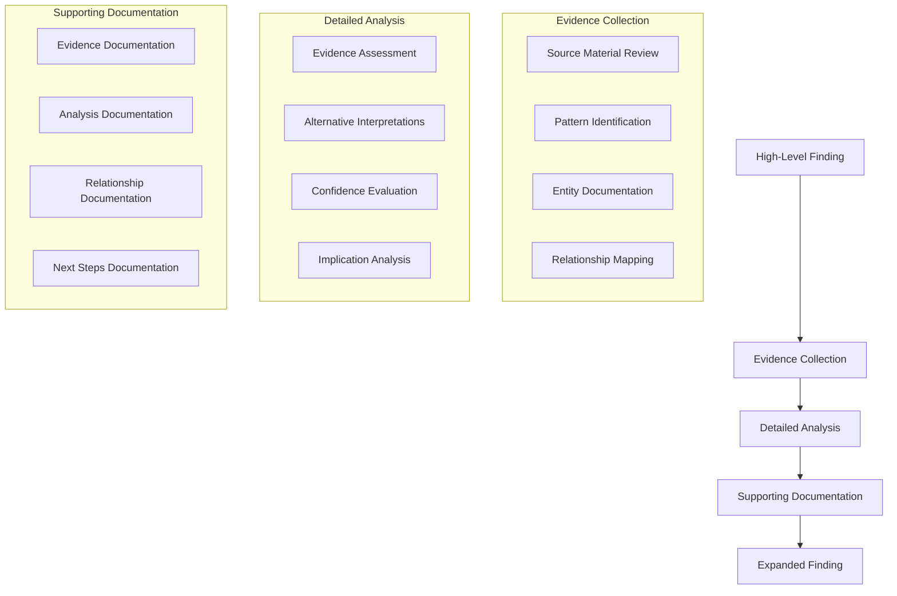

# Finding Expansion Process

## Purpose
This document outlines the process for expanding high-level bullet points in findings into comprehensive, well-documented analysis.

## Classification
- **Domain:** Process
- **Stability:** Semi-stable
- **Abstraction:** Structural
- **Confidence:** Established
- **Relevance:** High

## Content

### Overview

The finding expansion process provides a systematic approach to transforming high-level bullet points into detailed, well-documented findings. This process ensures thorough analysis, proper evidence documentation, and clear traceability.

### 1. Initial Assessment

Before beginning the expansion process:

1. Review the high-level bullet points:
   - Identify key claims and assertions
   - Note any explicit or implicit assumptions
   - Mark areas that seem to need supporting evidence
   - List any technical terms or concepts that need definition

2. Map to relevant frameworks:
   - Identify which analysis frameworks apply
   - Note where framework elements are missing
   - Consider if additional frameworks are needed
   - Document framework alignment

3. Gap Analysis:
   - Identify areas needing deeper investigation
   - Note missing evidence or support
   - List questions that need answering
   - Mark sections requiring additional context

### 2. Evidence Collection

For each high-level point:

1. Source Material Review:
   - Locate referenced source materials
   - Review source material context
   - Extract relevant quotes or data
   - Document source reliability

2. Entity Documentation:
   - Identify key entities mentioned
   - Document entity properties
   - Note entity relationships
   - Create new entity documents if needed

3. Pattern Identification:
   - Look for recurring patterns
   - Document pattern instances
   - Note pattern variations
   - Link to existing pattern documents

4. Relationship Mapping:
   - Map connections between entities
   - Document dependency relationships
   - Note conflicting relationships
   - Create relationship documents

### 3. Detailed Analysis

For each evidence item:

1. Evidence Assessment:
   - Evaluate evidence quality
   - Assess relevance to finding
   - Document evidence context
   - Note any limitations

2. Alternative Interpretations:
   - Consider other viewpoints
   - Document competing explanations
   - Analyze interpretation strengths
   - Note interpretation weaknesses

3. Confidence Evaluation:
   - Assess evidence strength
   - Evaluate source reliability
   - Consider conflicting evidence
   - Document confidence factors

4. Implication Analysis:
   - Identify direct implications
   - Consider indirect effects
   - Note potential impacts
   - Document assumptions

### 4. Documentation Expansion

Transform bullet points into detailed sections:

1. Finding Statements:
   - Create clear, specific statements
   - Include necessary context
   - Define key terms
   - Note any qualifications

2. Supporting Evidence:
   - Document each evidence item
   - Include source references
   - Note evidence strength
   - Explain relevance

3. Analysis Documentation:
   - Detail reasoning process
   - Explain conclusions drawn
   - Document methodology
   - Note any limitations

4. Implications Section:
   - List direct implications
   - Note indirect effects
   - Document assumptions
   - Consider future impact

5. Confidence Assessment:
   - Rate overall confidence
   - Document confidence factors
   - Note areas of uncertainty
   - Explain confidence rating

6. Related Findings:
   - Map to other findings
   - Document relationships
   - Note conflicts or support
   - Create relationship links

### 5. Quality Assurance

Verify documentation completeness:

1. Evidence Traceability:
   - Check source references
   - Verify quote accuracy
   - Confirm data points
   - Test link validity

2. Relationship Consistency:
   - Check bidirectional links
   - Verify relationship types
   - Confirm relationship logic
   - Update related documents

3. Confidence Assessment:
   - Review confidence ratings
   - Check supporting factors
   - Verify uncertainty notes
   - Validate confidence logic

4. Alternative Viewpoints:
   - Check competing views
   - Verify fair treatment
   - Note omitted viewpoints
   - Document limitations

### 6. Integration

Integrate the expanded finding:

1. Document Updates:
   - Update finding document
   - Revise related documents
   - Add new relationships
   - Update indexes

2. Metadata Management:
   - Update change history
   - Record document versions
   - Note contributors
   - Update timestamps

3. Task Integration:
   - Update task status
   - Record completion notes
   - Update task indexes
   - Note follow-up tasks

### Quality Standards

Maintain these standards throughout:

1. **Clarity**:
   - Use precise language
   - Define technical terms
   - Provide context
   - Use consistent terminology

2. **Completeness**:
   - Cover all key points
   - Include necessary context
   - Document all relationships
   - Note all sources

3. **Traceability**:
   - Link to sources
   - Document relationships
   - Record changes
   - Maintain history

4. **Objectivity**:
   - Consider all viewpoints
   - Note biases
   - Document assumptions
   - Maintain neutrality

## Relationships
- **Parent Nodes:** 
  - [processes/analysis.md] - extends - General analysis process
- **Related Nodes:** 
  - [processes/research.md] - relates-to - Research methodology
  - [processes/synthesis.md] - precedes - Finding synthesis process
  - [meta/updates.md] - informs - Change documentation
  - [analysis/findings/finding_template.md] - implements - Finding documentation standard

## Navigation Guide
- **When to Use:** When expanding high-level findings into detailed analysis
- **Common Next Steps:** Review source materials, document entities, create relationships
- **Related Tasks:** Finding development, evidence collection, relationship mapping
- **Update Patterns:** Update when analysis process changes or new requirements emerge

## Metadata
- **Created:** 2025-06-06
- **Created By:** Cline
- **Last Updated:** 2025-06-06
- **Updated By:** Cline

## Change History
- 2025-06-06: Initial creation of finding expansion process
