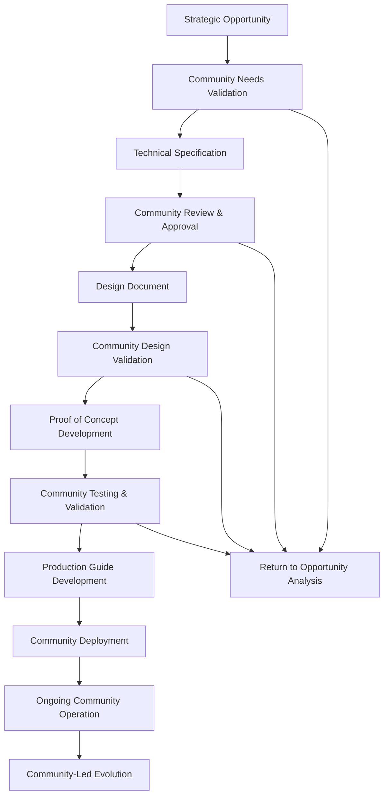

# Implementation Process

## Purpose
This document outlines the complete process for taking strategic opportunities through technical specification, design, prototyping, and production deployment while maintaining anti-capitalist principles and community control.

## Classification
- **Domain:** Process
- **Stability:** Semi-stable
- **Abstraction:** Structural
- **Confidence:** Established

## Overview

This process bridges the gap between strategic analysis (identifying Cannae-style opportunities) and community-controlled production systems. It ensures that implementation maintains anti-capitalist principles while serving real community needs.

## Implementation Lifecycle

## Stage 1: Strategic Opportunity to Technical Specification

### Prerequisites
- Completed strategic opportunity analysis (e.g., from cannae_ai_opportunities.md)
- Identified community need and capitalist vulnerability
- Anti-capitalist framework validation

### Community Needs Validation

#### Process Steps
1. **Community Identification**
   - Identify communities whose needs align with the opportunity
   - Establish relationships with community representatives
   - Ensure communities have capacity to participate in validation

2. **Needs Assessment Sessions**
   - Facilitate community discussions about their actual needs
   - Document current solutions and their limitations
   - Understand community values, practices, and constraints
   - Validate that the strategic opportunity addresses real community needs

3. **Community Priority Setting**
   - Work with communities to prioritize features and approaches
   - Understand community governance and decision-making processes
   - Identify community members who can participate in ongoing development
   - Establish community veto power over development decisions

#### Validation Criteria
- [ ] Community confirms the identified need exists and is priority
- [ ] Communities understand and agree with anti-capitalist approach
- [ ] Communities are willing to participate in development and testing
- [ ] Communities have capacity to eventually govern the system
- [ ] Multiple communities validate the need (avoid single-community bias)

#### Documentation Requirements
- Community needs assessment report
- Community values and constraints documentation
- Community governance process documentation
- Community participation agreement

### Technical Specification Development

#### Process Steps
1. **Architecture Planning**
   - Use technical specification template
   - Ensure architecture supports community control
   - Plan for federation and inter-community connection
   - Include anti-extraction safeguards in design

2. **Community Control Integration**
   - Design community governance interfaces
   - Plan community data sovereignty features
   - Include community decision-making in system architecture
   - Ensure communities can modify and evolve the system

3. **Anti-Capitalist Feature Planning**
   - Include resistance to value extraction
   - Plan for gift economy and commons integration
   - Design federated alternatives to centralized platforms
   - Include crisis resilience and mutual aid features

4. **Technical Feasibility Assessment**
   - Validate technical approach with existing tools and frameworks
   - Assess resource requirements for development and deployment
   - Plan for community technical capacity building
   - Identify technical risks and mitigation strategies

#### Quality Gates
- [ ] Specification clearly addresses identified community needs
- [ ] Architecture supports community control and governance
- [ ] Anti-capitalist features are built into core design
- [ ] Federation and inter-community connection is planned
- [ ] Technical approach is feasible with available resources
- [ ] Communities can realistically deploy and maintain the system

### Community Review and Approval

#### Process Steps
1. **Community Specification Review**
   - Present technical specification to participating communities
   - Facilitate community discussion and feedback
   - Ensure specification is accessible to non-technical community members
   - Address community concerns and suggestions

2. **Anti-Capitalist Framework Validation**
   - Review specification against anti-capitalist framework
   - Ensure capitalist trap detection has been applied
   - Validate resistance to co-optation and extraction
   - Confirm alignment with community self-determination

3. **Community Decision Process**
   - Use community-appropriate decision-making processes
   - Ensure all participating communities have veto power
   - Document community decisions and reasoning
   - Plan for specification revisions based on community input

#### Approval Criteria
- [ ] All participating communities approve the specification
- [ ] Specification passes anti-capitalist framework validation
- [ ] Communities understand and agree with technical approach
- [ ] Community governance features are approved by communities
- [ ] Resource requirements are acceptable to communities

## Stage 2: Technical Specification to Design Document

### Design Development Process

#### Community-Centered Design
1. **User Research with Communities**
   - Conduct participatory design sessions with community members
   - Document community workflows and practices
   - Understand accessibility needs and constraints
   - Learn about community cultural practices and values

2. **Design System Development**
   - Create design system that reflects community values
   - Ensure accessibility and inclusivity in design
   - Plan for cultural adaptation and localization
   - Design for diverse technical capacity levels

3. **Community Governance Interface Design**
   - Design community decision-making interfaces
   - Plan community administration and moderation tools
   - Design conflict resolution and mediation interfaces
   - Create community evolution and adaptation interfaces

#### Design Validation
1. **Community Design Review**
   - Present design concepts to communities
   - Facilitate design feedback and iteration sessions
   - Test design concepts with diverse community members
   - Ensure design respects community practices and values

2. **Accessibility Validation**
   - Test design with community members with disabilities
   - Validate design with assistive technology users
   - Ensure design meets accessibility standards
   - Plan for ongoing accessibility testing and improvement

#### Design Documentation
- Complete design document using template
- Community-validated user personas and scenarios
- Accessible and inclusive design specifications
- Community governance interface designs

## Stage 3: Design Document to Proof of Concept

### Prototype Development

#### Development Approach
1. **Minimum Viable Community Features**
   - Focus on core community needs identified in validation
   - Include essential community governance features
   - Implement basic anti-capitalist safeguards
   - Plan for community testing and feedback

2. **Community-Controlled Development**
   - Include communities in development decisions
   - Regular community review of development progress
   - Community veto power over development choices
   - Transparent development process and decision-making

3. **Anti-Capitalist Development Practices**
   - Open source development with community governance
   - No venture capital or extractive funding
   - Community ownership of development decisions
   - Resistance to feature creep that serves capital interests

#### Community Testing Process
1. **Community Tester Recruitment**
   - Recruit diverse community members for testing
   - Provide training and support for community testers
   - Establish community feedback collection processes
   - Plan for iterative testing and improvement

2. **Testing Methodology**
   - Community-led testing scenarios and processes
   - Real-world use case testing with communities
   - Accessibility testing with community members
   - Community governance feature testing

3. **Feedback Integration**
   - Regular community feedback review sessions
   - Community-controlled prioritization of improvements
   - Transparent communication about feedback implementation
   - Community validation of changes and iterations

#### Validation Criteria
- [ ] Core community needs are met by prototype
- [ ] Community governance features work effectively
- [ ] Anti-capitalist features resist extraction attempts
- [ ] Communities can use and understand the system
- [ ] Accessibility needs are met for diverse users
- [ ] Communities approve prototype for production development

## Stage 4: Proof of Concept to Production Guide

### Production Preparation

#### Community Readiness Development
1. **Community Capacity Building**
   - Technical training for community administrators
   - Community governance training for system management
   - Conflict resolution training for community moderators
   - Ongoing support and mentorship planning

2. **Community Infrastructure Preparation**
   - Hardware and network requirement planning
   - Community technical resource assessment
   - Community partnership development for technical support
   - Community sustainability planning

#### Production Guide Development
1. **Complete Implementation Documentation**
   - Step-by-step deployment instructions
   - Community governance setup guides
   - Technical maintenance procedures
   - Troubleshooting and support documentation

2. **Community Operations Planning**
   - Daily, weekly, and monthly operational procedures
   - Community decision-making integration
   - Inter-community federation setup
   - Long-term sustainability planning

#### Production Validation
1. **Community Deployment Testing**
   - Test deployment with pilot communities
   - Validate community operations procedures
   - Test inter-community federation functionality
   - Validate long-term sustainability planning

2. **Community Approval for Production**
   - Community review of production readiness
   - Community decision about production deployment
   - Community commitment to ongoing operation and governance
   - Community agreement on sustainability model

## Stage 5: Production Deployment and Community Operation

### Deployment Process

#### Community-Led Deployment
1. **Community Preparation**
   - Final community readiness validation
   - Community administrator training completion
   - Community governance structure finalization
   - Community resource allocation confirmation

2. **Technical Deployment**
   - Community-controlled deployment process
   - Community validation of system functionality
   - Community testing of governance features
   - Community approval of production system

3. **Community Operations Initiation**
   - Community administrator onboarding
   - Community member onboarding processes
   - Community governance process initiation
   - Community feedback and support systems activation

#### Ongoing Community Support
1. **Technical Support**
   - Community technical support network
   - Inter-community troubleshooting assistance
   - Federation technical resource sharing
   - Emergency technical response coordination

2. **Community Governance Support**
   - Community governance mentorship
   - Inter-community experience sharing
   - Conflict resolution support network
   - Community evolution and adaptation support

## Quality Assurance Throughout Process

### Anti-Capitalist Validation
At each stage, validate:
- [ ] Community control is maintained and strengthened
- [ ] Resistance to value extraction is effective
- [ ] Community self-determination is supported
- [ ] Commons and mutual aid are strengthened
- [ ] No capitalist dependencies are introduced

### Community Empowerment Validation
At each stage, validate:
- [ ] Communities have meaningful control over decisions
- [ ] Community capacity is built, not dependency
- [ ] Community values and practices are respected
- [ ] Community needs are effectively met
- [ ] Communities can evolve and adapt the system

### Technical Quality Validation
At each stage, validate:
- [ ] Technical approach is sound and sustainable
- [ ] Security and privacy are maintained
- [ ] Accessibility requirements are met
- [ ] Performance meets community needs
- [ ] System can be maintained by communities

## Resource Requirements

### Development Resources
- **Community Coordination**: Significant time for community engagement and validation
- **Technical Development**: Development skills appropriate to community needs
- **Design Expertise**: User experience design with community-centered approach
- **Testing and Validation**: Community testing coordination and support

### Community Resources
- **Time Investment**: Community participation in all stages of development
- **Skill Building**: Community capacity building for governance and technical maintenance
- **Infrastructure**: Community hardware and network resources for deployment
- **Governance Capacity**: Community decision-making and conflict resolution capacity

### Sustainability Resources
- **Ongoing Development**: Non-extractive funding for continued development
- **Community Support**: Inter-community support networks and resource sharing
- **Technical Maintenance**: Community technical capacity or support networks
- **Evolution and Adaptation**: Resources for community-led system evolution

## Risk Management

### Community Risks
- **Community Capacity**: Risk that communities don't have capacity for governance
- **Community Conflict**: Risk of community conflicts affecting system governance
- **Community Sustainability**: Risk that communities can't sustain system operation
- **Community Co-optation**: Risk of communities being co-opted by capitalist interests

### Technical Risks
- **Technical Complexity**: Risk that system is too complex for community maintenance
- **Security Vulnerabilities**: Risk of security breaches affecting communities
- **Performance Issues**: Risk of poor performance affecting community adoption
- **Integration Failures**: Risk of poor integration with existing community systems

### Political Risks
- **State Repression**: Risk of government interference with community systems
- **Corporate Retaliation**: Risk of corporate attacks on community alternatives
- **Infiltration**: Risk of infiltration and sabotage of community systems
- **Co-optation**: Risk of co-optation by capitalist interests

## Success Metrics

### Community Impact
- **Community Empowerment**: Measurable increase in community self-determination
- **Mutual Aid Strengthening**: Enhanced community mutual aid and support
- **Commons Building**: Contribution to community commons and shared resources
- **Resistance Building**: Reduced community dependence on capitalist systems

### Technical Success
- **Community Adoption**: Successful adoption and use by communities
- **System Reliability**: Reliable operation meeting community needs
- **Community Maintenance**: Successful community maintenance and operation
- **Federation Success**: Successful inter-community connection and resource sharing

### Anti-Capitalist Success
- **Extraction Resistance**: Successful resistance to value extraction attempts
- **Community Control**: Maintained and strengthened community control
- **Gift Economy Integration**: Successful integration with gift economy principles
- **Solidarity Building**: Enhanced solidarity and mutual support between communities

## Relationships
- **Parent Nodes:**
  - processes/analysis.md - follows - Analysis process feeds into implementation
  - foundation/principles.md - implements - Guided by project principles
- **Child Nodes:**
  - None currently defined
- **Related Nodes:**
  - analysis/implementations/README.md - describes - Implementation directory structure
  - analysis/frameworks/anti_capitalist_framework.md - applies - Used throughout implementation
  - analysis/frameworks/capitalist_trap_detector.md - integrates - Trap detection throughout process

## Navigation Guidance
- **Access Context:** Use when implementing strategic opportunities identified through Cannae analysis
- **Common Next Steps:** Select specific opportunity and begin community needs validation
- **Related Tasks:** Community engagement, technical development, system deployment
- **Update Patterns:** Update based on community feedback and implementation experience

## Metadata
- **Created:** 2025-07-23
- **Last Updated:** 2025-07-23
- **Updated By:** Claude (Implementation Process Development)

## Change History
- 2025-07-23: Initial implementation process based on opportunity-to-implementation lifecycle design