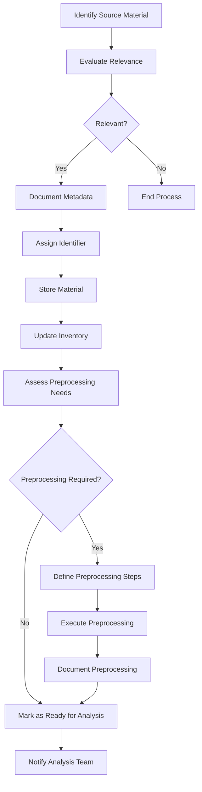

# Source Material Ingestion Process

## Purpose
This document outlines the process for ingesting new source materials into the analysis project.

## Classification
- **Domain:** Process
- **Source Type:** Mixed
- **Analysis Stage:** Raw
- **Stability:** Semi-stable
- **Abstraction:** Structural
- **Confidence:** Established
- **Relevance:** High

## Content

### Overview

The source material ingestion process ensures that all materials to be analyzed are properly documented, stored, and prepared for analysis. This process maintains the integrity of the source materials while making them accessible for analysis.

### Step 1: Identify Source Material

When a new source material is identified:

1. Determine the material's type (document, repository, log, dataset)
2. Verify the material's authenticity and origin
3. Confirm access permissions and usage rights
4. Assess the material's format and technical characteristics

### Step 2: Evaluate Relevance

Assess the material's relevance to the analysis goals:

1. Review the material against the project's scope and objectives
2. Determine if the material contains information pertinent to the analysis questions
3. Consider the material's quality, completeness, and reliability
4. Decide whether to include the material in the analysis scope

### Step 3: Document Metadata

For materials deemed relevant, document key metadata:

1. Material name and description
2. Type and format
3. Source and provenance information
4. Creation date and version information
5. Size and structure details
6. Content summary
7. Known limitations or issues

### Step 4: Assign Identifier

Assign a unique identifier to the material:

1. Follow the project's identifier convention (e.g., SM001, SM002)
2. Ensure the identifier is used consistently in all references to the material

### Step 5: Store Material

Store the material in the designated location:

1. Place the material in the appropriate storage location based on type
2. Ensure the storage method preserves the material's integrity
3. Set up appropriate access controls
4. Create backups if necessary

### Step 6: Update Inventory

Update the source material inventory:

1. Open `source_material/inventory.md`
2. Add a new entry with all documented metadata
3. Include the storage location and access instructions

### Step 7: Assess Preprocessing Needs

Determine if the material requires preprocessing:

1. Evaluate if format conversion is needed
2. Assess if data cleaning is required
3. Determine if structure normalization would be beneficial
4. Consider if information extraction should be performed
5. Decide if anonymization or redaction is necessary

### Step 8: Preprocess Material (if needed)

If preprocessing is required:

1. Define the specific preprocessing steps needed
2. Execute the preprocessing according to the defined steps
3. Verify the preprocessing results
4. Store the preprocessed version alongside the original
5. Document the preprocessing steps in `source_material/preprocessing.md`

### Step 9: Mark as Ready for Analysis

Once the material is properly ingested and preprocessed:

1. Update its status in the inventory to "Ready for Analysis"
2. Ensure all necessary documentation is complete

### Step 10: Notify Analysis Team

Inform the analysis team of the new material:

1. Provide a summary of the material and its relevance
2. Highlight any special considerations for analysis
3. Include links to the material and its documentation

## Relationships
- **Parent Nodes:** 
  - [foundation/analysis_approach.md] - implements - Overall analysis methodology
- **Child Nodes:** None
- **Related Nodes:** 
  - [source_material/inventory.md] - updates - Catalog of all source materials
  - [source_material/preprocessing.md] - documents - Preprocessing applied to materials
  - [processes/analysis.md] - precedes - Analysis workflow that uses ingested materials

## Navigation Guidance
- **Access Context:** Use this document when adding new source materials to the project
- **Common Next Steps:** After ingestion, typically proceed to analysis/frameworks to select analysis approaches
- **Related Tasks:** Material acquisition, preprocessing, inventory management
- **Update Patterns:** This process may be refined based on experience with different material types

## Metadata
- **Created:** [Date]
- **Last Updated:** [Date]
- **Updated By:** [Role/Agent]

## Change History
- [Date]: Initial creation of source material ingestion process
