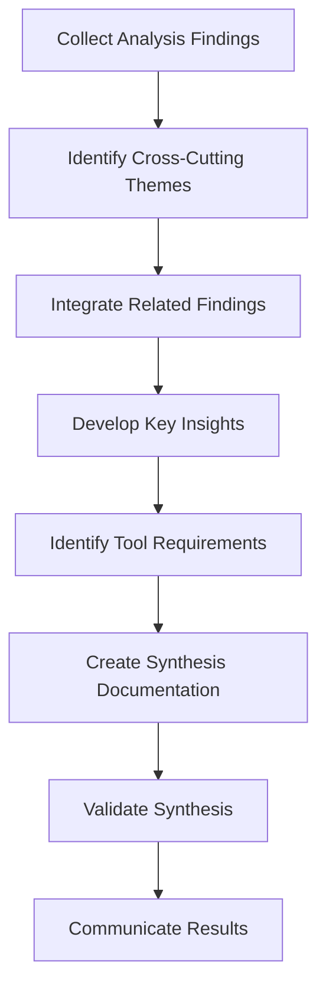

# Synthesis Process

## Purpose
This document outlines the process for synthesizing findings from analysis into coherent insights and tool requirements.

## Classification
- **Domain:** Process
- **Source Type:** Mixed
- **Analysis Stage:** Synthesized
- **Stability:** Semi-stable
- **Abstraction:** Structural
- **Confidence:** Established
- **Relevance:** Critical

## Content

### Overview

The synthesis process transforms individual analysis findings into integrated insights, cross-cutting patterns, and actionable tool requirements. This process ensures that the full value of the analysis is captured and can be effectively applied.

### Step 1: Collect Analysis Findings

Begin by gathering all findings from the analysis:

1. Review all documented findings in `analysis/findings/`
2. Organize findings by topic, confidence level, and relevance
3. Identify any gaps or inconsistencies in the findings
4. Note the strength of evidence supporting each finding
5. Create a consolidated list or map of all findings to work with

### Step 2: Identify Cross-Cutting Themes

Look for themes that span multiple findings:

1. Identify recurring concepts, patterns, or issues across findings
2. Group related findings that address similar aspects of the source materials
3. Look for connections between findings from different analysis frameworks
4. Identify potential causal or correlational relationships between findings
5. Document emerging themes with references to supporting findings

### Step 3: Integrate Related Findings

Combine and integrate related findings:

1. For each theme, integrate the related findings into a coherent narrative
2. Resolve any apparent contradictions or tensions between findings
3. Identify how findings complement or build upon each other
4. Assess the combined strength of evidence for integrated findings
5. Document the integration process and reasoning

### Step 4: Develop Key Insights

Transform integrated findings into key insights:

1. Distill the essential meaning and significance of each integrated finding set
2. Articulate insights in clear, concise language that captures their importance
3. Prioritize insights based on their significance, confidence, and relevance
4. Identify the implications of each insight for understanding the source materials
5. Document each key insight with its supporting evidence and implications

### Step 5: Identify Tool Requirements

Derive tool requirements from insights:

1. For each key insight, consider what tools would help apply or extend it
2. Identify opportunities for automation, visualization, or analysis support
3. Consider how tools could address challenges identified in the analysis
4. Prioritize potential tool requirements based on impact and feasibility
5. Document tool requirements using the template in `tools/requirements/requirement_template.md`

### Step 6: Create Synthesis Documentation

Document the synthesis results:

1. Create a synthesis summary document that presents the key insights
2. Include visual representations of relationships between insights when helpful
3. Document the reasoning process that led to each key insight
4. Link insights to their supporting findings and evidence
5. Include a prioritized list of tool requirements with their rationales

### Step 7: Validate Synthesis

Validate the synthesis results:

1. Review the synthesis against the original source materials
2. Ensure that insights are supported by sufficient evidence
3. Check that no significant findings have been overlooked
4. Verify that the synthesis accurately represents the analysis findings
5. Identify any areas requiring further analysis or evidence

### Step 8: Communicate Results

Prepare and share the synthesis results:

1. Tailor communication of results to different audiences and needs
2. Create executive summaries for high-level understanding
3. Prepare detailed documentation for technical implementation
4. Develop visualizations to communicate complex relationships
5. Update the context network with all synthesis documentation

### Synthesis Quality Criteria

Evaluate the quality of synthesis using these criteria:

1. **Comprehensiveness**: Does the synthesis incorporate all significant findings?
2. **Coherence**: Do the insights form a logical and consistent whole?
3. **Traceability**: Can each insight be traced back to supporting evidence?
4. **Significance**: Do the insights address important aspects of the source materials?
5. **Actionability**: Do the insights and tool requirements enable concrete actions?
6. **Clarity**: Are the insights expressed in clear, understandable language?

### Handling Synthesis Challenges

#### Conflicting Findings
1. Acknowledge the conflict explicitly
2. Assess the evidence supporting each side
3. Consider contextual factors that might explain the conflict
4. Develop insights that account for the tension or uncertainty
5. Note areas where further investigation is needed

#### Uncertainty Management
1. Clearly communicate confidence levels for all insights
2. Distinguish between established facts and interpretations
3. Identify assumptions and their impact on conclusions
4. Present alternative interpretations when appropriate
5. Prioritize areas for further investigation to reduce uncertainty

#### Complexity Management
1. Use hierarchical organization to manage complex insights
2. Create visual representations of complex relationships
3. Develop multiple views or perspectives on the synthesis
4. Focus on the most significant insights while acknowledging complexity
5. Create navigation aids to help users understand the synthesis structure

## Relationships
- **Parent Nodes:** 
  - [foundation/analysis_approach.md] - implements - Overall analysis methodology
- **Child Nodes:** None
- **Related Nodes:** 
  - [processes/analysis.md] - follows - Process for analyzing source materials
  - [analysis/findings/] - synthesizes - Findings from analysis
  - [tools/requirements/] - generates - Tool requirements based on synthesis
  - [meta/updates.md] - records - Documentation of synthesis activities

## Navigation Guidance
- **Access Context:** Use this document when integrating findings from analysis into coherent insights
- **Common Next Steps:** After synthesis, typically proceed to tool requirement specification or decision-making
- **Related Tasks:** Finding integration, insight development, requirement specification
- **Update Patterns:** This process may be refined based on experience with different types of findings and synthesis goals

## Metadata
- **Created:** [Date]
- **Last Updated:** [Date]
- **Updated By:** [Role/Agent]

## Change History
- [Date]: Initial creation of synthesis process document
