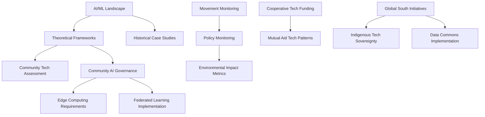

# Research Tasks Index

## Purpose
This document provides a centralized index of all research tasks across the project, tracking their status, relationships, and progress.

## Classification
- **Domain:** Research Task Management
- **Stability:** Dynamic
- **Abstraction:** Structural
- **Confidence:** Established

## Task Overview

### Crisis-Driven Research
| Task | Status | Priority | Next Run/Due | Last Updated |
|------|--------|----------|--------------|--------------|
| [Mutual Aid Tech Patterns](crisis_driven/mutual_aid_tech_patterns.md) | In Progress | High | 2025-06-15 | 2025-06-03 |

### Economic Research
| Task | Status | Priority | Next Run/Due | Last Updated |
|------|--------|----------|--------------|--------------|
| [Cooperative Tech Funding](economic/cooperative_tech_funding.md) | Not Started | Medium | 2025-07-01 | 2025-06-03 |

### Foundational Research
| Task | Status | Priority | Next Run/Due | Last Updated |
|------|--------|----------|--------------|--------------|
| [AI/ML Landscape](foundational/ai_ml_landscape.md) | Completed | High | - | 2025-06-03 |
| [Historical Case Studies](foundational/historical_case_studies.md) | Completed | High | - | 2025-06-06 |
| [Theoretical Frameworks](foundational/theoretical_frameworks.md) | In Progress | High | 2025-06-30 | 2025-06-03 |

### Framework Development
| Task | Status | Priority | Next Run/Due | Last Updated |
|------|--------|----------|--------------|--------------|
| [Community Tech Assessment](frameworks/community_tech_assessment.md) | Not Started | Medium | 2025-07-15 | 2025-06-03 |

### Geographic Research
| Task | Status | Priority | Next Run/Due | Last Updated |
|------|--------|----------|--------------|--------------|
| [Global South Initiatives](geographic/global_south_initiatives.md) | Not Started | High | 2025-07-01 | 2025-06-03 |
| [Indigenous Tech Sovereignty](geographic/indigenous_tech_sovereignty.md) | Not Started | High | 2025-07-01 | 2025-06-03 |

### Governance Research
| Task | Status | Priority | Next Run/Due | Last Updated |
|------|--------|----------|--------------|--------------|
| [Community AI Governance](governance/community_ai_governance.md) | Not Started | High | 2025-07-15 | 2025-06-03 |
| [Data Commons Implementation](governance/data_commons_implementation.md) | Not Started | Medium | 2025-08-01 | 2025-06-03 |
| [Safety Systems for Vulnerable Users](governance/safety_systems_for_vulnerable_users.md) | In Progress | High | 2025-07-08 | 2025-06-08 |

### Infrastructure Research
| Task | Status | Priority | Next Run/Due | Last Updated |
|------|--------|----------|--------------|--------------|
| [Edge Computing Requirements](infrastructure/edge_computing_requirements.md) | Not Started | Medium | 2025-08-15 | 2025-06-03 |
| [Federated Learning Implementation](infrastructure/federated_learning_implementation.md) | Not Started | Medium | 2025-08-15 | 2025-06-03 |
| [Jekyll Setup Requirements](infrastructure/jekyll_setup_requirements.md) | Completed | High | - | 2025-06-03 |

### Monitoring Research
| Task | Status | Priority | Next Run/Due | Last Updated |
|------|--------|----------|--------------|--------------|
| [Environmental Impact Metrics](monitoring/environmental_impact_metrics.md) | Not Started | Medium | 2025-09-01 | 2025-06-03 |
| [Movement Monitoring](monitoring/movement_monitoring.md) | In Progress | High | 2025-06-30 | 2025-06-03 |
| [Policy Monitoring](monitoring/policy_monitoring.md) | In Progress | High | 2025-06-30 | 2025-06-03 |

## Task Relationships

## Progress Overview

### Status Distribution
- Not Started: 8 tasks
- In Progress: 4 tasks
- Completed: 3 tasks
- Total: 15 tasks

### Priority Distribution
- High Priority: 9 tasks
- Medium Priority: 6 tasks
- Low Priority: 0 tasks

## Metadata
- **Created:** 2025-06-05
- **Created By:** Cline
- **Last Updated:** 2025-06-08
- **Updated By:** Cline

## Change History
- 2025-06-08: Added Safety Systems for Vulnerable Users task and updated statistics
- 2025-06-06: Updated Historical Case Studies task to Completed
- 2025-06-05: Initial creation of research tasks index
