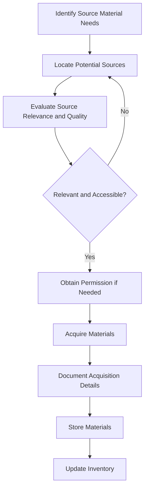

# Source Material Acquisition

## Purpose
This document outlines the processes and considerations for acquiring source materials for analysis.

## Classification
- **Domain:** Source Material
- **Source Type:** Mixed
- **Analysis Stage:** Raw
- **Stability:** Semi-stable
- **Abstraction:** Structural
- **Confidence:** Established
- **Relevance:** High

## Content

### Overview

Source material acquisition is the process of identifying, obtaining, and documenting materials for analysis. This process ensures that all relevant materials are collected in a systematic way that preserves their integrity and provenance.

### Acquisition Methods

#### Document Acquisition

1. **Direct Collection**
   - **Description**: Gathering documents directly from their source
   - **When to Use**: When documents are publicly available or permission has been granted
   - **Considerations**: 
     - Ensure complete collection of all relevant documents
     - Maintain document structure and metadata
     - Document collection date and method
   - **Examples**: Downloading PDFs from websites, receiving documents from stakeholders

2. **Web Scraping**
   - **Description**: Automated collection of documents from websites
   - **When to Use**: For large-scale collection of web-based documents
   - **Considerations**: 
     - Respect robots.txt and site terms of service
     - Manage rate limiting to avoid overloading servers
     - Preserve document context and structure
   - **Examples**: Scraping news articles, public reports, documentation

3. **API Access**
   - **Description**: Using APIs to access and download documents
   - **When to Use**: When sources provide API access to their content
   - **Considerations**: 
     - Follow API usage guidelines and rate limits
     - Handle authentication and access tokens securely
     - Process and store API responses appropriately
   - **Examples**: Accessing documents via Google Drive API, GitHub API

#### Repository Acquisition

1. **Repository Cloning**
   - **Description**: Creating a local copy of a code repository
   - **When to Use**: When analyzing code repositories
   - **Considerations**: 
     - Clone with full history if history is relevant to analysis
     - Document repository URL and commit hash/tag
     - Note any repository access requirements
   - **Examples**: Git clone, SVN checkout

2. **Archive Download**
   - **Description**: Downloading repository archives
   - **When to Use**: When full history is not needed or not available
   - **Considerations**: 
     - Document the exact version downloaded
     - Note any missing information compared to full repository
     - Record archive source and date
   - **Examples**: ZIP/tarball downloads from GitHub, GitLab

3. **Code Sampling**
   - **Description**: Collecting specific portions of code
   - **When to Use**: When only certain components are relevant
   - **Considerations**: 
     - Document selection criteria and rationale
     - Maintain file structure and relationships
     - Note limitations of partial collection
   - **Examples**: Downloading specific directories or files

#### Log Acquisition

1. **Direct Log Access**
   - **Description**: Accessing logs directly from systems
   - **When to Use**: When you have direct access to the systems generating logs
   - **Considerations**: 
     - Ensure complete log coverage for the time period of interest
     - Maintain log format and metadata
     - Document log sources and time ranges
   - **Examples**: Server logs, application logs, system logs

2. **Log Aggregation Systems**
   - **Description**: Accessing logs through aggregation platforms
   - **When to Use**: When logs are already collected in a centralized system
   - **Considerations**: 
     - Understand aggregation system's filtering or processing
     - Document query parameters used to extract logs
     - Note any limitations in the aggregated data
   - **Examples**: Splunk exports, ELK stack queries, CloudWatch logs

3. **Log Exports**
   - **Description**: Receiving exported log files
   - **When to Use**: When direct access is not possible
   - **Considerations**: 
     - Verify completeness of exported logs
     - Document export format and any processing applied
     - Record source of exports and responsible parties
   - **Examples**: Exported CSV/JSON log files, log dumps

#### Dataset Acquisition

1. **Direct Download**
   - **Description**: Downloading datasets from repositories or sources
   - **When to Use**: When datasets are publicly available
   - **Considerations**: 
     - Verify dataset integrity (checksums, file sizes)
     - Document dataset version and publication date
     - Note any usage restrictions or licenses
   - **Examples**: Kaggle datasets, government data portals, research datasets

2. **API-Based Collection**
   - **Description**: Gathering data through APIs
   - **When to Use**: When data is available through service APIs
   - **Considerations**: 
     - Document API version and query parameters
     - Handle pagination and rate limiting
     - Process and combine API responses appropriately
   - **Examples**: Twitter API data, weather data APIs, financial data APIs

3. **Database Exports**
   - **Description**: Exporting data from databases
   - **When to Use**: When analyzing database content
   - **Considerations**: 
     - Document database schema and export queries
     - Maintain relational integrity in exports
     - Note any filtering or transformation during export
   - **Examples**: SQL dumps, MongoDB exports, database backups

### Acquisition Guidelines

#### Legal and Ethical Considerations

1. **Permission and Licensing**
   - Obtain necessary permissions before acquiring non-public materials
   - Respect copyright, terms of service, and licensing restrictions
   - Document the legal basis for using each source material
   - Consider data privacy regulations (GDPR, CCPA, etc.) when applicable

2. **Confidentiality and Sensitivity**
   - Identify sensitive or confidential information in source materials
   - Implement appropriate security measures for sensitive materials
   - Consider anonymization or redaction needs before acquisition
   - Document any confidentiality requirements or agreements

3. **Attribution and Citation**
   - Record proper attribution information for all source materials
   - Follow citation standards appropriate to the material type
   - Respect attribution requirements in licenses
   - Document any usage restrictions for analysis outputs

#### Technical Considerations

1. **Format and Structure Preservation**
   - Preserve original file formats when possible
   - Maintain directory structures and file relationships
   - Capture metadata (creation dates, authors, etc.)
   - Document any format conversions performed during acquisition

2. **Completeness and Sampling**
   - Aim for complete acquisition when feasible
   - Document sampling methods when complete acquisition isn't possible
   - Note any known gaps or limitations in the acquired materials
   - Consider potential biases introduced by incomplete acquisition

3. **Versioning and Temporal Aspects**
   - Record version information for all source materials
   - Document acquisition date and time
   - Consider temporal relationships between different materials
   - Plan for updates or changes to source materials over time

### Documentation Requirements

For each acquired source material, document:

1. **Source Information**
   - Origin (URL, organization, system, etc.)
   - Owner or publisher
   - Contact information if applicable
   - Original format and structure

2. **Acquisition Details**
   - Date and time of acquisition
   - Method used for acquisition
   - Person or agent responsible for acquisition
   - Any tools or scripts used in the process

3. **Legal and Usage Information**
   - Permission status
   - License or terms of use
   - Usage restrictions
   - Attribution requirements

4. **Technical Metadata**
   - File formats and sizes
   - Version information
   - Checksums or integrity verification
   - Temporal coverage (for logs, datasets, etc.)

5. **Content Summary**
   - Brief description of content
   - Relevance to analysis goals
   - Known limitations or quality issues
   - Relationship to other source materials

## Relationships
- **Parent Nodes:** None
- **Child Nodes:** None
- **Related Nodes:** 
  - [source_material/inventory.md] - updates - Inventory of acquired materials
  - [source_material/preprocessing.md] - precedes - Preprocessing applied to acquired materials
  - [processes/ingestion.md] - part-of - Overall ingestion process
  - [foundation/analysis_approach.md] - guided-by - Analysis approach that informs acquisition needs

## Navigation Guidance
- **Access Context:** Use this document when planning to acquire new source materials
- **Common Next Steps:** After acquisition, typically update the inventory and assess preprocessing needs
- **Related Tasks:** Source identification, permission management, acquisition planning
- **Update Patterns:** This document should be updated when new acquisition methods are developed or requirements change

## Metadata
- **Created:** [Date]
- **Last Updated:** [Date]
- **Updated By:** [Role/Agent]

## Change History
- [Date]: Initial creation of acquisition documentation
