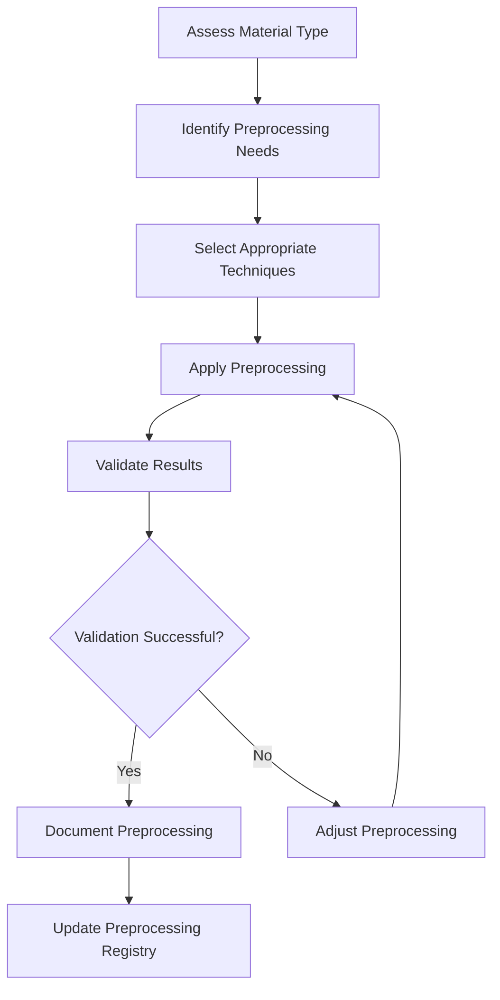

# Source Material Preprocessing

## Purpose
This document tracks preprocessing steps applied to source materials to prepare them for analysis.

## Classification
- **Domain:** Source Material
- **Source Type:** Mixed
- **Analysis Stage:** Processed
- **Stability:** Dynamic
- **Abstraction:** Detailed
- **Confidence:** Established
- **Relevance:** High

## Content

### Overview

Preprocessing transforms raw source materials into formats that are more suitable for analysis. This document tracks what preprocessing has been applied to each source material and provides guidance on preprocessing approaches for different material types.

### Preprocessing Registry

| Material ID | Preprocessing Applied | Date | Performed By | Output Location | Notes |
|-------------|------------------------|------|--------------|-----------------|-------|
| [SM001] | [List of preprocessing steps] | [Date] | [Person/Agent] | [Path or URL] | [Notes on results or issues] |
| [SM002] | [List of preprocessing steps] | [Date] | [Person/Agent] | [Path or URL] | [Notes on results or issues] |
| [SM003] | [List of preprocessing steps] | [Date] | [Person/Agent] | [Path or URL] | [Notes on results or issues] |

### Standard Preprocessing Techniques

#### For Documents

1. **Format Conversion**
   - **Purpose**: Convert documents to standard, analyzable formats
   - **Common Techniques**: 
     - PDF to text conversion
     - OCR for scanned documents
     - Document format normalization
   - **Tools**: [List of recommended tools]
   - **Best Practices**: [Guidelines for effective conversion]

2. **Text Extraction and Cleaning**
   - **Purpose**: Extract clean text content from documents
   - **Common Techniques**:
     - Header/footer removal
     - Boilerplate text removal
     - Table and figure extraction
     - Noise reduction
   - **Tools**: [List of recommended tools]
   - **Best Practices**: [Guidelines for effective extraction]

3. **Structure Identification**
   - **Purpose**: Identify and mark document structure
   - **Common Techniques**:
     - Section and heading identification
     - List and table structure marking
     - Paragraph and sentence segmentation
   - **Tools**: [List of recommended tools]
   - **Best Practices**: [Guidelines for structure identification]

#### For Repositories

1. **Repository Analysis**
   - **Purpose**: Extract structural information from code repositories
   - **Common Techniques**:
     - Directory structure extraction
     - File type categorization
     - Dependency mapping
     - Commit history analysis
   - **Tools**: [List of recommended tools]
   - **Best Practices**: [Guidelines for repository analysis]

2. **Code Parsing**
   - **Purpose**: Parse code for analysis
   - **Common Techniques**:
     - Abstract syntax tree generation
     - Function and class extraction
     - Comment extraction
     - Code metric calculation
   - **Tools**: [List of recommended tools]
   - **Best Practices**: [Guidelines for code parsing]

3. **Documentation Extraction**
   - **Purpose**: Extract documentation from repositories
   - **Common Techniques**:
     - README and documentation file identification
     - Comment and docstring extraction
     - Wiki and issue tracker integration
   - **Tools**: [List of recommended tools]
   - **Best Practices**: [Guidelines for documentation extraction]

#### For Logs

1. **Log Parsing**
   - **Purpose**: Convert logs to structured format
   - **Common Techniques**:
     - Log entry segmentation
     - Timestamp extraction and normalization
     - Field identification and extraction
     - Event type classification
   - **Tools**: [List of recommended tools]
   - **Best Practices**: [Guidelines for log parsing]

2. **Log Aggregation**
   - **Purpose**: Combine logs from multiple sources
   - **Common Techniques**:
     - Timestamp alignment
     - Source identification
     - Duplicate removal
     - Session reconstruction
   - **Tools**: [List of recommended tools]
   - **Best Practices**: [Guidelines for log aggregation]

3. **Log Filtering and Sampling**
   - **Purpose**: Reduce log volume while preserving important information
   - **Common Techniques**:
     - Noise filtering
     - Sampling strategies
     - Error and exception highlighting
     - Pattern-based filtering
   - **Tools**: [List of recommended tools]
   - **Best Practices**: [Guidelines for log filtering]

#### For Datasets

1. **Data Cleaning**
   - **Purpose**: Prepare datasets for analysis
   - **Common Techniques**:
     - Missing value handling
     - Outlier detection and treatment
     - Data type conversion
     - Inconsistency resolution
   - **Tools**: [List of recommended tools]
   - **Best Practices**: [Guidelines for data cleaning]

2. **Data Transformation**
   - **Purpose**: Transform data into more analyzable formats
   - **Common Techniques**:
     - Normalization and standardization
     - Feature engineering
     - Encoding categorical variables
     - Dimensionality reduction
   - **Tools**: [List of recommended tools]
   - **Best Practices**: [Guidelines for data transformation]

3. **Data Integration**
   - **Purpose**: Combine data from multiple sources
   - **Common Techniques**:
     - Schema matching
     - Record linkage
     - Conflict resolution
     - Temporal alignment
   - **Tools**: [List of recommended tools]
   - **Best Practices**: [Guidelines for data integration]

### Preprocessing Workflow

### Preprocessing Guidelines

1. **Preserve Original Materials**
   - Always maintain the original, unmodified source materials
   - Create separate copies for preprocessing
   - Document the location of both original and preprocessed versions

2. **Document All Steps**
   - Record all preprocessing steps applied to each material
   - Include tool versions and parameter settings
   - Note any issues encountered and how they were addressed

3. **Validate Results**
   - Verify that preprocessing preserves essential information
   - Check for unintended side effects or distortions
   - Compare samples of preprocessed output with original material

4. **Consider Analysis Needs**
   - Tailor preprocessing to the specific analysis goals
   - Balance preprocessing thoroughness with analysis requirements
   - Consult with analysts about specific preprocessing needs

5. **Handle Sensitive Information**
   - Identify and properly handle sensitive or confidential information
   - Apply appropriate anonymization or redaction techniques
   - Document any information that was removed or modified

## Relationships
- **Parent Nodes:** None
- **Child Nodes:** None
- **Related Nodes:** 
  - [source_material/inventory.md] - references - Source materials that undergo preprocessing
  - [source_material/acquisition.md] - precedes - Acquisition process that provides materials for preprocessing
  - [processes/ingestion.md] - includes - Ingestion process that includes preprocessing steps
  - [processes/analysis.md] - supports - Analysis process that uses preprocessed materials

## Navigation Guidance
- **Access Context:** Use this document when planning preprocessing for new materials or checking what preprocessing has been applied
- **Common Next Steps:** After reviewing preprocessing, typically proceed to analysis planning
- **Related Tasks:** Material preparation, preprocessing technique selection, preprocessing validation
- **Update Patterns:** This document should be updated whenever new preprocessing is applied or new techniques are developed

## Metadata
- **Created:** [Date]
- **Last Updated:** [Date]
- **Updated By:** [Role/Agent]

## Change History
- [Date]: Initial creation of preprocessing documentation
