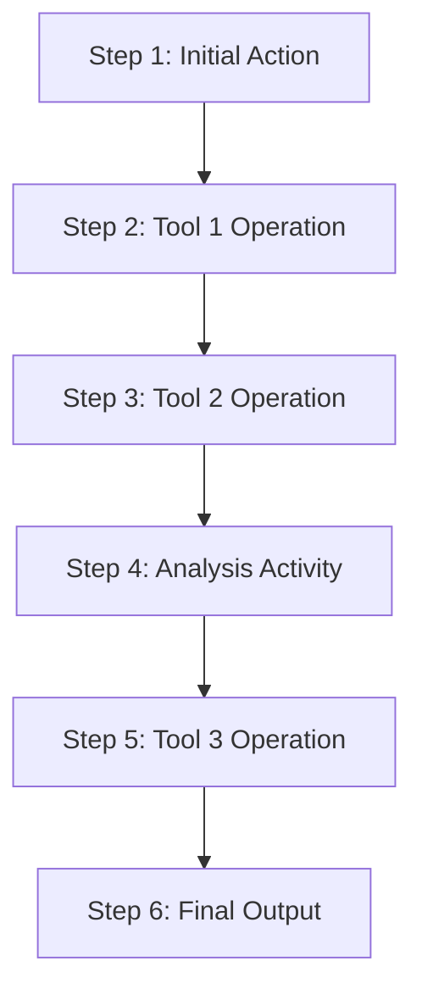

# [Tool Workflow Name]

## Purpose
This document describes a workflow for using tools to support the analysis of source materials or implement functionality based on analysis findings.

## Classification
- **Domain:** Tool Workflow
- **Source Type:** [Document/Repository/Log/Dataset/Mixed]
- **Analysis Stage:** [Raw/Processed/Analyzed/Synthesized]
- **Stability:** [Static/Semi-stable/Dynamic]
- **Abstraction:** [Conceptual/Structural/Detailed]
- **Confidence:** [Established/Evolving/Speculative]
- **Relevance:** [Critical/High/Medium/Low]

## Content

### Workflow Summary

[Brief description of the workflow, including its purpose and the analysis activities it supports]

### Tools Used

| Tool | Version | Purpose in Workflow |
|------|---------|---------------------|
| [Tool Name] | [Version] | [Brief description of how the tool is used] |
| [Tool Name] | [Version] | [Brief description of how the tool is used] |
| [Tool Name] | [Version] | [Brief description of how the tool is used] |

### Workflow Diagram



### Workflow Steps

#### Step 1: [Step Name]
**Tools Used:** [Tool(s) used in this step]
**Input:** [What inputs are required]
**Process:** 
1. [Detailed description of the first action]
2. [Detailed description of the second action]
3. [Detailed description of the third action]
**Output:** [What outputs are produced]
**Notes:** [Any special considerations or tips]

#### Step 2: [Step Name]
**Tools Used:** [Tool(s) used in this step]
**Input:** [What inputs are required]
**Process:** 
1. [Detailed description of the first action]
2. [Detailed description of the second action]
3. [Detailed description of the third action]
**Output:** [What outputs are produced]
**Notes:** [Any special considerations or tips]

#### Step 3: [Step Name]
**Tools Used:** [Tool(s) used in this step]
**Input:** [What inputs are required]
**Process:** 
1. [Detailed description of the first action]
2. [Detailed description of the second action]
3. [Detailed description of the third action]
**Output:** [What outputs are produced]
**Notes:** [Any special considerations or tips]

### Tool Configuration

#### [Tool 1 Name]
**Installation:** [How to install the tool]
**Configuration:** [Specific configuration settings]
```
[Configuration code or settings]
```
**Integration Points:** [How this tool connects with others]
**Common Issues:** [Known issues and how to resolve them]

#### [Tool 2 Name]
**Installation:** [How to install the tool]
**Configuration:** [Specific configuration settings]
```
[Configuration code or settings]
```
**Integration Points:** [How this tool connects with others]
**Common Issues:** [Known issues and how to resolve them]

### Input and Output Specifications

#### Input Requirements
[Detailed description of the input requirements for this workflow, including:
- File formats
- Data structures
- Content requirements
- Naming conventions
- Organization requirements]

#### Output Specifications
[Detailed description of the outputs produced by this workflow, including:
- File formats
- Data structures
- Naming conventions
- Storage locations
- Integration with the context network]

### Workflow Variations

#### Variation 1: [Variation Name]
**When to Use:** [Conditions under which this variation is appropriate]
**Differences:** [How this variation differs from the standard workflow]
**Special Considerations:** [Any special considerations for this variation]

#### Variation 2: [Variation Name]
**When to Use:** [Conditions under which this variation is appropriate]
**Differences:** [How this variation differs from the standard workflow]
**Special Considerations:** [Any special considerations for this variation]

### Troubleshooting

| Issue | Possible Cause | Resolution |
|-------|---------------|------------|
| [Issue description] | [Potential causes] | [Steps to resolve] |
| [Issue description] | [Potential causes] | [Steps to resolve] |
| [Issue description] | [Potential causes] | [Steps to resolve] |

### Best Practices

1. [Best practice recommendation]
2. [Best practice recommendation]
3. [Best practice recommendation]
4. [Best practice recommendation]
5. [Best practice recommendation]

## Relationships
- **Parent Nodes:** None
- **Child Nodes:** None
- **Related Nodes:** 
  - [tools/requirements/[related requirement]] - implements - Requirement that this workflow addresses
  - [tools/evaluations/[related evaluation]] - uses - Tool evaluation that informed tool selection
  - [processes/analysis.md] - supports - Analysis process that uses this workflow
  - [analysis/findings/[related finding]] - addresses - Finding that led to this workflow

## Navigation Guidance
- **Access Context:** Use this document when implementing analysis workflows or tool-supported processes
- **Common Next Steps:** After reviewing this workflow, typically explore the specific tools or related requirements
- **Related Tasks:** Tool configuration, workflow implementation, process integration
- **Update Patterns:** This document should be updated when tools change or workflow improvements are identified

## Metadata
- **Created:** [Date]
- **Last Updated:** [Date]
- **Updated By:** [Role/Agent]

## Change History
- [Date]: Initial documentation of workflow
