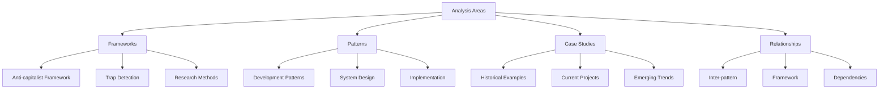
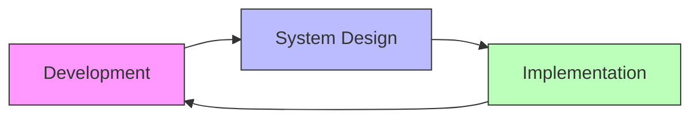

# Analysis & Insights

Our analysis explores the intersection of AI/ML technologies with anti-capitalist frameworks, documenting patterns, relationships, and practical implications for community-driven development.

## Analysis Dashboard

## Key Findings

### Framework Analysis
Detailed examination of our core analytical frameworks and their practical applications.

#### Anti-capitalist Framework
- [Core Principles](/context-network/analysis/frameworks/anti_capitalist_framework.md)
- [Application Examples](/context-network/analysis/findings/case_studies/)
- [Evolution & Refinements](/context-network/meta/updates.md)

#### Capitalist Trap Detection
- [Methodology Overview](/context-network/analysis/frameworks/capitalist_trap_detector.md)
- [Common Patterns](/context-network/analysis/patterns/)
- [Mitigation Strategies](/context-network/analysis/findings/theoretical_frameworks_analysis.md)

### Pattern Recognition

#### Development Patterns
Common patterns observed in AI/ML development:
- Community-First Design
- Distributed Decision Making
- Resource Sharing Models
- Privacy-Preserving Methods

[View Full Pattern Analysis](/context-network/analysis/patterns/)

#### System Design Patterns
Architectural patterns that support anti-capitalist principles:
- Decentralized Control
- Data Commons Architecture
- Federation & Interoperability
- Community Governance Models

[View System Design Details](/context-network/analysis/findings/theoretical_frameworks_analysis.md)

#### Implementation Patterns
Practical patterns for building anti-capitalist systems:
- Cooperative Development
- Open Source Practices
- Knowledge Sharing
- Resource Distribution

[View Implementation Guide](/context-network/processes/creation.md)

## Current Research Focus

### Active Investigations

- **{{ investigation.name }}**
  - Status: {{ investigation.status }}
  - Expected Completion: {{ investigation.completion_date }}
  - [View Progress](/context-network/research_tasks/{{ investigation.id }})


### Recent Findings

#### AI/ML Landscape
Key insights from our comprehensive analysis:
- [Current State Assessment](/context-network/analysis/findings/ai_ml_landscape_analysis.md)
- [Emerging Trends](/context-network/analysis/findings/theoretical_frameworks_analysis.md)
- [Community Impact](/context-network/analysis/findings/movement_monitoring_analysis.md)

#### Movement Monitoring
Latest developments in community technology initiatives:
- [Movement Analysis](/context-network/analysis/findings/movement_monitoring_analysis.md)
- [Policy Impacts](/context-network/analysis/findings/policy_monitoring_analysis.md)
- [Environmental Considerations](/context-network/research_tasks/monitoring/environmental_impact_metrics.md)

## Pattern Relationships

### Inter-pattern Connections
Understanding how different patterns interact and reinforce each other:

[View Detailed Relationships](/context-network/connections/dependencies.md)

### Framework Interactions
How our analytical frameworks complement each other:
- Cross-framework validation
- Complementary perspectives
- Integrated application

[View Framework Connections](/context-network/connections/interfaces.md)

## Deep Dive Resources

For comprehensive analysis and documentation:
- [Full Research Archive](/context-network/research_tasks/research_tasks_index.md)
- [Detailed Methodology](/context-network/processes/analysis.md)
- [Case Study Collection](/context-network/analysis/findings/case_studies/)
- [Pattern Library](/context-network/analysis/patterns/)
