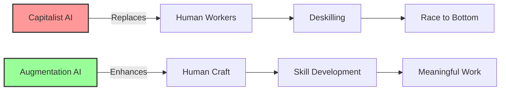

# Augmentation Not Automation: AI as Apprentice, Not Replacement
{: .fs-9 }

Preserving human craft and judgment while enhancing capabilities
{: .fs-6 .fw-300 }

---

## The Opportunity

**Exploits**: Automation Absolutism  
**Their Blind Spot**: "Automate everything possible"  
**Our Approach**: AI that enhances human craft and judgment rather than replacing it

While capitalism races to eliminate human workers, communities need tools that make human work more meaningful, sustainable, and valuable. This creates a perfect opportunity for AI that acts as an apprentice rather than a replacement.

## Why This Works



### Capitalist Blind Spots We Exploit

1. **Efficiency Obsession**: They can't see value in "inefficient" human craft
2. **Standardization Drive**: They miss the value of unique, personal touch
3. **Cost Minimization**: They ignore externalized costs of lost skills
4. **Speed Maximization**: They undervalue careful, thoughtful work

## Real-World Examples

### Woodworking Augmentation
Instead of CNC machines that replace craftspeople, imagine:
- AI that suggests grain-optimized cuts
- Tools that teach traditional joinery techniques
- Systems that preserve master craftsperson knowledge
- Sustainability calculators for material usage

### Textile Craft Enhancement
Rather than factory automation:
- Pattern recognition that helps with traditional techniques
- Color matching that respects cultural traditions
- Quality control that enhances rather than replaces human judgment
- Teaching systems that pass skills to next generation

### Food Production Support
Not industrial food processing, but:
- Fermentation monitoring that teaches principles
- Recipe scaling that maintains artisanal quality
- Seasonal ingredient optimization
- Traditional technique preservation

## Implementation Guide

### Phase 1: Community Engagement (Month 1)

**Identify Craft Communities**
- Local artisan guilds
- Traditional craft practitioners
- Teaching workshops and schools
- Cultural preservation groups

**Understand Needs**
- What knowledge is at risk of being lost?
- What tasks are physically challenging?
- Where could enhancement help most?
- What must remain human-controlled?

### Phase 2: Co-Design Process (Months 2-3)

**Principles Workshop**
- Define what "augmentation not automation" means for each craft
- Identify red lines that must not be crossed
- Establish success metrics focused on skill preservation
- Create governance structure for ongoing decisions

**Technical Requirements**
- Map specific augmentation opportunities
- Design teaching and learning features
- Plan knowledge preservation systems
- Ensure accessibility for all skill levels

### Phase 3: Prototype Development (Months 4-6)

**Start Small**
- Choose one specific craft technique
- Build minimal viable augmentation
- Test with master craftspeople
- Iterate based on feedback

**Key Features**
- Suggestion not direction
- Teaching not replacing
- Enhancing not standardizing
- Preserving not eliminating

### Phase 4: Community Deployment (Months 7-9)

**Careful Rollout**
- Begin with experienced practitioners
- Gradually include apprentices
- Document impact on craft quality
- Measure skill development

**Continuous Improvement**
- Regular community feedback sessions
- Adjustment based on craft evolution
- Feature requests from practitioners
- Knowledge base expansion

## Technical Architecture

### Core Principles
- **Local First**: Tools work without internet
- **Privacy Preserving**: Craft knowledge stays with community
- **Open Source**: No proprietary lock-in
- **Modular Design**: Communities can modify for their needs

### Key Components

```
┌─────────────────────────────────────────┐
│         Craft Knowledge Base            │
│  (Community-owned, locally-stored)      │
└────────────────┬────────────────────────┘
                 │
┌────────────────┴────────────────────────┐
│        Augmentation Engine              │
│   (Suggests, teaches, enhances)         │
└────────────────┬────────────────────────┘
                 │
┌────────────────┴────────────────────────┐
│      Practitioner Interface             │
│  (Respects craft, enables flow)         │
└─────────────────────────────────────────┘
```

### Data Sovereignty
- All craft knowledge remains with community
- No external dependencies
- Export functionality for preservation
- Community controls all updates

## Success Metrics

### What We Measure
- **Skill Preservation**: Traditional techniques maintained
- **Knowledge Transfer**: Apprentices learning faster
- **Craft Quality**: Enhanced not diminished
- **Economic Viability**: Artisans earning living wages
- **Community Strength**: Bonds between practitioners

### What We Don't Measure
- ❌ Efficiency gains
- ❌ Cost reduction
- ❌ Speed increases
- ❌ Standardization rates
- ❌ Automation percentages

## Resources Needed

### Minimal Viable Implementation
- **Budget**: $5,000-10,000
- **Team**: 2-3 developers + craft practitioners
- **Time**: 6-9 months to first deployment
- **Infrastructure**: Basic computing, no cloud required

### Ongoing Sustainability
- Community membership model
- Grants from cultural preservation organizations
- Sales of enhanced craft products
- Teaching and workshop revenue

## Getting Started

### For Craft Communities

1. **Assess Your Needs**
   - What skills are at risk?
   - Where could augmentation help?
   - Who wants to participate?

2. **Connect with Tech Allies**
   - Find developers who respect craft
   - Look for appropriate technology
   - Ensure community control

3. **Start Small**
   - Pick one technique to augment
   - Test with trusted practitioners
   - Build from successes

### For Developers

1. **Listen First**
   - Spend time with craftspeople
   - Understand their values
   - Respect their expertise

2. **Build Together**
   - Co-design every feature
   - Test in real workshops
   - Iterate based on use

3. **Preserve Agency**
   - AI suggests, humans decide
   - Enhance don't replace
   - Teach don't automate

## Case Studies

### Japanese Woodworking Collective
- Preserved 500-year-old joinery techniques
- AI helps visualize wood grain patterns
- Masters' knowledge captured for apprentices
- Young people joining craft due to tech enhancement

### Indigenous Weaving Cooperative
- Pattern recognition respects cultural protocols
- Elders control what knowledge is shared
- Technology enhances but doesn't alter tradition
- Economic sustainability through enhanced production

### Fermentation Guild Network
- Monitoring tools teach principles not just recipes
- Knowledge sharing across geographic boundaries
- Quality improvement without standardization
- New fermenters learn traditional methods faster

## Common Questions

**Q: Isn't this just slowing down progress?**
A: It's redirecting progress toward human flourishing rather than human replacement.

**Q: How can this compete with full automation?**
A: It serves different values - quality, meaning, and community rather than just efficiency.

**Q: What about scalability?**
A: Each community scales to meet its needs, not infinite growth.

**Q: How do we prevent this becoming automation eventually?**
A: Community ownership and governance with clear principles embedded in the technology itself.

## Specific Implementation: Craft Augmentation AI

We've developed a complete technical specification for AI that enhances traditional crafts without replacing craftspeople. This "Intelligent Apprentice System" preserves the joy, meaning, and livelihood of craft work while providing tools that amplify human creativity and skill.

[Learn more about Craft Augmentation AI →](craft-augmentation)

## Join the Movement

Ready to build AI that enhances rather than replaces human craft?

- [Download Technical Specification](/specs/craft-augmentation-spec)
- [Join Implementation Working Group](https://forum.myceliary.org/craft-augmentation)
- [Access Funding Resources](/resources/craft-preservation-funding)
- [Connect with Craft Communities](/community/craft-guilds)

---

*"The master's tools will never dismantle the master's house. But tools we build ourselves, for our own purposes, following our own values - these can build the world we need."*