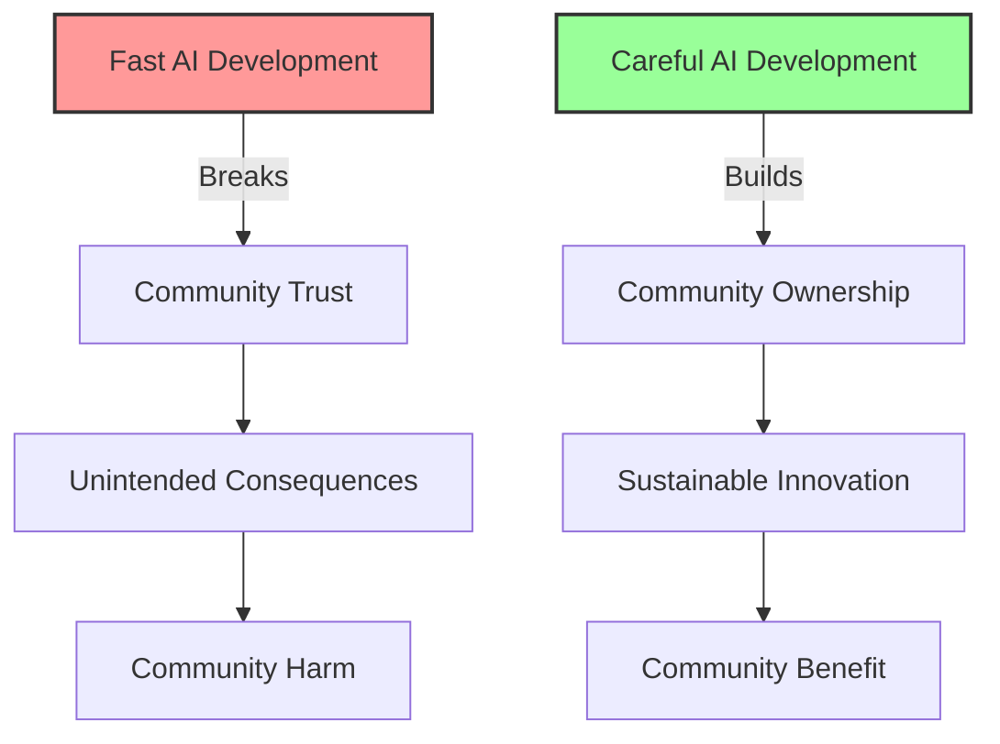

# Careful AI Development: Community-Governed Innovation
{: .fs-9 }

AI developed with/by communities at the speed of trust, not venture capital
{: .fs-6 .fw-300 }

---

## The Opportunity

**Exploits**: Innovation Speed Cult  
**Their Blind Spot**: "Move fast and break things"  
**Our Approach**: Slow, community-governed AI deployment with mandatory wisdom and review periods

While Big Tech races to deploy AI as quickly as possible, communities need technologies developed at the speed of trust, with proper community input, elder wisdom, and cultural consideration. This creates opportunities for AI that serves human needs rather than investor timelines.

## Why This Works



### Capitalist Blind Spots We Exploit

1. **Speed Obsession**: They can't see value in taking time for proper development
2. **Investor Timelines**: They're driven by funding cycles, not community needs
3. **Technical Solutionism**: They ignore social and cultural complexity
4. **Disruption Ideology**: They see breaking existing systems as always good

## Real-World Applications

### Elder Care AI with Community Wisdom
- AI assistants developed with and by elder communities
- Mandatory elder council review of all features
- Intergenerational design process respecting elder knowledge
- Deployment only when community consensus achieved

### Indigenous Knowledge Systems
- Traditional ecological knowledge preservation with full cultural protocols
- AI development guided by indigenous research methodologies
- Community-controlled pace respecting ceremonial and seasonal cycles
- Integration of spiritual and technical considerations

### Community Health AI
- Health monitoring systems developed with neighborhood health workers
- Community epidemiology respecting local knowledge and privacy
- Mental health support systems designed with trauma-informed approaches
- Deployment tied to community capacity and readiness

### Democratic Decision Support
- Consensus-building tools developed through actual consensus processes
- AI trained on community's own successful decision-making history
- Governance systems tested extensively before implementation
- Continuous community evaluation and adjustment protocols

## Implementation Guide

### Phase 1: Community Relationship Building (Months 1-6)

**Deep Community Engagement**
- Spend significant time understanding community values and needs
- Build authentic relationships before discussing any technology
- Learn community decision-making processes and governance structures
- Identify community champions and skeptics

**Cultural Competency Development**
- Study community history, trauma, and resilience patterns
- Understand power dynamics and representation challenges
- Learn appropriate protocols for community engagement
- Develop cultural humility and authentic accountability

### Phase 2: Collaborative Needs Assessment (Months 7-12)

**Community-Led Problem Definition**
- Communities define problems in their own terms
- Technology solutions explored only after thorough needs assessment
- Traditional and existing solutions documented and respected
- Clear boundaries established about what technology can and cannot do

**Wisdom Integration Planning**
- Identify elders, traditional knowledge holders, and community experts
- Create formal roles for community wisdom in development process
- Establish protocols for cultural and spiritual considerations
- Design decision-making processes that honor community governance

### Phase 3: Co-Design and Prototyping (Months 13-24)

**Community-Controlled Development**
- All design decisions made through community governance processes
- Regular community review and feedback cycles
- Traditional knowledge integrated with cultural protocols
- Iterative development at community-determined pace

**Mandatory Review Periods**
- Built-in waiting periods for community reflection
- Elder councils and community groups review all developments
- Cultural and spiritual impact assessments
- Community veto power at every stage

### Phase 4: Careful Deployment (Months 25-36)

**Community Readiness Assessment**
- Technical capacity and training completed
- Community governance structures adapted for ongoing oversight
- Protocols established for community control and modification
- Emergency procedures and discontinuation plans prepared

**Graduated Implementation**
- Pilot with small group of community champions
- Gradual expansion based on community feedback and comfort
- Continuous monitoring of community impact and satisfaction
- Regular community assemblies for evaluation and adjustment

## Technical Architecture

### Community Governance Integration
- All technical decisions subject to community approval
- Democratic processes built into development workflow
- Community data sovereignty and ownership
- Open source with community-controlled forks

### Careful Development Pipeline

```
┌─────────────────────────────────────────┐
│        Community Wisdom Council         │
│     (Elders, knowledge holders)         │
└────────────────┬────────────────────────┘
                 │ Approves/Vetoes
┌────────────────┴────────────────────────┐
│       Technical Development Team        │
│    (Community members + allies)         │
└────────────────┬────────────────────────┘
                 │ Builds/Tests
┌────────────────┴────────────────────────┐
│      Community Review Assembly          │
│    (Broader community evaluation)       │
└─────────────────────────────────────────┘
```

### Key Components

1. **Community Oversight Systems**
   - Democratic decision-making tools for technical choices
   - Elder and wisdom keeper formal review processes
   - Community assemblies for major development decisions
   - Continuous feedback and adjustment mechanisms

2. **Cultural Protection Protocols**
   - Traditional knowledge handling with appropriate permissions
   - Cultural impact assessment for all features
   - Spiritual and ceremonial consideration integration
   - Community protocols embedded in technical architecture

3. **Gradual Implementation Tools**
   - Pilot testing with community volunteers
   - Staged rollout based on community readiness
   - Community-controlled feature activation
   - Emergency shutdown and rollback capabilities

## Success Metrics

### What We Measure
- **Community Trust**: Satisfaction with development process and outcomes
- **Cultural Integrity**: Traditional knowledge and values preserved and honored
- **Community Capacity**: Local skills and governance strength increased
- **Democratic Participation**: Meaningful community involvement in decisions
- **Long-term Sustainability**: Technology serves community across generations

### What We Don't Measure
- ❌ Development speed
- ❌ Time to market
- ❌ Feature delivery velocity
- ❌ Competitive advantages
- ❌ Investor satisfaction

## Example Implementation: Elder Care AI Cooperative

### The Challenge
Aging rural community faces:
- Isolation and limited healthcare access
- Loss of traditional knowledge as elders pass away
- Difficulty coordinating community care resources
- Mistrust of technology developed without community input

### The Careful Development Solution
**WisdomKeeper**: Elder care AI developed with/by elder community

**Community-Centered Process**:
1. **Relationship Building** (6 months): Regular community meals, listening sessions
2. **Elder Council Formation** (3 months): Traditional governance structure for AI oversight
3. **Needs Assessment** (6 months): Elders define problems and desired solutions
4. **Co-Design** (12 months): Intergenerational design process with elder leadership
5. **Gradual Testing** (6 months): Careful pilots with enthusiastic elder volunteers
6. **Community Deployment** (6 months): Rollout based on elder comfort and readiness

**Key Features Developed**:
- Health monitoring that respects elder privacy and autonomy
- Story preservation system honoring cultural protocols
- Community connection tools strengthening existing relationships
- Emergency support integrated with traditional mutual aid

**Governance Structure**:
- Elder Council has veto power over all features
- Monthly community assemblies review AI performance
- Traditional knowledge sharing protocols embedded in technology
- Community controls all data and can modify or discontinue system

**Results After 3 Years**:
- 87% elder satisfaction with development process
- Traditional knowledge preservation accelerated
- Community care coordination improved without replacing human connection
- Model replicated by 12 other rural communities
- No major unintended consequences or community conflicts

## Resources Needed

### Minimal Viable Implementation
- **Budget**: $75,000-150,000 for full careful development process
- **Team**: 1-2 developers + community organizers + cultural mediators
- **Time**: 2-3 years from relationship building to full deployment
- **Infrastructure**: Community-controlled, culturally appropriate technology

### Community Capacity Requirements
- Existing governance structures or willingness to develop them
- Community members interested in technical learning
- Cultural and spiritual leadership support
- Commitment to democratic decision-making about technology

## Getting Started

### For Communities

1. **Assess Community Readiness**
   - Do you have strong community governance?
   - Are there clear processes for collective decision-making?
   - Is there interest in community-controlled technology?
   - Are elders and wisdom keepers supportive?

2. **Define Your Values**
   - What are your non-negotiables for technology development?
   - How do you make decisions about things that affect everyone?
   - What cultural and spiritual considerations are important?
   - How do you handle disagreement and build consensus?

3. **Start Relationship Building**
   - Connect with technologists who respect community autonomy
   - Begin conversations about needs before solutions
   - Establish community governance for technology decisions
   - Create protocols for ongoing community control

### For Developers

1. **Learn Community Engagement**
   - Study community organizing and democratic decision-making
   - Understand power dynamics and historical trauma
   - Develop cultural humility and authentic accountability
   - Learn to follow community leadership

2. **Embrace Slow Development**
   - Design processes that prioritize community trust over speed
   - Build in mandatory waiting periods for reflection
   - Create systems for continuous community feedback
   - Accept that good technology takes time

3. **Design for Community Control**
   - All code open source with community ownership
   - Democratic processes embedded in development workflow
   - Community veto power at every stage
   - Clear protocols for community modification and discontinuation

## Case Studies

### Indigenous Digital Sovereignty Initiative
- 5 tribal nations developing AI for language preservation
- Ceremony and seasonal cycles integrated into development timeline
- Traditional governance structures guide all technical decisions
- 4-year development process results in culturally appropriate AI

### Urban Community Health Cooperative
- Neighborhood residents develop AI for community health monitoring
- Community health workers lead development process
- Trauma-informed design with mental health community guidance
- 2-year careful implementation with strong community satisfaction

### Rural Mutual Aid Network
- Agricultural communities develop AI for resource coordination
- Farmer wisdom and traditional knowledge central to development
- Cooperative governance structure ensures democratic control
- Technology strengthens existing mutual aid rather than replacing it

## Common Questions

**Q: Isn't this just too slow for real innovation?**
A: We prioritize sustainable innovation that serves communities over quick profits.

**Q: How can this compete with venture-funded development?**
A: We serve different values - community benefit vs. investor returns.

**Q: What if the community decides against beneficial technology?**
A: Community autonomy and self-determination are more important than our opinion of what's beneficial.

**Q: How do we scale this approach?**
A: Each community controls its own development process, with sharing of approaches and techniques.

## Join the Movement

Ready to develop AI at the speed of trust and community wisdom?

- [Download Technical Specification](/specs/careful-ai-development-spec)
- [Join Implementation Working Group](https://forum.myceliary.org/careful-ai)
- [Access Community Engagement Resources](/resources/community-tech-organizing)
- [Connect with Slow Technology Networks](/community/careful-innovation)

---

*"The right technology in the wrong relationship becomes the wrong technology. Careful development prioritizes right relationship above all else."*