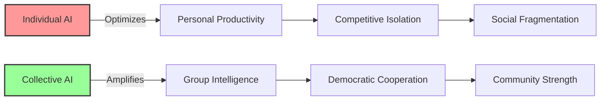

# Collective Intelligence Amplifiers: Group Wisdom Over Individual Productivity
{: .fs-9 }

AI that amplifies what communities know together, not what individuals can produce alone
{: .fs-6 .fw-300 }

---

## The Opportunity

**Exploits**: Individual Productivity Obsession  
**Their Blind Spot**: "AI should make individuals more productive"  
**Our Approach**: AI that amplifies group wisdom and collective decision-making

While Big Tech focuses on making individuals more productive consumers and producers, communities need tools that enhance collective intelligence, democratic participation, and group wisdom. This creates perfect opportunities for AI that serves the group mind rather than individual competition.

## Why This Works



### Capitalist Blind Spots We Exploit

1. **Individual Focus**: They can't see value beyond personal optimization
2. **Competition Obsession**: They miss benefits of cooperation
3. **Quantified Self**: They ignore collective wisdom and intuition  
4. **Efficiency Metrics**: They can't measure community health and solidarity

## Real-World Applications

### Participatory Budgeting Enhancement
- AI detects emerging consensus in community discussions
- Pattern recognition reveals shared values and priorities
- Translation tools enable multilingual participation
- Synthesis tools help communities see their collective wisdom

### Community Conflict Resolution
- AI identifies underlying interests beneath stated positions
- Pattern matching with successful resolution approaches
- Group process facilitation and agenda setting
- Documentation of community agreements and decisions

### Collaborative Planning and Visioning
- AI helps communities envision multiple possible futures
- Resource mapping for collective projects
- Timeline coordination for community initiatives
- Integration of diverse perspectives and knowledge

### Consensus Building Tools
- Real-time mood and sentiment awareness during meetings
- Identification of points needing more discussion
- Synthesis of complex multi-stakeholder conversations
- Support for indigenous and traditional decision-making processes

## Implementation Guide

### Phase 1: Community Engagement (Months 1-2)

**Identify Partner Communities**
- Groups already practicing participatory democracy
- Organizations with collective decision-making experience
- Communities facing complex decisions requiring group wisdom
- Networks interested in improving democratic processes

**Understand Decision-Making Culture**
- How does the community currently make collective decisions?
- What are the barriers to fuller participation?
- What traditional or cultural practices inform group wisdom?
- Where does the community get stuck in decision-making?

### Phase 2: Co-Design Process (Months 3-4)

**Map Collective Intelligence Needs**
- Where does group wisdom get lost or ignored?
- What information is needed for good collective decisions?
- How can technology enhance rather than replace human judgment?
- What are the community's values around technology and democracy?

**Design Participatory Systems**
- Tools that enhance existing democratic practices
- Interfaces accessible to all community members
- Integration with traditional decision-making methods
- Clear boundaries about what AI can and cannot do

### Phase 3: Prototype Development (Months 5-7)

**Build Community-Controlled Systems**
- AI that learns from the community's own decision-making history
- Pattern recognition trained on successful collective processes
- Tools that make group intelligence visible and accessible
- Systems that preserve community autonomy and values

**Test with Real Decisions**
- Start with lower-stakes community choices
- Document impact on participation and decision quality
- Adjust based on community feedback and values
- Build trust through transparency and community control

### Phase 4: Integration and Scaling (Months 8-12)

**Embed in Community Practice**
- Integration with regular community meetings and processes
- Training for community facilitators and leaders
- Documentation of successful applications and techniques
- Continuous improvement based on community experience

**Share with Movement Networks**
- Connect with other communities using similar approaches
- Share successful patterns and techniques
- Build movement-wide capacity for democratic technology
- Create mutual support networks for ongoing development

## Technical Architecture

### Collective Intelligence Principles
- **Group First**: Optimize for collective wisdom, not individual productivity
- **Transparent**: All AI reasoning visible to community
- **Community-Controlled**: Algorithms reflect community values
- **Enhancement**: Amplify human intelligence, don't replace it

### Core Components

```
┌─────────────────────────────────────────┐
│        Community Input Layer            │
│   (Voices, perspectives, knowledge)     │
└────────────────┬────────────────────────┘
                 │
┌────────────────┴────────────────────────┐
│      Pattern Recognition Engine         │
│   (Detect consensus, synthesis)         │
└────────────────┬────────────────────────┘
                 │
┌────────────────┴────────────────────────┐
│    Collective Wisdom Interface          │
│   (Group intelligence made visible)     │
└─────────────────────────────────────────┘
```

### Key Features

1. **Consensus Detection**
   - Real-time analysis of group discussion patterns
   - Identification of emerging agreement areas
   - Recognition of points requiring more exploration
   - Multi-modal input (speech, text, gesture, energy)

2. **Synthesis and Pattern Recognition**
   - Integration of diverse perspectives and knowledge
   - Connection of current decisions with community history
   - Recognition of successful decision-making patterns
   - Cultural and traditional wisdom integration

3. **Democratic Process Support**
   - Facilitation tools for inclusive participation
   - Documentation and memory of collective decisions
   - Translation and accessibility features
   - Integration with existing governance structures

## Success Metrics

### What We Measure
- **Participation Quality**: Depth and breadth of community engagement
- **Decision Satisfaction**: Community happiness with collective choices
- **Democratic Health**: Inclusivity and representation in decision-making
- **Collective Wisdom**: Integration of diverse knowledge and perspectives
- **Community Capacity**: Growing skills in collaborative decision-making

### What We Don't Measure
- ❌ Individual productivity gains
- ❌ Decision-making speed
- ❌ Efficiency optimization
- ❌ Competitive advantages
- ❌ Personal data collection

## Example Implementation: ConsensusEngine for Participatory Budgeting

### The Challenge
Urban neighborhood with $500,000 annual participatory budget faces:
- Language barriers limiting participation
- Complex proposals difficult to evaluate collectively
- Traditional meetings exclude working families
- Difficulty synthesizing hundreds of community inputs

### The Collective Intelligence Solution
**ConsensusEngine**: AI that amplifies community wisdom in budget decisions

**How It Works**:
1. **Input Gathering**: Multiple ways for residents to share priorities and ideas
2. **Pattern Recognition**: AI identifies shared values and emerging consensus
3. **Synthesis Support**: Complex proposals broken down for collective understanding
4. **Consensus Building**: Real-time feedback on community agreement levels
5. **Decision Integration**: Final choices reflect authentic collective wisdom

**Technical Features**:
- Multilingual input and output for inclusive participation
- Anonymous option to encourage honest input
- Real-time visualization of community priorities and consensus
- Integration with in-person meetings and traditional decision-making
- Community control over all algorithms and data

**Results After 2 Years**:
- Participation increased from 200 to 800+ residents
- Decision satisfaction ratings improved from 6.2 to 8.7/10
- More complex projects successfully implemented
- Residents report feeling more connected to neighborhood
- Model replicated in 5 other communities

### Community Ownership Features
- Residents vote on algorithm changes
- Community data stays local and encrypted
- Open source with no corporate dependencies
- Democratic governance of technology decisions
- Clear boundaries about AI capabilities and limits

## Resources Needed

### Minimal Viable Implementation
- **Budget**: $25,000-50,000 for community-specific deployment
- **Team**: 2-3 developers + experienced community facilitators
- **Time**: 6-9 months to functional system
- **Infrastructure**: Community-controlled servers, open source software

### Scaling Across Communities
- Each community customizes for their specific needs
- Shared infrastructure reduces costs for additional communities
- Network effects improve pattern recognition across implementations
- Communities can share successful approaches and techniques

## Getting Started

### For Communities

1. **Assess Democratic Capacity**
   - How does your community currently make collective decisions?
   - Where do you get stuck or lose community wisdom?
   - What are your values around technology and democracy?
   - Who would need to be involved in design and implementation?

2. **Identify Decision-Making Challenges**
   - Complex choices that would benefit from collective intelligence
   - Barriers to broader participation in community decisions
   - Areas where group wisdom gets lost or ignored
   - Opportunities to strengthen democratic practices

3. **Build Readiness**
   - Experience with participatory decision-making
   - Community facilitators with group process skills
   - Technical allies who understand democratic values
   - Commitment to community control of technology

### For Developers

1. **Learn Community Democracy**
   - Study facilitation, consensus-building, and group dynamics
   - Understand power dynamics and inclusion challenges
   - Learn from indigenous and traditional decision-making wisdom
   - Practice participating in collective decision-making processes

2. **Design for Collective Intelligence**
   - Optimize for group wisdom, not individual efficiency
   - Build transparency and community control into all systems
   - Focus on enhancing human judgment, not replacing it
   - Respect cultural and traditional approaches to group decisions

3. **Prioritize Community Sovereignty**
   - Communities control all data and algorithms
   - Open source with no corporate dependencies
   - Clear limitations on what AI can and cannot do
   - Democratic processes for technology decisions

## Case Studies

### Indigenous Nation Governance Council
- Traditional consensus processes enhanced with pattern recognition
- Elder wisdom integrated with youth perspectives
- Complex treaty negotiations supported by synthesis tools
- Community sovereignty maintained throughout implementation

### Worker Cooperative Network
- 12 cooperatives coordinating regional economic decisions
- Democratic planning processes supported by collective intelligence
- Resource sharing optimized through group wisdom
- Movement building enhanced through shared decision-making

### Transition Town Climate Planning
- Community climate resilience planning with 500+ residents
- Complex technical information made accessible for collective decisions
- Multiple scenarios evaluated through community wisdom
- Implementation coordinated through democratic processes

## Common Questions

**Q: Won't this just slow down decision-making?**
A: Good collective decisions often take time, but they're more sustainable and effective.

**Q: How do we prevent manipulation by special interests?**
A: Transparency, community control, and democratic governance of the technology itself.

**Q: What about communities without strong democratic traditions?**
A: The technology can support learning democratic practices, but community capacity building is essential.

**Q: How is this different from online polls or surveys?**
A: It amplifies collective wisdom and synthesis, not just opinion aggregation.

## Join the Movement

Ready to build AI that serves collective wisdom rather than individual productivity?

- [Download Technical Specification](/specs/collective-intelligence-spec)
- [Join Implementation Working Group](https://forum.myceliary.org/collective-intelligence)
- [Access Democratic Technology Resources](/resources/participatory-tech)
- [Connect with Community Democracy Networks](/community/democratic-innovation)

---

*"The intelligence we need is not artificial but collective - the wisdom that emerges when communities think together."*