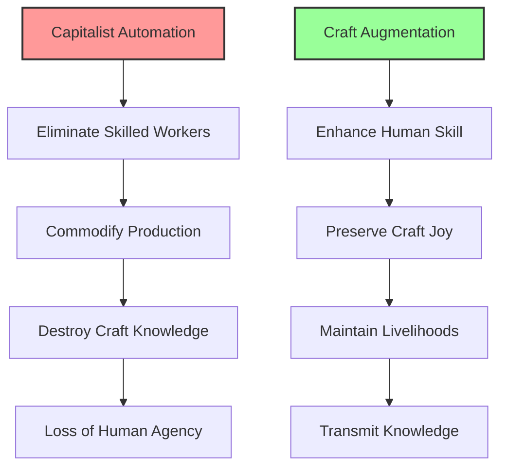

# Craft Augmentation AI: Enhancing Human Skill, Not Replacing It
{: .fs-9 }

AI as intelligent apprentice - preserving the joy, meaning, and livelihood of craft work
{: .fs-6 .fw-300 }

---

## The Opportunity

**Exploits**: Automation Absolutism  
**Their Blind Spot**: "Automate everything possible for maximum efficiency"  
**Our Approach**: AI that explicitly preserves and enhances human craft

While capitalism pushes to automate away skilled workers and turn craft into commodity manufacturing, communities need tools that amplify human creativity and skill. This blindness to the value of human judgment, craft joy, and meaningful work creates space for AI that serves craftspeople rather than replacing them.

## Why This Matters



### What Capitalism Built vs What Communities Need

**Capitalism's "Solution":**
- Automation that replaces workers
- AI that makes craft obsolete
- Efficiency that destroys meaning
- Technology that deskills labor

**Community Alternative:**
- AI as intelligent apprentice
- Technology that enhances skill
- Tools that preserve craft joy
- Systems that support livelihoods

## Core Principles

### 1. Preserve Human Agency
The craftsperson always remains in control. AI suggests, assists, and enhances - but never decides or creates autonomously.

### 2. Enhance Not Replace
Every feature must amplify human capability without creating dependency or replacing human judgment.

### 3. Maintain Craft Value
The human touch, creative decision-making, and craft tradition remain central to the work's value.

### 4. Support Livelihood
Tools must help craftspeople sustain themselves economically without commodifying their craft.

## How It Works

### The Intelligent Apprentice System

Our Craft Augmentation AI acts like a skilled apprentice who:
- Handles tedious preparation tasks
- Offers suggestions when asked
- Remembers techniques and preferences
- Never makes creative decisions alone
- Learns from the master's approach
- Respects craft traditions

### Human-Centered Task Analysis

The system identifies which aspects of craft work should remain human:

**Always Human:**
- Creative decisions and aesthetic choices
- Quality judgments and final approval
- Client relationships and custom design
- Innovation and artistic expression
- Teaching and knowledge transmission

**Open to Assistance:**
- Material optimization and waste reduction
- Pattern calculations and measurements
- Inventory tracking and supply ordering
- Documentation and portfolio creation
- Time estimation and project planning

### Joy and Satisfaction Detection

The AI actively monitors and protects the aspects of craft that bring satisfaction:
- Identifies tasks that craftspeople enjoy
- Preserves meaningful challenges
- Maintains flow states
- Protects creative exploration time
- Respects individual work rhythms

## Craft Domains and Examples

### Woodworking
**Augmentation Features:**
- Grain analysis for optimal cuts (preserves selection judgment)
- Joint stress calculations (maintains hand-cutting skill)
- Wood movement predictions (supports design decisions)
- Tool maintenance reminders (extends craft tool life)

**What Stays Human:**
- Design aesthetic and artistic vision
- Hand tool technique and feel
- Surface finishing and texture
- Customer consultation and customization

### Textiles and Fiber Arts
**Augmentation Features:**
- Pattern scaling and grading (preserves original design)
- Tension monitoring for consistent results (maintains hand control)
- Color combination suggestions (respects artistic choice)
- Yarn quantity calculations (reduces waste)

**What Stays Human:**
- Color selection and artistic decisions
- Texture and material choice
- Stitch selection and technique
- Final quality assessment

### Culinary Arts
**Augmentation Features:**
- Flavor pairing suggestions (enhances creativity)
- Timing coordination for complex meals (maintains cooking skill)
- Inventory tracking and supplier connections (reduces waste)
- Recipe scaling calculations (preserves technique)

**What Stays Human:**
- Taste and seasoning decisions
- Presentation and plating artistry
- Technique execution and timing
- Menu creation and innovation

### Metalwork and Blacksmithing
**Augmentation Features:**
- Heat treatment guidance (preserves skill development)
- Stress analysis for structural work (maintains safety)
- Material property database (supports informed choices)
- Project documentation for clients (showcases craft)

**What Stays Human:**
- Hammer control and forming technique
- Aesthetic decisions and artistic vision
- Heat judgment and color reading
- Custom design and problem-solving

### Pottery and Ceramics
**Augmentation Features:**
- Glaze chemistry calculations (enables experimentation)
- Kiln firing schedule optimization (preserves intuition)
- Form proportion suggestions (maintains artistic control)
- Inventory and commission tracking (supports business)

**What Stays Human:**
- Throwing technique and hand control
- Form creation and artistic expression
- Surface decoration and glazing decisions
- Clay preparation and wedging

## Implementation Approach

### Phase 1: Craft Community Engagement (4 months)
**Focus**: Building relationships and understanding needs

- Partner with craft guilds and maker spaces
- Interview master craftspeople about their work
- Identify what brings joy and meaning to craft
- Understand economic pressures and opportunities
- Map existing tools and pain points

### Phase 2: Augmentation Prototyping (8 months)
**Focus**: Co-creating enhancement tools

- Develop task analysis algorithms with craftspeople
- Build joy and satisfaction detection systems
- Create first augmentation tools for specific crafts
- Test with small group of craft partners
- Iterate based on preserving craft essence

### Phase 3: Economic Integration (12 months)
**Focus**: Supporting sustainable livelihoods

- Develop fair pricing calculators
- Create market connection tools (without commodification)
- Build cooperative formation support
- Implement direct sales platforms
- Establish craft knowledge commons

## Technical Architecture

### System Components

```
┌─────────────────────────────────────────┐
│         Craftsperson Interface          │
│    (Respects craft rhythm and flow)     │
└────────────────┬────────────────────────┘
                 │
┌────────────────┴────────────────────────┐
│    Human-Centered Task Analyzer         │
│  (Identifies what should stay human)    │
└────────────────┬────────────────────────┘
                 │
┌────────────────┴────────────────────────┐
│     Intelligent Apprentice Engine       │
│   (Provides assistance when requested)  │
└────────────────┬────────────────────────┘
                 │
┌────────────────┴────────────────────────┐
│    Craft Knowledge Preservation         │
│  (Documents without commodifying)       │
└─────────────────────────────────────────┘
```

### Key Features

1. **Task Value Assessment**
   - Analyzes which tasks bring satisfaction
   - Identifies tedious vs. meaningful work
   - Preserves challenges that build skill
   - Protects creative decision points

2. **Skill Development Tracking**
   - Monitors growing expertise
   - Adjusts assistance level appropriately
   - Celebrates skill milestones
   - Supports apprenticeship learning

3. **Economic Sustainability Tools**
   - Fair pricing based on skill and time
   - Direct customer connections
   - Cooperative business models
   - Grant and funding assistance

4. **Knowledge Commons**
   - Technique documentation with attribution
   - Story and context preservation
   - Intergenerational knowledge transfer
   - Protection of traditional methods

## Community Control

### Craftsperson Sovereignty
- Complete control over automation boundaries
- Individual override on any AI assistance
- Data ownership and portability
- Algorithm transparency and adjustment

### Guild Governance
- Collective decisions on feature development
- Peer validation of augmentation ethics
- Traditional knowledge protection protocols
- Economic model participation choices

### Cultural Respect
- Indigenous craft method protection
- Traditional technique preservation
- Regional variation support
- Anti-commodification safeguards

## Success Metrics

### What We Measure
- **Craft Preservation**: Active practitioners maintained or increased
- **Skill Development**: New apprentices successfully trained
- **Economic Viability**: Living wages achieved by craftspeople
- **Joy Maintenance**: Satisfaction and meaning in craft work preserved
- **Knowledge Transfer**: Techniques passed to next generation

### What We Don't Measure
- ❌ Production speed increases
- ❌ Labor cost reductions
- ❌ Automation percentages
- ❌ Efficiency optimizations
- ❌ Output maximization

## Real Impact Stories

### The Furniture Maker's Apprentice
A solo furniture maker uses the system to:
- Calculate joint angles while hand-cutting remains theirs
- Track wood inventory without losing shop time
- Document custom pieces for portfolio
- Price work fairly for sustainable income
- **Result**: 40% more creative time, living wage maintained

### The Weaving Cooperative
A textile cooperative implements augmentation for:
- Pattern sharing while preserving individual style
- Collaborative inventory management
- Fair pricing across different skill levels
- Market connections without middlemen
- **Result**: All members earning sustainable income

### The Pottery Studio
A ceramics studio uses AI assistance for:
- Glaze recipe experimentation and records
- Kiln scheduling optimization
- Student progress tracking
- Commission management
- **Result**: More time for teaching and creating

## Getting Involved

### For Craftspeople
1. Share what brings joy to your craft
2. Identify tedious tasks you'd gladly delegate
3. Help define automation boundaries
4. Test augmentation tools in your practice
5. Join governance discussions

### For Developers
1. Learn from master craftspeople
2. Understand craft values and traditions
3. Build with respect for human skill
4. Focus on enhancement not efficiency
5. Prioritize craftsperson control

### For Communities
1. Support local craft economies
2. Fund augmentation development
3. Connect craftspeople with resources
4. Celebrate human-made goods
5. Resist automation pressure

### For Funders
1. Invest in craft preservation
2. Support cooperative development
3. Fund anti-automation research
4. Enable sustainable craft livelihoods
5. Value meaning over efficiency

## Current Status

**Development Stage**: Design Complete (Stage 5/7)
- ✅ Opportunity identified and validated
- ✅ Core principles established
- ✅ Technical architecture designed
- ✅ Craft domains mapped
- ✅ Implementation plan created
- ⏳ Prototype development beginning
- ⏳ Community partnerships forming

## Why This Challenges Capitalism

This approach directly confronts capitalism's core assumptions:

1. **Efficiency Isn't Everything**: We optimize for joy, meaning, and human development
2. **Automation Isn't Inevitable**: We choose what to augment and what to preserve
3. **Craft Has Intrinsic Value**: Beyond commodity production and profit extraction
4. **Workers Control Technology**: Not the other way around
5. **Tradition Matters**: Indigenous and traditional knowledge deserves protection

## Next Steps

Ready to help build AI that serves craftspeople rather than replacing them?

- [View Full Technical Specification](https://github.com/Myceliary/myceliary/blob/main/context-network/analysis/implementations/technical_specifications/craft_augmentation_ai.md)
- [Join Craft Augmentation Working Group](https://forum.myceliary.org/craft-augmentation)
- [Connect with Partner Guilds](/community/craft-guilds)
- [Support Development](/donate/craft-augmentation)

---

*"The future of craft isn't automation - it's augmentation that preserves what makes us human while enhancing what we can create together."*