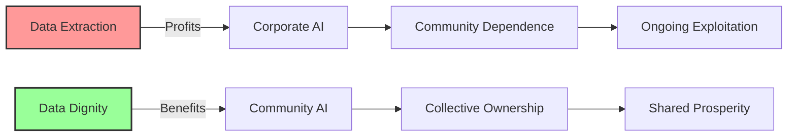

# Data Dignity Cooperatives: Communities Own Their Collective Intelligence
{: .fs-9 }

What happens when patients own the medical AI instead of corporations?
{: .fs-6 .fw-300 }

---

## The Opportunity

**Exploits**: Data Monetization Imperative  
**Their Blind Spot**: "Data is the new oil - extract and refine"  
**Our Approach**: Communities own their collective intelligence and control how it's used

While Big Tech extracts data to create AI that they own and profit from, communities can create cooperatives where they collectively own both their data and the AI trained on it. This exploits capitalism's inability to imagine data relationships that aren't based on extraction.

## Why This Works



### Capitalist Blind Spots We Exploit

1. **Extraction Assumption**: They can't imagine data relationships without ownership transfer
2. **Individual Focus**: They miss the power of collective data ownership
3. **Profit Maximization**: They can't see value in community-controlled returns
4. **Platform Control**: They can't compete with community-owned infrastructure

## Real-World Applications

### Medical AI Cooperatives
- Patients collectively own AI trained on their health data
- Communities control medical insights and research directions
- Healthcare workers and patients govern AI development together
- Profits from medical discoveries return to community health programs

### Educational Intelligence Commons
- Students and teachers own AI trained on learning experiences
- Communities control educational insights and curriculum development
- Learning data used to improve community education, not corporate products
- Educational AI serves learners, not surveillance or ranking systems

### Agricultural Wisdom Cooperatives
- Farmers collectively own AI trained on their growing experiences
- Traditional and modern agricultural knowledge combined respectfully
- Climate adaptation strategies developed with and for farming communities
- Agricultural insights benefit farmers, not agribusiness corporations

### Community Mental Health Networks
- Therapy and support groups collectively own mental health AI
- Communities control research directions and privacy protections
- Mental health workers and community members govern development
- Healing insights stay within community rather than being commercialized

## Implementation Guide

### Phase 1: Cooperative Foundation (Months 1-6)

**Legal Structure Development**
- Multi-stakeholder cooperative with community members as owners
- Governance structure ensuring democratic control of data and AI
- Legal protections for community ownership of collective intelligence
- Clear protocols for data sovereignty and member rights

**Community Engagement and Education**
- Community education about data dignity and cooperative ownership
- Member recruitment emphasizing shared values and benefits
- Democratic development of cooperative policies and procedures
- Cultural competency and community accountability structures

### Phase 2: Data Infrastructure (Months 7-12)

**Community-Controlled Data Systems**
- Local data storage with community ownership and control
- Privacy-preserving technologies that protect individual members
- Democratic governance processes for data use and sharing
- Protocols for research and AI development using community data

**Member Onboarding and Training**
- Education about data dignity and cooperative membership
- Training for community members in basic data and AI concepts
- Leadership development for cooperative board and committees
- Technical capacity building for ongoing community control

### Phase 3: AI Development (Months 13-24)

**Community-Owned AI Training**
- AI trained exclusively on community-contributed data
- Democratic decision-making about AI capabilities and limitations
- Community oversight of AI development and deployment
- Clear boundaries about AI use and community values

**Collective Intelligence Governance**
- Protocols for how community insights are used and shared
- Democratic processes for research priorities and partnerships
- Community control over any commercial applications or licensing
- Benefit-sharing agreements that prioritize community welfare

### Phase 4: Sustainable Operations (Months 25-36)

**Economic Sustainability**
- Revenue models that serve community rather than extractive capital
- Reinvestment of profits in community health and welfare
- Diversified funding that maintains community independence
- Long-term sustainability planning with cooperative principles

**Network Development**
- Connection with other data dignity cooperatives
- Sharing of best practices and mutual support
- Collaboration on larger research questions and social challenges
- Movement building for data dignity and community ownership

## Technical Architecture

### Cooperative Ownership Principles
- **Member Control**: Community members democratically govern all decisions
- **Collective Benefit**: AI serves community needs, not external profits
- **Data Sovereignty**: Community retains full control over their data
- **Transparent Operations**: All processes open to member oversight

### Cooperative Infrastructure

```
┌─────────────────────────────────────────┐
│        Member Assembly                  │
│    (Democratic governance)              │
└────────────────┬────────────────────────┘
                 │ Controls
┌────────────────┴────────────────────────┐
│    Community Data Commons               │
│   (Collectively owned data)             │
└────────────────┬────────────────────────┘
                 │ Trains
┌────────────────┴────────────────────────┐
│     Community-Owned AI                  │
│  (Serves members, not profits)          │
└─────────────────────────────────────────┘
```

### Key Technical Components

1. **Community Data Governance**
   - Democratic decision-making tools for data policies
   - Privacy-preserving technologies protecting individual members
   - Community-controlled research and analysis capabilities
   - Transparent audit trails for all data use

2. **Cooperative AI Systems**
   - AI trained only on community-consented data
   - Community oversight of AI development and deployment
   - Democratic processes for AI feature development
   - Community-controlled access and usage policies

3. **Benefit Distribution Systems**
   - Transparent accounting of AI-generated value and insights
   - Democratic processes for benefit distribution
   - Reinvestment in community health and infrastructure
   - Protocols for sharing benefits with external communities

## Success Metrics

### What We Measure
- **Member Satisfaction**: Community happiness with cooperative governance
- **Democratic Participation**: Member engagement in cooperative decisions
- **Community Benefit**: How AI serves community health and wellbeing
- **Data Dignity**: Member control over their personal and collective data
- **Cooperative Health**: Financial sustainability and member growth

### What We Don't Measure
- ❌ Data extraction volume
- ❌ User engagement optimization
- ❌ Corporate profit maximization
- ❌ Market share growth
- ❌ Individual data monetization

## Example Implementation: Community Health AI Cooperative

### The Challenge
Urban neighborhood with significant health disparities faces:
- Medical research that doesn't address community priorities
- Health data extracted by corporations without community benefit
- AI systems that don't understand community-specific health challenges
- Limited community control over health research and resources

### The Data Dignity Solution
**HealthCommons Cooperative**: Community-owned medical AI serving 5,000 residents

**Cooperative Structure**:
- **Community Members**: Patients and families (60% ownership)
- **Healthcare Workers**: Nurses, community health workers, some doctors (30%)
- **Community Organizations**: Local clinics, mutual aid groups (10%)

**How It Works**:
1. **Community Data Contribution**: Members voluntarily share health data
2. **Democratic Governance**: Quarterly assemblies decide research priorities
3. **AI Development**: Community-controlled AI trained on local health patterns
4. **Benefit Sharing**: Health insights and any profits return to community

**Key Features**:
- AI trained on community-specific health data and social determinants
- Research priorities set by community assemblies, not corporate interests
- Privacy protection through community-controlled differential privacy
- Health insights used to improve community health programs and policies

**Governance Innovation**:
- Community Health Assembly meets quarterly to set research priorities
- Patient Privacy Council oversees all data use and sharing
- Healthcare Worker Advisory Committee guides clinical applications
- Youth Health Leadership Program trains next generation of cooperative leaders

**Results After 2 Years**:
- 3,200 active community members participating
- AI identified 12 community-specific health patterns invisible to general systems
- $150,000 in community health program funding from cooperative surplus
- 40% improvement in community health outcomes measured by community priorities
- Model being replicated in 8 other communities

### Economic Model
- **Member Contributions**: Voluntary data sharing (non-monetary)
- **Operating Revenue**: Research partnerships that benefit community
- **Surplus Distribution**: 70% community health programs, 30% cooperative reserves
- **External Partnerships**: Only with organizations that respect community ownership

## Resources Needed

### Minimal Viable Cooperative
- **Budget**: $200,000-500,000 for legal structure and initial operations
- **Team**: Cooperative development specialist + community organizers + technical team
- **Time**: 18-24 months from organization to functioning cooperative
- **Community**: 500-1,000 committed members for sustainable operations

### Legal and Regulatory Considerations
- Multi-stakeholder cooperative legal structure
- Data protection and privacy compliance
- Healthcare regulation compliance (if applicable)
- Intellectual property frameworks for community ownership

## Getting Started

### For Communities

1. **Assess Community Assets**
   - What data does your community collectively generate?
   - What shared challenges could benefit from AI insights?
   - Who are potential cooperative members and stakeholders?
   - What existing organizations could anchor the cooperative?

2. **Build Community Readiness**
   - Education about data dignity and cooperative ownership
   - Leadership development for democratic governance
   - Legal and technical allies who respect community control
   - Initial membership commitment and resource assessment

3. **Start Legal Development**
   - Cooperative legal structure appropriate for your jurisdiction
   - Data governance policies reflecting community values
   - Benefit-sharing agreements prioritizing community welfare
   - Protocols for democratic decision-making and member control

### For Developers and Technologists

1. **Learn Cooperative Development**
   - Study multi-stakeholder cooperative models and governance
   - Understand community organizing and democratic decision-making
   - Learn privacy-preserving technologies and community-controlled AI
   - Develop relationships with cooperative development organizations

2. **Design for Community Ownership**
   - Technical systems that support democratic governance
   - Privacy technologies that protect community members
   - AI development processes that respect community control
   - Economic models that benefit community rather than extractive capital

3. **Support Movement Building**
   - Connect communities interested in data dignity cooperatives
   - Share technical resources and best practices
   - Advocate for legal frameworks supporting community ownership
   - Build relationships with cooperative development ecosystem

## Case Studies

### Rural Healthcare AI Cooperative (Montana)
- 12 rural communities jointly own AI for telehealth and health monitoring
- Traditional healing knowledge integrated with modern medical AI
- Community control prevents data extraction by pharmaceutical companies
- Health outcomes improved through community-specific insights

### Educational AI Commons (Detroit)
- Students, families, and teachers collectively own educational AI
- Learning data used to improve community schools, not corporate products
- Community research priorities focus on liberation rather than ranking
- Educational sovereignty developed through cooperative ownership

### Indigenous Data Sovereignty Cooperative (Pacific Northwest)
- Tribal communities maintain sovereignty over traditional ecological knowledge
- AI trained on community-consented environmental and cultural data
- Research priorities set by traditional governance structures
- Benefits support cultural preservation and community resilience

## Common Questions

**Q: How can communities compete with Big Tech's AI capabilities?**
A: We serve different purposes - community benefit vs. profit extraction.

**Q: What about privacy concerns with community data sharing?**
A: Privacy-preserving technologies and community control provide better protection than corporate ownership.

**Q: How do we prevent mission creep toward corporate models?**
A: Cooperative legal structure and democratic governance provide structural protections.

**Q: What if communities can't afford the technical infrastructure?**
A: Federation between cooperatives allows resource sharing and mutual support.

## Join the Movement

Ready to build AI that communities own rather than corporations?

- [Download Technical Specification](/specs/data-dignity-cooperatives-spec)
- [Join Implementation Working Group](https://forum.myceliary.org/data-dignity)
- [Access Cooperative Development Resources](/resources/cooperative-ai)
- [Connect with Data Justice Networks](/community/data-sovereignty)

---

*"When communities own their data and AI, the intelligence serves community needs rather than corporate profits. This is data dignity."*