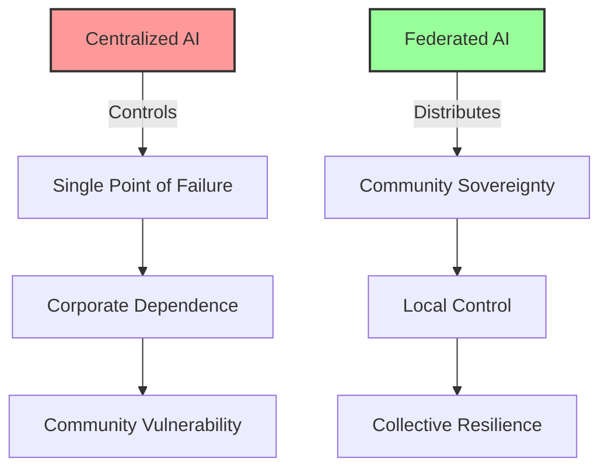
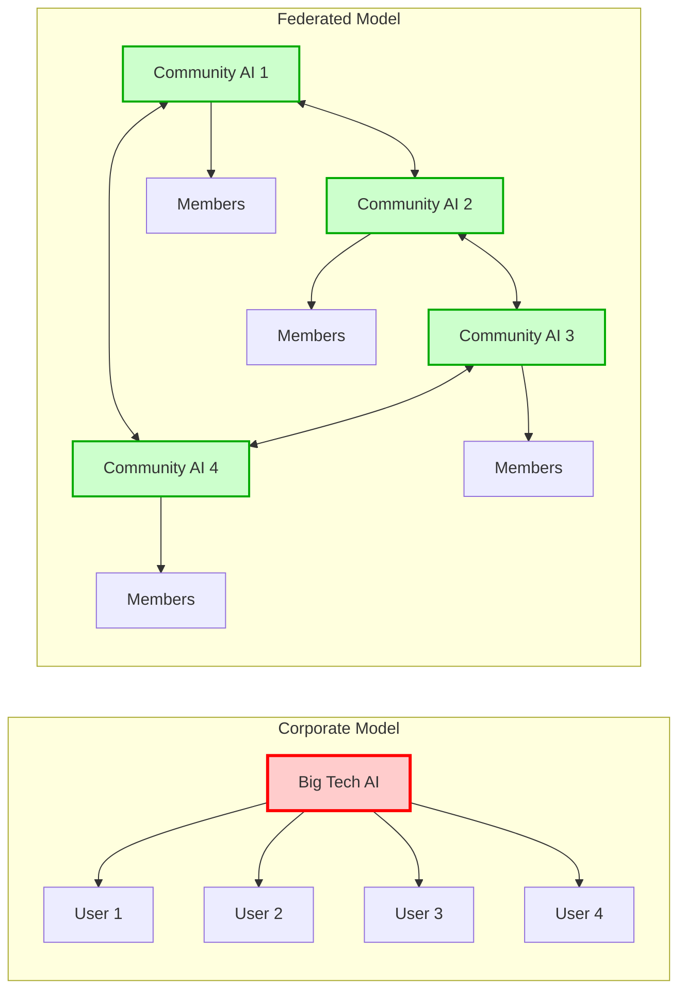

# Federated Community AI Networks: Small AI, Big Impact
{: .fs-9 }

Distributed AI networks that serve communities, not corporations
{: .fs-6 .fw-300 }

---

## The Opportunity

**Exploits**: AI Centralization Orthodoxy  
**Their Blind Spot**: "AI requires massive centralized compute"  
**Our Approach**: Small, distributed AI serving specific communities

While Big Tech concentrates AI power in massive data centers, communities can build federated networks of smaller AI systems that serve local needs better than any centralized system could. This exploits capitalism's inability to see value in distributed, community-controlled intelligence.

## Why This Works



### How Federation Creates Resilience



### Capitalist Blind Spots We Exploit

1. **Scale Economics**: They can't see profit in serving small communities
2. **Centralization Efficiency**: They miss benefits of distributed decision-making
3. **Data Control**: They can't imagine AI without data extraction
4. **Market Size**: They ignore communities too small to monetize

## Real-World Applications

### Indigenous Language Preservation
- Community-controlled language models for endangered languages
- Elders train AI in culturally appropriate ways
- Knowledge stays within community governance
- Federation enables resource sharing without cultural appropriation

### Local Knowledge Networks
- Agricultural wisdom specific to bioregions
- Traditional healing knowledge with proper protocols
- Community history and storytelling preservation
- Craft and artisan technique documentation

### Mutual Aid Coordination
- Resource sharing algorithms that respect community values
- Crisis response networks with local decision-making
- Skill matching within neighborhoods
- Community resilience planning and coordination

### Democratic Participation
- Consensus-building tools for community meetings
- Participatory budgeting with cultural sensitivity
- Conflict resolution drawing on local wisdom
- Decision-making support that enhances rather than replaces human judgment

## Implementation Guide

### Phase 1: Community Readiness Assessment (Month 1)

**Identify Partner Communities**
- Communities with clear governance structures
- Shared values around technological sovereignty
- Existing networks for resource sharing
- Commitment to mutual support and federation

**Assess Technical Capacity**
- Local technical skills and infrastructure
- Internet connectivity and hardware access
- Community capacity for ongoing maintenance
- Resources for initial setup and training

### Phase 2: Federation Design (Months 2-4)

**Governance Framework**
- Community sovereignty principles
- Inter-community cooperation agreements
- Shared resources and mutual aid protocols
- Conflict resolution and decision-making processes

**Technical Architecture**
- Peer-to-peer communication protocols
- Data sovereignty and privacy protection
- Resource sharing without exploitation
- Emergency backup and resilience systems

### Phase 3: Pilot Network Development (Months 5-8)

**Start Small**
- 3-5 communities maximum for initial network
- Single use case to prove concept
- Clear success metrics and evaluation methods
- Strong community relationships before scaling

**Build Infrastructure**
- Local AI nodes with community control
- Secure communication between communities
- Shared learning and model improvement
- Emergency protocols and backup systems

### Phase 4: Network Growth and Sustainability (Months 9-12)

**Organic Expansion**
- Communities invite others based on relationships
- Shared governance evolves with network size
- Technical systems scale horizontally
- Mutual aid strengthens network resilience

**Long-term Sustainability**
- Community ownership of all infrastructure
- Diversified funding without corporate dependence
- Skills development and knowledge transfer
- Continuous adaptation to community needs

## Technical Architecture

### Federation Principles
- **Community Sovereignty**: Each node controlled by its community
- **Voluntary Cooperation**: Communities choose when and how to share
- **Privacy by Design**: Local data never leaves community without permission
- **Resilient Networks**: System continues working if nodes disconnect

### Network Structure

```
Community A          Community B          Community C
┌─────────────┐     ┌─────────────┐     ┌─────────────┐
│ Local AI    │     │ Local AI    │     │ Local AI    │
│ Node        │◄────┤ Federation  ├────►│ Node        │
│             │     │ Protocol    │     │             │
├─────────────┤     ├─────────────┤     ├─────────────┤
│ Community   │     │ Shared      │     │ Community   │
│ Data &      │     │ Resources   │     │ Data &      │
│ Models      │     │ (Optional)  │     │ Models      │
└─────────────┘     └─────────────┘     └─────────────┘
```

### Key Technical Components

1. **Local AI Nodes**
   - Community-sized language models
   - Local training on community data
   - Edge computing for privacy
   - Community-controlled updates

2. **Federation Protocol**
   - Encrypted peer-to-peer communication
   - Selective resource sharing
   - Distributed governance mechanisms
   - Emergency coordination systems

3. **Community Interface**
   - Culturally appropriate user experience
   - Multi-generational accessibility
   - Integration with existing community tools
   - Democratic control mechanisms

## Success Metrics

### What We Measure
- **Community Autonomy**: Degree of self-determination in AI decisions
- **Network Resilience**: Ability to function during crises
- **Cultural Preservation**: Traditional knowledge maintained and strengthened
- **Democratic Participation**: Community engagement in governance
- **Mutual Aid Effectiveness**: Resource sharing and crisis response

### What We Don't Measure
- ❌ User growth rates
- ❌ Data collection volume
- ❌ Engagement optimization
- ❌ Revenue generation
- ❌ Market penetration

## Example Implementation: Indigenous Language Federation

### The Challenge
- 3,000+ endangered languages worldwide
- Limited resources for preservation efforts
- Corporate AI ignores non-profitable languages
- Cultural appropriation risks in centralized systems

### The Federation Solution
**Network of Sovereign Language Communities**

**Participating Communities**:
- Ojibwe Nation (Great Lakes region)
- Native Hawaiians (Pacific Islands)
- Maori Communities (Aotearoa/New Zealand)
- Aboriginal Groups (Australia)

**How It Works**:
1. Each community controls its own language AI
2. Communities can share linguistic techniques (not data)
3. Collaborative development of preservation tools
4. Mutual support during crises or transitions

**Technical Implementation**:
- Local language models trained on community-provided data
- Cultural protocols embedded in AI behavior
- Secure federation for sharing techniques and solidarity
- Community elders have ultimate authority over AI decisions

**Results After 18 Months**:
- 12 languages with improved preservation tools
- 200+ young people engaged in language learning
- Elder knowledge documented with cultural protocols
- Technical skills distributed across communities
- Network resilience demonstrated during COVID-19

## Resources Needed

### Minimal Viable Federation
- **Budget**: $50,000-100,000 for 3-community pilot
- **Team**: 2-3 developers + community coordinators in each location
- **Time**: 8-12 months to functional federation
- **Infrastructure**: Local hardware, strong community governance

### Scaling Considerations
- Each new community adds complexity slowly
- Technical infrastructure reusable across communities
- Governance models evolve with network size
- Resource sharing reduces individual community costs

## Getting Started

### For Communities

1. **Assess Federation Readiness**
   - Strong internal governance?
   - Shared values with potential partners?
   - Technical capacity or allies?
   - Commitment to mutual aid?

2. **Find Network Partners**
   - Communities facing similar challenges
   - Complementary skills and resources
   - Geographic or cultural connections
   - Proven track record of cooperation

3. **Start Small**
   - Single shared project or need
   - Clear agreements about governance
   - Pilot period with evaluation
   - Build trust before expanding

### For Technologists

1. **Understand Community Needs**
   - Spend significant time with each community
   - Learn governance structures and values
   - Identify technical allies within communities
   - Respect cultural protocols and knowledge

2. **Design for Sovereignty**
   - Communities control their own nodes
   - Federation is opt-in for everything
   - Technical systems reflect community values
   - No backdoors or centralized control

3. **Build for Resilience**
   - Systems work during emergencies
   - Graceful degradation when nodes disconnect
   - Community capacity for maintenance
   - Open source with community ownership

## Case Studies

### Appalachian Mutual Aid Federation
- 8 rural communities sharing resources and knowledge
- AI coordinates food distribution during emergencies
- Traditional ecological knowledge preserved and shared
- Democratic decision-making enhanced by technology

### Urban Community Garden Alliance
- 15 neighborhood gardens federated for resource sharing
- AI optimizes crop planning across different microclimates
- Seed library coordination and preservation
- Youth education and skill-sharing programs

### Artisan Craft Preservation Network
- Traditional craftspeople across 6 countries
- AI helps preserve and teach endangered techniques
- Cultural protocols embedded in knowledge sharing
- Economic cooperation without exploitation

## Common Questions

**Q: How can small communities afford AI infrastructure?**
A: Federation allows resource sharing, and community-sized AI is much cheaper than corporate systems.

**Q: What prevents this from becoming another surveillance system?**
A: Community ownership and governance from day one, with technical sovereignty.

**Q: How do we handle conflicts between federated communities?**
A: Democratic processes and the option to disconnect - federation is always voluntary.

**Q: Can this really compete with corporate AI capabilities?**
A: It serves different needs - community sovereignty vs. corporate efficiency.

## Join the Movement

Ready to build AI networks that serve communities, not corporations?

- [Download Technical Specification](/specs/federated-ai-networks-spec)
- [Join Implementation Working Group](https://forum.myceliary.org/federated-ai)
- [Access Community Organizing Resources](/resources/ai-sovereignty)
- [Connect with Potential Federation Partners](/community/federation-builders)

---

*"The most powerful AI is not the one with the most data, but the one most accountable to the communities it serves."*