# Implementation Guide: Augmentation Not Automation
{: .fs-9 }

A step-by-step guide to building AI that enhances human craft rather than replacing it
{: .fs-6 .fw-300 }

---

## Quick Start Overview

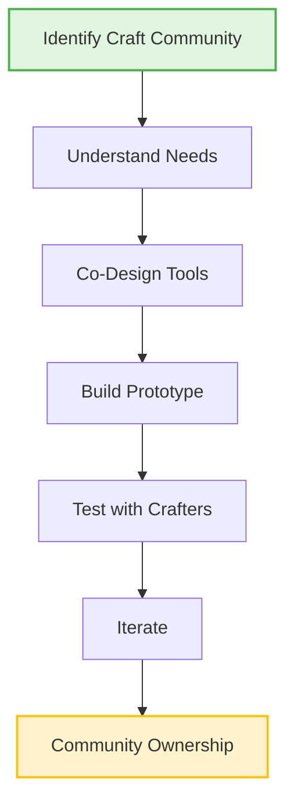

**Time Required**: 6-9 months  
**Budget Needed**: $5,000-10,000  
**Team Size**: 2-3 developers + craft practitioners  
**Difficulty**: ⭐⭐⭐ (Moderate)

## Phase 1: Community Foundation (Month 1)

### Week 1-2: Identify Your Craft Community

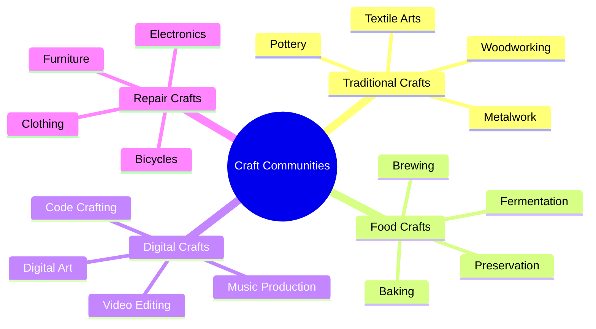

**Action Steps**:
1. **Map Local Craft Communities**
   - Visit maker spaces and craft guilds
   - Check community centers and libraries
   - Search social media groups
   - Talk to local artisan shops

2. **Initial Conversations**
   - "What parts of your craft are most challenging?"
   - "What knowledge might be lost without intervention?"
   - "Where could tools help without replacing skill?"
   - "What would 'success' look like for you?"

3. **Document Findings**
   ```
   Craft: [Name]
   Practitioners: [Number]
   Key Challenges: [List]
   Augmentation Opportunities: [List]
   Community Assets: [List]
   ```

### Week 3-4: Build Trust and Understanding

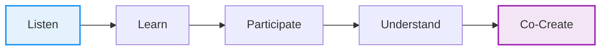

**Trust Building Activities**:
- Attend craft sessions as observer/learner
- Share your own making experiences
- Be transparent about project goals
- Emphasize community ownership from start

## Phase 2: Co-Design Process (Months 2-3)

### Design Principles Workshop

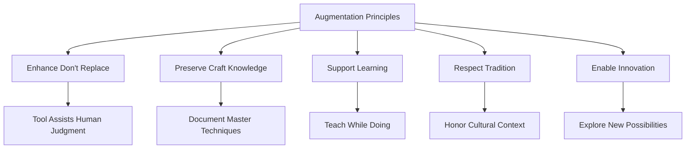

**Workshop Agenda** (Half Day):
1. **Welcome & Introductions** (30 min)
2. **Principles Discussion** (60 min)
   - What must never be automated?
   - What enhancement would be helpful?
   - How do we preserve craft spirit?
3. **Brainstorming Session** (90 min)
   - Specific augmentation ideas
   - Priority ranking exercise
   - Technical feasibility discussion
4. **Governance Planning** (60 min)
   - Decision-making structure
   - Ownership model
   - Benefit sharing

### Technical Specification Development

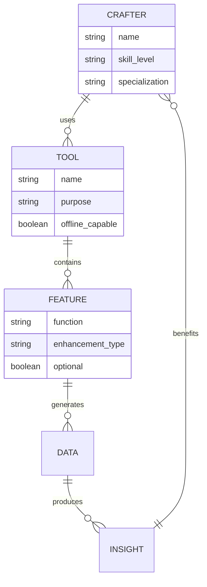

**Key Technical Decisions**:

| Aspect | Options | Recommendation |
|--------|---------|----------------|
| **Platform** | Mobile app, Web app, Desktop software | Start with web (accessible) |
| **AI Type** | Cloud AI, Local AI, Hybrid | Local-first with optional cloud |
| **Data Storage** | User device, Community server, Cloud | User-controlled with backup |
| **Open Source** | Fully open, Partially open, Closed | Fully open from day one |

## Phase 3: Prototype Development (Months 4-6)

### Minimum Viable Augmentation (MVA)

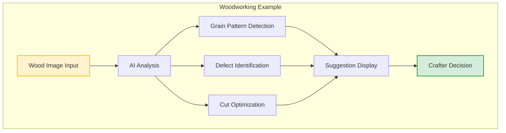

**Development Approach**:
1. **Start Simple**
   - One craft, one augmentation
   - Basic UI, focus on function
   - Real device testing early
   - Crafter feedback loops

2. **Privacy First**
   ```javascript
   // Example: Local-first architecture
   const augmentationEngine = {
     processImage: async (imageData) => {
       // Process locally on device
       const analysis = await localAI.analyze(imageData);
       // No data leaves device
       return analysis;
     },
     saveToDevice: (data) => {
       // User controls all data
       localStorage.setItem('craftData', data);
     }
   };
   ```

3. **Iterative Testing**
   - Weekly crafter sessions
   - A/B testing features
   - Performance metrics
   - Usability studies

### Community Testing Protocol

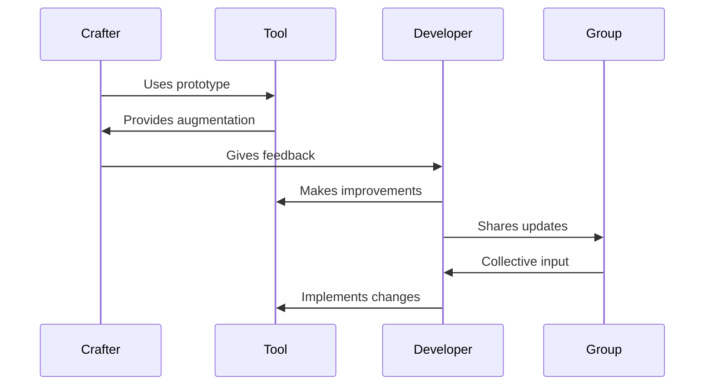

## Phase 4: Community Deployment (Months 7-9)

### Rollout Strategy

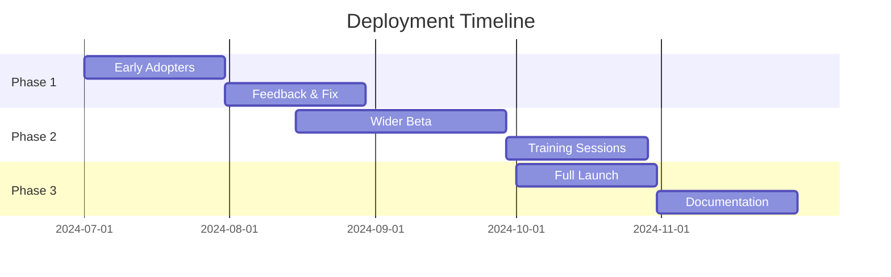

### Governance Implementation

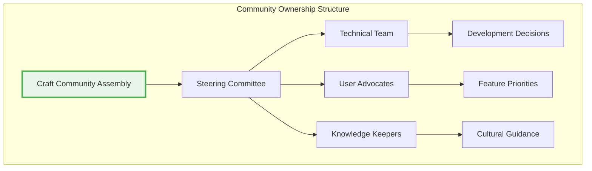

**Governance Checklist**:
- [ ] Legal structure established (co-op, LLC, etc.)
- [ ] Decision-making process documented
- [ ] Benefit sharing agreement signed
- [ ] Intellectual property assigned to community
- [ ] Conflict resolution process defined

### Training and Documentation

**Training Materials Needed**:
1. **Quick Start Guide** (1 page)
   - Basic setup steps
   - First augmentation use
   - Where to get help

2. **Video Tutorials** (3-5 min each)
   - Installation process
   - Core features demo
   - Advanced techniques
   - Troubleshooting

3. **Community Knowledge Base**
   - FAQ section
   - Tips from expert users
   - Integration with craft process
   - Cultural considerations

## Success Metrics Dashboard

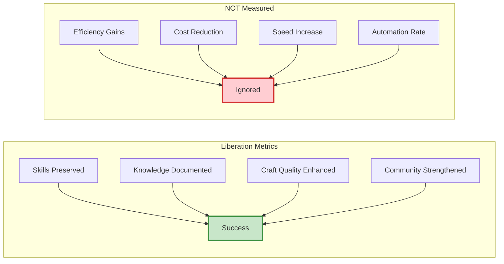

**Monthly Review Questions**:
1. Are crafters using the tool to enhance their work?
2. Is traditional knowledge being preserved/shared?
3. Are new crafters learning faster?
4. Is the community growing stronger?
5. Do crafters feel more empowered?

## Common Challenges and Solutions

### Challenge: Technical Intimidation

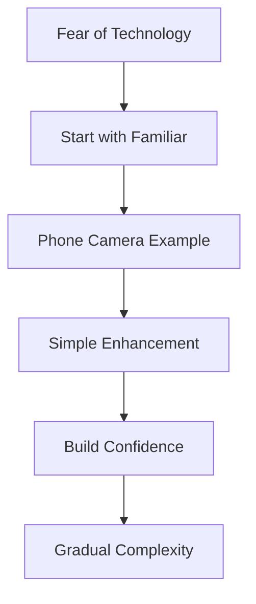

**Solution Approach**:
- Begin with tools they already use
- Make first interaction magical but simple
- Celebrate small successes
- Peer support groups

### Challenge: Maintaining Craft Authenticity

**Solution Framework**:
- Crafters define authenticity boundaries
- Tool suggests, never decides
- Traditional methods always available
- Enhancement optional, not required

### Challenge: Sustainable Funding

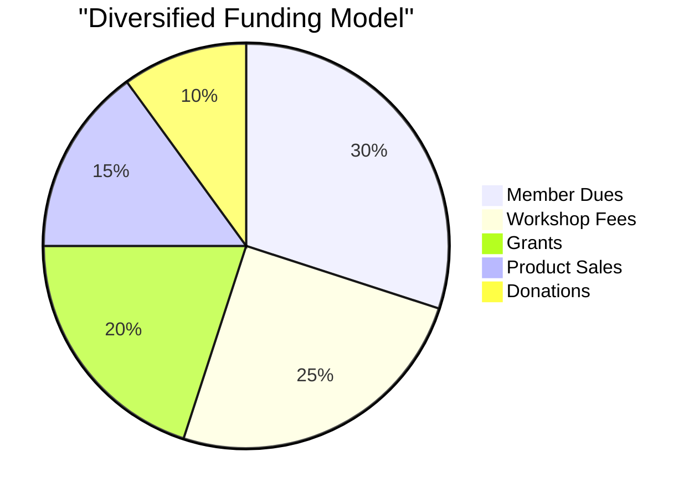

## Resources and Support

### Technical Resources
- **Open Source Templates**: github.com/myceliary/craft-augmentation
- **AI Models**: Adapted TensorFlow Lite models for edge computing
- **UI Components**: Accessible React component library
- **Data Formats**: Open standards for craft knowledge

### Community Resources
- **Monthly Office Hours**: First Tuesday, 7pm
- **Peer Support Forum**: forum.myceliary.org/craft-augmentation
- **Success Stories**: Shared monthly in newsletter
- **Technical Assistance**: help@myceliary.org

### Funding Opportunities
- **National Endowment for the Arts**: Craft innovation grants
- **Local Arts Councils**: Community project funding
- **Cooperative Development Funds**: Worker ownership support
- **Crowdfunding**: Community-backed campaigns

## Next Steps Checklist

**Month 1**:
- [ ] Identify target craft community
- [ ] Hold initial conversations
- [ ] Form organizing committee
- [ ] Schedule co-design workshop

**Month 2-3**:
- [ ] Complete design process
- [ ] Secure initial funding
- [ ] Recruit technical team
- [ ] Begin prototype development

**Month 4-6**:
- [ ] Build and test prototype
- [ ] Iterate based on feedback
- [ ] Prepare for deployment
- [ ] Train early adopters

**Month 7-9**:
- [ ] Launch to community
- [ ] Provide ongoing support
- [ ] Document learnings
- [ ] Plan sustainability

---

## Get Started Today!

Ready to build augmentation tools for your craft community?

1. **Download this guide** as a PDF
2. **Join our next workshop** on craft augmentation
3. **Connect with other communities** doing similar work
4. **Share your journey** to inspire others

Remember: The goal isn't to automate craft out of existence, but to ensure craft traditions thrive and evolve for generations to come.

*Questions? Contact us at augmentation@myceliary.org*