# Implementation Guide: Hyperlocal AI Federations
{: .fs-9 }

Building intentionally unscalable AI that knows your soil, your weather, your community
{: .fs-6 .fw-300 }

---

## Quick Start Overview

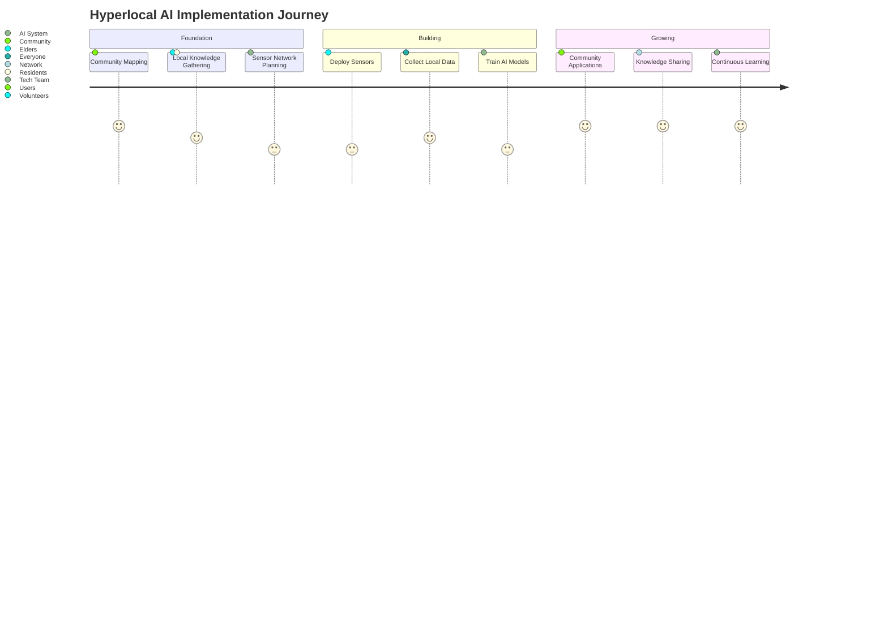

**Time Required**: 3-6 months  
**Budget Needed**: $500-1,000 per neighborhood  
**Team Size**: 1-2 tech volunteers + community coordinators  
**Difficulty**: ⭐⭐ (Easy)

## Why Hyperlocal Beats Global

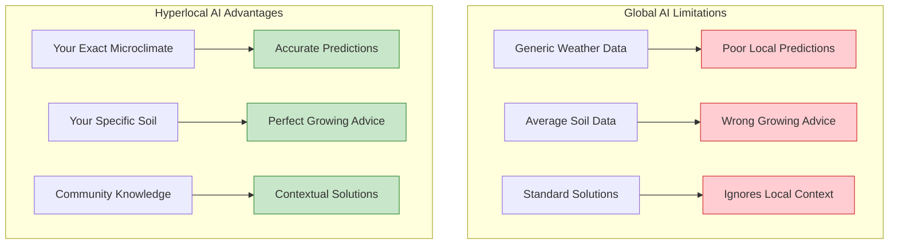

## Phase 1: Define Your Hyperlocal Area (Week 1-2)

### Boundary Setting Exercise

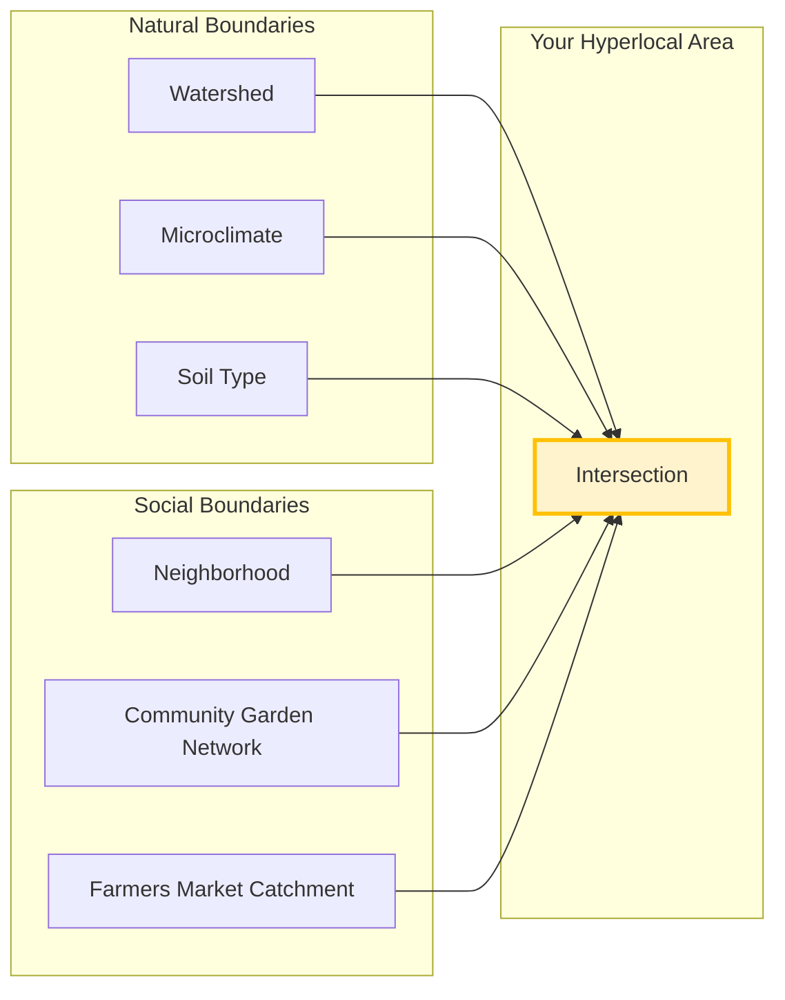

**Mapping Checklist**:
- [ ] Walk the boundaries of your area
- [ ] Note microclimates (sunny spots, wind tunnels, frost pockets)
- [ ] Identify community gathering spots
- [ ] Map existing gardens and green spaces
- [ ] Document water flows and drainage
- [ ] Talk to long-time residents about changes

### Community Asset Inventory

**Local Knowledge Holders**:
- 🌱 Master gardeners
- 🌦️ Weather watchers
- 📚 Local historians
- 🌾 Traditional farmers
- 🏘️ Neighborhood elders

**Physical Assets**:
- Community gardens
- Tool libraries
- Meeting spaces
- Existing sensors/weather stations
- Internet access points

## Phase 2: Knowledge Gathering (Week 3-4)

### Elder Interview Protocol

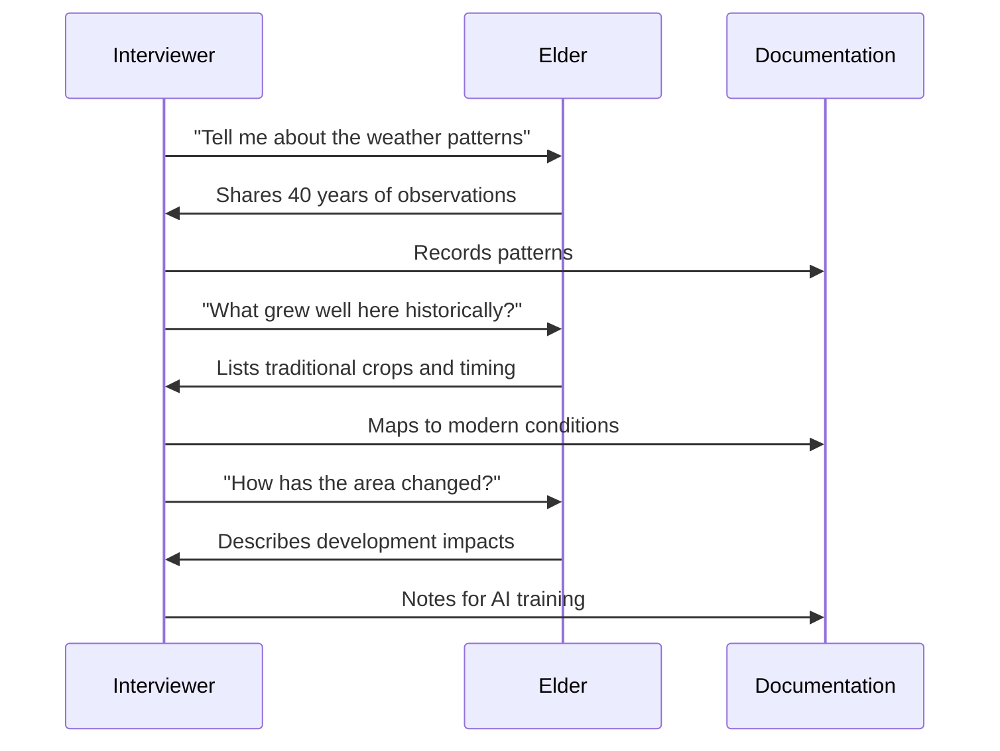

**Key Questions to Ask**:
1. "Where does water collect after rain?"
2. "Which areas get frost first/last?"
3. "What plants indicate good/poor soil?"
4. "When do seasonal changes typically occur?"
5. "What extreme weather have you seen?"

### Crowdsourced Observation Campaign

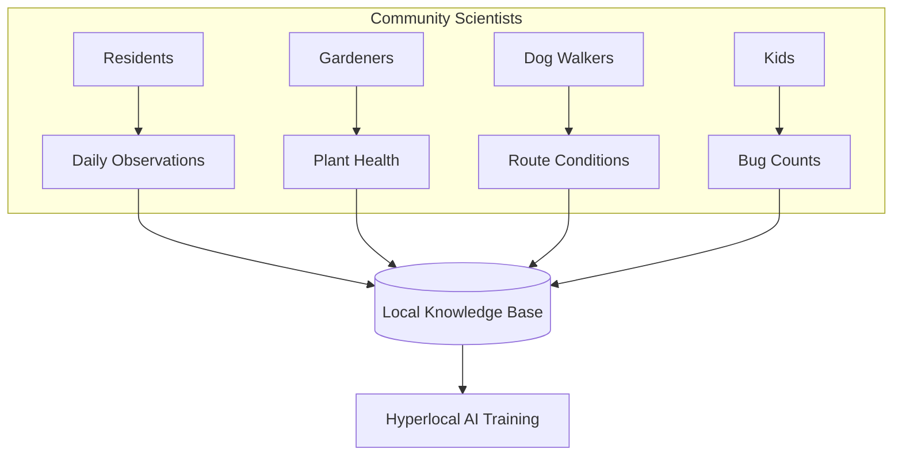

**Simple Data Collection Tools**:
- Paper forms at community centers
- WhatsApp/Signal group for photos
- Simple web form (works on any phone)
- Monthly data parties to share findings

## Phase 3: Sensor Network Setup (Month 2)

### DIY Sensor Station Build

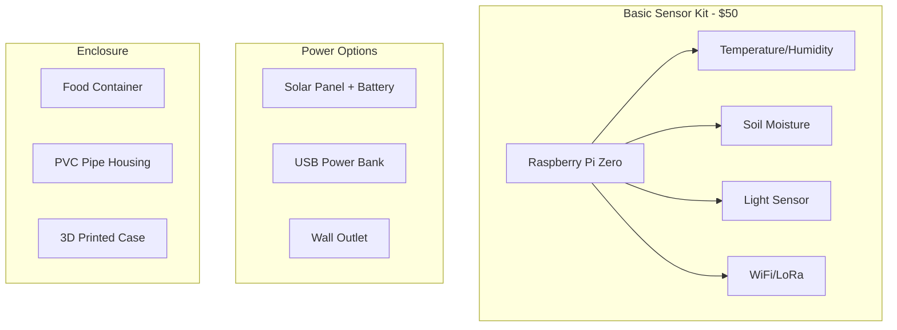

**Community Build Day Agenda**:
1. **Welcome & Purpose** (30 min)
2. **Sensor Assembly** (2 hours)
   - Solder headers (we teach you!)
   - Connect sensors
   - Load software
3. **Weatherproofing** (1 hour)
4. **Installation Planning** (30 min)
5. **Celebration!** (ongoing)

### Deployment Map

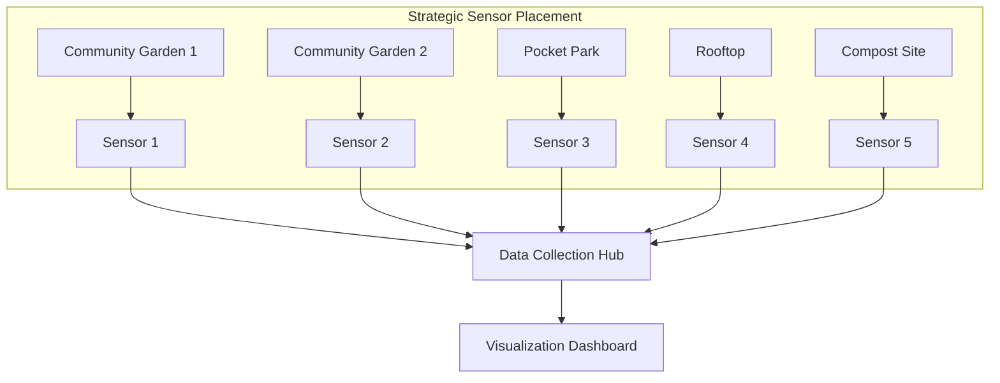

## Phase 4: AI Training on Local Data (Month 3)

### Community-Specific Model Development

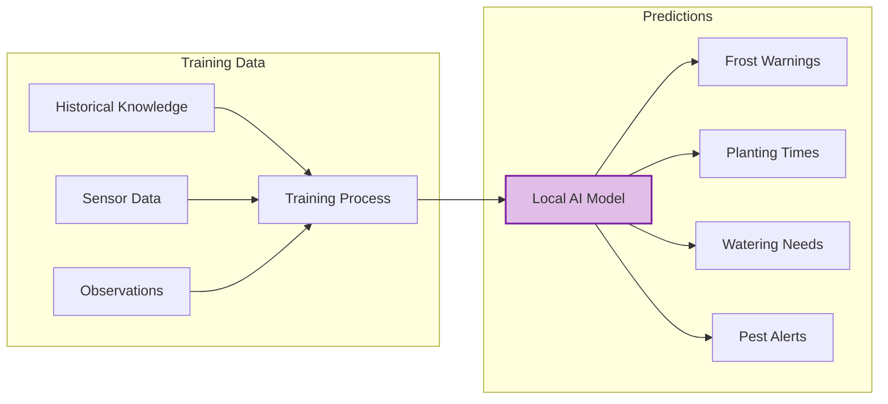

**What Makes It Hyperlocal**:
- Trained ONLY on your neighborhood's data
- Incorporates specific landmarks and features
- Learns your unique weather patterns
- Adapts to your soil conditions
- Reflects community priorities

### Privacy-First Architecture

```javascript
// Example: Local-Only AI Processing
class HyperlocalAI {
  constructor(communityBoundary) {
    this.boundary = communityBoundary;
    this.localData = new SecureLocalStorage();
  }
  
  processObservation(data) {
    // Verify data is within community boundary
    if (!this.boundary.contains(data.location)) {
      return reject("Data outside community boundary");
    }
    
    // Process locally, never send to cloud
    const prediction = this.model.predict(data);
    
    // Store locally with community encryption
    this.localData.store(data, prediction);
    
    return prediction;
  }
}
```

## Phase 5: Community Applications (Month 4-6)

### Garden Planning Assistant

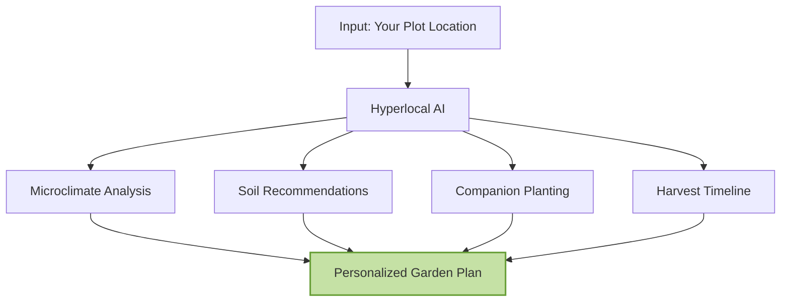

### Community Alert System

**Automated Notifications**:
- 🌡️ "Frost likely in low-lying areas tonight"
- 💧 "Optimal watering time: 6-8am tomorrow"
- 🐛 "Aphid outbreak reported on Oak Street"
- 🌱 "Time to start tomato seedlings indoors"
- 🎉 "Record high soil temperature - celebrate!"

### Resource Coordination

```mermaid
graph LR
    subgraph "Resource Sharing"
    A[Tool Library] <--> AI[Coordination AI]
    B[Seed Swap] <--> AI
    C[Compost Hub] <--> AI
    end
    
    AI --> N[Neighborhood Notifications]
    N --> U1[User: "I need a tiller"]
    N --> U2[User: "I have extra seedlings"]
    N --> U3[User: "Compost ready"]
```

## Measuring Success

### Liberation Metrics Dashboard

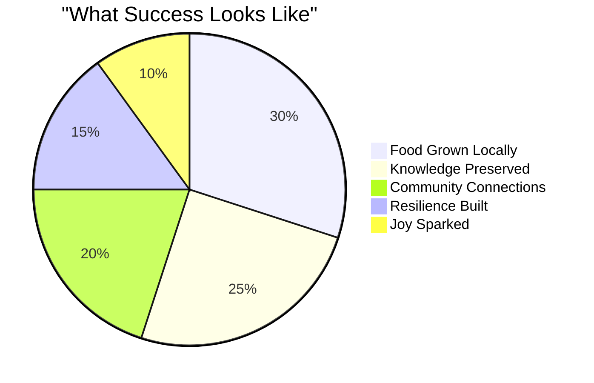

**Monthly Community Check-ins**:
- How many people grew food successfully?
- What local knowledge was preserved?
- How many new connections formed?
- Did we handle challenges together?
- Are we having fun?

## Expansion Through Federation

### Connecting Hyperlocal Networks

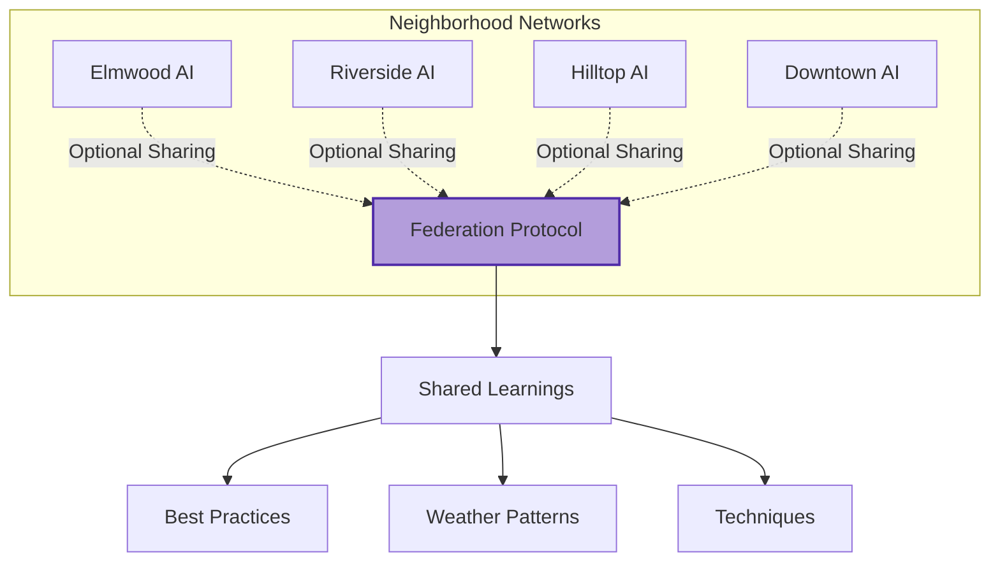

**Federation Principles**:
- Each neighborhood maintains full autonomy
- Sharing is optional and consensual
- Local data stays local
- Learn from each other's successes
- No central control point

## Common Challenges & Solutions

### "We're Not Technical"
**Solution**: That's perfect! You know your place better than any engineer. We'll find tech allies who respect that knowledge.

### "What About Winter/Dry Season?"
**Solution**: Seasonal patterns are hyperlocal gold! Your AI will learn your specific dormant season patterns.

### "It Seems Too Simple"
**Solution**: Simple is powerful. Global systems fail because they're too complex for local needs.

## Resources & Support

### Starter Kits Available
- Basic sensor package: $50
- Pre-configured Raspberry Pi: $35
- Weatherproof enclosure: $15
- Total starter kit: $100

### Monthly Skillshares
- First Saturday: Sensor building
- Second Saturday: Data collection training
- Third Saturday: AI basics for communities
- Fourth Saturday: Celebration and planning

### Online Resources
- **Code Repository**: github.com/myceliary/hyperlocal-ai
- **Video Tutorials**: youtube.com/myceliary-hyperlocal
- **Community Forum**: forum.myceliary.org/hyperlocal
- **Direct Support**: hyperlocal@myceliary.org

## Your Next Steps

**Week 1**: 
- [ ] Walk your neighborhood boundaries
- [ ] Talk to 3 elders about local knowledge
- [ ] Identify 5 potential sensor locations

**Week 2**:
- [ ] Host community interest meeting
- [ ] Form organizing committee
- [ ] Apply for micro-grant if needed

**Week 3-4**:
- [ ] Order sensor components
- [ ] Schedule build day
- [ ] Start observation campaign

**Month 2+**:
- [ ] Deploy sensors
- [ ] Collect data
- [ ] Train your hyperlocal AI
- [ ] Celebrate what you're learning!

---

## Remember: Small is Beautiful

You're not trying to compete with Google. You're building something Google could never understand - intelligence that truly knows and serves your specific place.

That's your superpower. That's the blind spot we exploit.

*Ready to start? Email us at hyperlocal@myceliary.org*