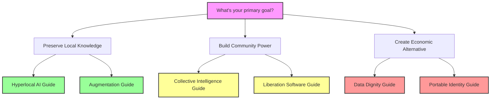
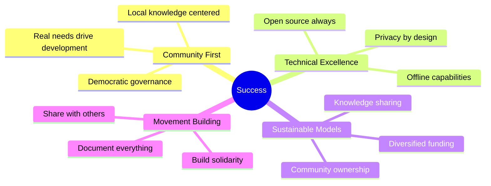

# Cannae Implementation Guides
{: .fs-9 }

Step-by-step guides to building community-controlled alternatives that exploit capitalist blind spots
{: .fs-6 .fw-300 }

---

## 📚 Available Guides

### 🌟 Ready Now (Start Today)

#### [Augmentation Not Automation Guide](augmentation-not-automation-guide)
Build AI tools that enhance human craft rather than replacing it
- **Time**: 6-9 months
- **Budget**: $5,000-10,000  
- **Difficulty**: ⭐⭐⭐ Moderate

#### [Hyperlocal AI Guide](hyperlocal-ai-guide)
Create intentionally unscalable AI for your specific community
- **Time**: 3-6 months
- **Budget**: $500-1,000
- **Difficulty**: ⭐⭐ Easy

#### [Liberation Software Guide](liberation-software-guide)
Develop tools designed to make themselves unnecessary
- **Time**: 6-12 months
- **Budget**: $10,000-20,000
- **Difficulty**: ⭐⭐⭐ Moderate

### 🤝 Ready with Partners

#### [Federated AI Networks Guide](federated-ai-networks-guide)
Build small, distributed AI serving specific communities
- **Time**: 8-12 months
- **Budget**: $50,000-100,000
- **Difficulty**: ⭐⭐⭐⭐ Advanced

#### [Collective Intelligence Guide](collective-intelligence-guide)
Create AI that amplifies group wisdom over individual productivity
- **Time**: 6-9 months
- **Budget**: $25,000-50,000
- **Difficulty**: ⭐⭐⭐⭐ Advanced

#### [Careful AI Development Guide](careful-ai-development-guide)
Implement community-governed AI at the speed of trust
- **Time**: 18-24 months
- **Budget**: $75,000-150,000
- **Difficulty**: ⭐⭐⭐ Moderate

### 🏗️ Foundation Building

#### [Data Dignity Cooperatives Guide](data-dignity-guide)
Establish community ownership of collective intelligence
- **Time**: 18-24 months
- **Budget**: $200,000-500,000
- **Difficulty**: ⭐⭐⭐⭐⭐ Expert

#### [Portable Identity Commons Guide](portable-identity-guide)
Create worker-owned reputation systems
- **Time**: 12-18 months
- **Budget**: $150,000-300,000
- **Difficulty**: ⭐⭐⭐⭐ Advanced

---

## 🗺️ Which Guide Should You Start With?

## 📋 What Each Guide Contains

### Standard Sections
- **Quick Start Overview**: Visual timeline and requirements
- **Phase-by-Phase Instructions**: Detailed steps with timelines
- **Visual Diagrams**: Mermaid charts explaining concepts
- **Templates and Tools**: Ready-to-use resources
- **Common Challenges**: Solutions to typical problems
- **Success Metrics**: How to measure liberation, not KPIs
- **Resources and Support**: Where to get help

### Special Features
- **Community Governance Models**: Democratic structures that work
- **Technical Architecture Diagrams**: Understand the systems
- **Funding Strategies**: Non-extractive financing approaches
- **Case Study Examples**: Learn from successful implementations
- **Worksheet Downloads**: Planning tools for your team

## 🎯 Implementation Success Factors

## 💡 Before You Begin

### Essential Prerequisites
1. **Community Support**: Have you engaged the affected community?
2. **Clear Need**: Is there a specific problem to solve?
3. **Committed Team**: Do you have 3+ dedicated organizers?
4. **Time Investment**: Can you sustain effort for 6+ months?
5. **Values Alignment**: Are you committed to non-extraction?

### Red Flags to Avoid
- Starting with technology instead of community
- Accepting venture capital or extractive funding
- Building without affected people at the table
- Competing instead of collaborating
- Focusing on scale over community benefit

## 🤔 Frequently Asked Questions

**Q: Do I need technical expertise to use these guides?**
A: Basic technical knowledge helps, but the guides emphasize finding technical allies. Community organizing skills are more important than coding ability.

**Q: Can these work in my small town/big city?**
A: Yes! Each guide includes adaptations for different contexts. The key is matching the opportunity to your community's specific needs.

**Q: How do we fund these projects without compromising values?**
A: Each guide includes detailed non-extractive funding strategies. See our [Funding Resources](/resources/funding) for more options.

**Q: What if we fail?**
A: Failure is learning! Document what didn't work and share with the movement. Your "failure" saves others time and helps refine approaches.

## 🚀 Ready to Start?

1. **Choose a guide** that matches your community's needs
2. **Download the PDF version** for offline access
3. **Join the implementers forum** for peer support
4. **Schedule a consultation** if you need guidance

Remember: These aren't just technical projects - they're acts of resistance. Each implementation demonstrates that another technological world is possible.

---

## 📞 Get Support

- **Email**: guides@myceliary.org
- **Forum**: forum.myceliary.org/implementation
- **Office Hours**: Tuesdays 7pm ET
- **Peer Mentorship**: Match with experienced implementers

*Together, we're building the technologies of liberation.*