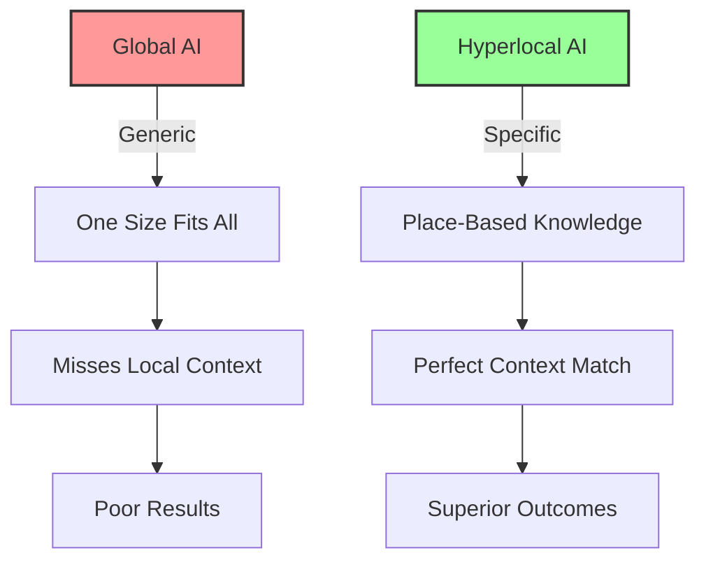

# Hyperlocal AI Federations: Intentionally Unscalable Intelligence
{: .fs-9 }

AI that knows your exact soil, your specific microclimate, your particular community
{: .fs-6 .fw-300 }

---

## The Opportunity

**Exploits**: Scale-or-Die Mentality  
**Their Blind Spot**: "If it doesn't scale globally, it's worthless"  
**Our Approach**: Intentionally unscalable AI for specific neighborhoods and bioregions

While Big Tech chases global scale, the most valuable intelligence is hyperlocal - understanding your specific soil, weather patterns, community relationships, and ecosystem. This creates perfect opportunities for AI that serves place-based communities.

## Why This Works



### Capitalist Blind Spots We Exploit

1. **Scale Obsession**: They can't see value in serving just one neighborhood
2. **Market Size Focus**: They ignore small communities with specific needs
3. **Standardization Drive**: They miss how context determines success
4. **Global Competition**: They can't compete with deep local knowledge

## Real-World Applications

### Community Garden Intelligence
- Knows your exact soil composition and history
- Tracks microclimate patterns specific to your plots
- Understands companion planting for your region
- Connects with neighborhood seed swaps and tool libraries

### Watershed Management
- Monitors local water systems in real-time
- Predicts flooding based on hyperlocal topography
- Connects upstream and downstream communities
- Preserves traditional ecological knowledge

### Local Food Networks
- Maps food production and needs within walking distance
- Coordinates gleaning and surplus sharing
- Supports seasonal eating patterns
- Strengthens community food resilience

### Bioregional Health
- Tracks local environmental health indicators
- Connects symptoms with local pollution sources
- Builds community health knowledge
- Supports traditional and alternative healing practices

## Implementation Guide

### Phase 1: Community Mapping (Month 1)

**Define Your Hyperlocal Area**
- Geographic boundaries (watershed, neighborhood, bioregion)
- Community institutions and networks
- Existing knowledge holders
- Unique local challenges and assets

**Inventory Local Intelligence**
- What data exists about your place?
- Who holds traditional knowledge?
- What patterns matter locally?
- Where are the knowledge gaps?

### Phase 2: Knowledge Gathering (Months 2-3)

**Community Knowledge Collection**
- Elder interviews about environmental changes
- Participatory mapping sessions
- Traditional ecological knowledge documentation
- Citizen science data collection

**Environmental Monitoring Setup**
- Low-cost sensor networks
- Crowdsourced observations
- Integration with existing monitoring
- Community-controlled data collection

### Phase 3: AI System Development (Months 4-6)

**Local Training Data**
- Use only community-generated data
- Preserve traditional knowledge properly
- Ensure cultural protocols respected
- Build community ownership of datasets

**Hyperlocal Models**
- Train on place-specific patterns
- Incorporate traditional knowledge
- Focus on local prediction needs
- Design for community use

### Phase 4: Community Deployment (Months 7-9)

**Start with Champions**
- Work with established community leaders
- Begin with concrete, useful applications
- Demonstrate clear local benefits
- Build trust through transparency

**Expand Through Networks**
- Leverage existing community connections
- Training and support for new users
- Peer-to-peer knowledge sharing
- Community-controlled growth

## Technical Architecture

### Federation Principles
- **Sovereignty**: Each community controls its own system
- **Interoperability**: Communities can share when they choose
- **Privacy**: Local data stays local unless explicitly shared
- **Resilience**: Systems work independently

### Core Components

```
Community A          Community B          Community C
┌─────────────┐     ┌─────────────┐     ┌─────────────┐
│ Local AI    │     │ Local AI    │     │ Local AI    │
│ Engine      │     │ Engine      │     │ Engine      │
├─────────────┤     ├─────────────┤     ├─────────────┤
│ Place Data  │     │ Place Data  │     │ Place Data  │
│ Repository  │     │ Repository  │     │ Repository  │
├─────────────┤     ├─────────────┤     ├─────────────┤
│ Community   │◄────┤ Federation  ├────►│ Knowledge   │
│ Interface   │     │ Protocol    │     │ Exchange    │
└─────────────┘     └─────────────┘     └─────────────┘
```

### Data Sovereignty Model
- Each community owns its data completely
- No central servers or corporate control
- Sharing happens through peer-to-peer protocols
- Communities can disconnect anytime

## Success Metrics

### What We Measure
- **Local Resilience**: Community's ability to meet its own needs
- **Knowledge Preservation**: Traditional wisdom maintained and expanded
- **Environmental Health**: Ecosystem indicators improving
- **Community Capacity**: More people able to participate
- **Food Security**: Local food production and access

### What We Don't Measure
- ❌ User growth rates
- ❌ Market penetration
- ❌ Revenue scaling
- ❌ Global adoption
- ❌ Data extraction value

## Example Implementation: Community Garden Network

### The Challenge
Urban community gardens struggle with:
- Limited growing experience among members
- Soil contamination from industrial history
- Unpredictable microclimate effects
- Coordination between scattered garden sites

### The Solution
Hyperlocal AI that:
- Maps soil health across garden network
- Predicts weather impacts on specific plots
- Recommends crops based on local success patterns
- Coordinates resource sharing between gardens

### Community Benefits
- New gardeners learn faster from local successes
- Contaminated areas identified and remediated
- Resource sharing reduces waste and costs
- Gardens become community knowledge hubs

### Technical Implementation
- Soil sensors in each garden plot
- Weather stations at strategic locations
- Mobile app for gardener observations
- Web dashboard for garden coordinators
- Peer-to-peer sharing with other garden networks

## Resources Needed

### Minimal Viable Implementation
- **Budget**: $500-1,000 per community
- **Team**: 1-2 developers + community coordinators
- **Time**: 3-6 months to first deployment
- **Infrastructure**: Local hardware, minimal internet

### Scaling Considerations
- Each community starts independently
- Federation happens when communities choose
- Costs stay low due to local focus
- Technical complexity remains manageable

## Getting Started

### For Communities

1. **Define Your Place**
   - What are your geographic boundaries?
   - What makes your area unique?
   - Who holds local knowledge?

2. **Identify Priority Needs**
   - Food security challenges?
   - Environmental concerns?
   - Health disparities?
   - Economic isolation?

3. **Find Your Champions**
   - Community leaders who see the value
   - Technical allies who respect your sovereignty
   - Neighbors ready to participate

### For Developers

1. **Think Small**
   - Start with one neighborhood
   - Focus on specific local problems
   - Design for community control

2. **Learn from Place**
   - Spend time in the community
   - Understand unique local context
   - Respect existing knowledge

3. **Build for Federation**
   - Design for local sovereignty
   - Enable peer-to-peer sharing
   - Avoid centralized dependencies

## Case Studies

### Detroit Urban Agriculture Network
- 200+ community gardens sharing growing intelligence
- Soil remediation guidance for post-industrial sites
- Seed varieties optimized for Great Lakes climate
- Youth employment in data collection and system maintenance

### Appalachian Watershed Collective
- Stream health monitoring across mountain communities
- Traditional knowledge of seasonal patterns preserved
- Early warning systems for floods and droughts
- Regional food forest planning and management

### Southwest Desert Communities
- Water harvesting optimization for specific microclimates
- Indigenous plant knowledge integrated with modern monitoring
- Heat island mitigation through community planning
- Renewable energy micro-grids for community resilience

## Common Questions

**Q: How can this compete with Google or Amazon's resources?**
A: It doesn't compete - it serves needs they can't profitably address.

**Q: Isn't this just creating digital divides between communities?**
A: It's creating digital sovereignty - communities controlling their own tech destiny.

**Q: What about communities without technical capacity?**
A: Federation allows communities to share resources and knowledge.

**Q: How do we prevent this becoming another surveillance system?**
A: Community ownership and governance from day one, with privacy by design.

## Join the Movement

Ready to build AI that serves your specific place?

- [Download Technical Specification](/specs/hyperlocal-ai-spec)
- [Join Implementation Working Group](https://forum.myceliary.org/hyperlocal-ai)
- [Access Community Grants](/resources/hyperlocal-funding)
- [Connect with Place-Based Networks](/community/bioregional-groups)

---

*"The most radical thing we can do is pay attention to our place. The most powerful AI is the one that knows your soil."*