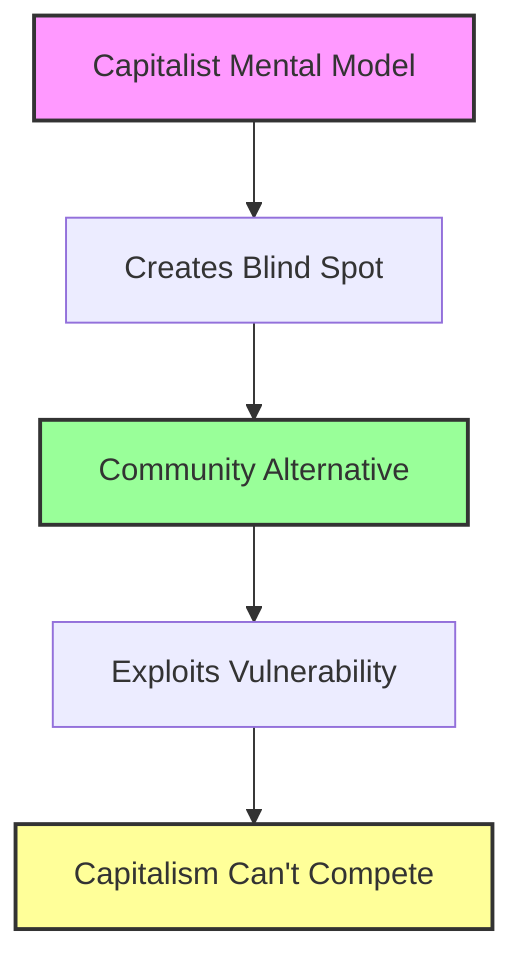

# Cannae Opportunities: AI That Exploits Capitalist Vulnerabilities
{: .fs-9 }

Technologies that turn capitalism's greatest strengths into its greatest weaknesses
{: .fs-6 .fw-300 }

---

## What Are Cannae Opportunities?

Drawing from Joan Westenberg's analysis of the Cannae Problem - where success creates the very blind spots that lead to failure - we've identified 8 specific vulnerabilities in how capitalism approaches technology. Each vulnerability represents an opportunity to build community-controlled alternatives that capitalism literally cannot comprehend or compete with.

> "Success creates its own failure mechanisms. The very things that make you successful produce the blind spots that make you vulnerable." - Joan Westenberg

## The 8 Opportunities

### 🌐 Ready Now (Start Today)

#### [1. Augmentation Not Automation](augmentation-not-automation)
**Exploits**: Automation Absolutism  
**Their Blind Spot**: "Automate everything possible"  
**Our Opportunity**: AI that enhances human craft and judgment rather than replacing it  
**Example**: Craft augmentation tools that preserve artisan skills while improving sustainability

#### [2. Hyperlocal AI Federations](hyperlocal-ai)
**Exploits**: Scale-or-Die Mentality  
**Their Blind Spot**: "If it doesn't scale globally, it's worthless"  
**Our Opportunity**: Intentionally unscalable AI for specific neighborhoods  
**Example**: Community garden AI that knows your exact soil and microclimate

#### [3. Liberation Software](liberation-software)
**Exploits**: Engagement Maximization Trap  
**Their Blind Spot**: "Success = maximum user engagement"  
**Our Opportunity**: Tools designed to make themselves unnecessary  
**Example**: Language learning AI that celebrates when you no longer need it

### 🤝 Ready with Partners

#### [4. Federated Community AI Networks](federated-ai-networks)
**Exploits**: AI Centralization Orthodoxy  
**Their Blind Spot**: "AI requires massive centralized compute"  
**Our Opportunity**: Small, distributed AI serving specific communities  
**Example**: Indigenous language preservation networks

#### [5. Collective Intelligence Amplifiers](collective-intelligence)
**Exploits**: Individual Productivity Obsession  
**Their Blind Spot**: "AI should make individuals more productive"  
**Our Opportunity**: AI that amplifies group wisdom and consensus  
**Example**: Participatory budgeting with emergence detection

#### [6. Careful AI Development](careful-ai-development)
**Exploits**: Innovation Speed Cult  
**Their Blind Spot**: "Move fast and break things"  
**Our Opportunity**: Slow, community-governed AI deployment  
**Example**: Elder care AI developed with mandatory community review periods

### 🏗️ Foundation Building

#### [7. Data Dignity Cooperatives](data-dignity-cooperatives)
**Exploits**: Data Monetization Imperative  
**Their Blind Spot**: "Data is the new oil - extract and refine"  
**Our Opportunity**: Communities own their collective intelligence  
**Example**: Medical AI cooperatives where patients control insights

#### [8. Portable Identity Commons](portable-identity)
**Exploits**: Platform Lock-in Strategy  
**Their Blind Spot**: "Control the platform, control the value"  
**Our Opportunity**: User-owned identity and reputation  
**Example**: Gig worker reputation that travels between platforms

## Why These Work

Each opportunity works because it violates fundamental assumptions that capitalism cannot question without undermining its own logic:

1. **They optimize for extraction** → We optimize for liberation
2. **They centralize control** → We distribute sovereignty  
3. **They maximize engagement** → We celebrate graduation
4. **They scale infinitely** → We serve specifically
5. **They automate humans out** → We augment humans in

## Getting Started

### For Communities

1. **Assess Your Needs**: Which capitalist blindspot affects your community most?
2. **Start Small**: Begin with "Ready Now" opportunities that require minimal resources
3. **Find Partners**: Connect with other communities facing similar challenges
4. **Access Resources**: Download implementation guides and technical specifications

### For Developers

1. **Choose Your Battle**: Pick an opportunity that matches your skills and values
2. **Join the Movement**: Connect with communities ready to implement
3. **Contribute Code**: All specifications are open source and need builders
4. **Share Knowledge**: Document your implementation for others

### For Organizers

1. **Map Vulnerabilities**: Identify which mental models dominate your sector
2. **Build Coalitions**: Unite communities around specific opportunities
3. **Resource Mobilization**: Access non-extractive funding sources
4. **Movement Building**: Use implementations to demonstrate alternatives

## Implementation Support

Each opportunity includes:
- 📋 **Technical Specification**: Complete architecture and requirements
- 🎨 **Design Patterns**: User experience optimized for communities
- 🔧 **Implementation Guide**: Step-by-step deployment instructions
- 💰 **Resource Calculator**: Estimate costs and requirements
- 🤝 **Community Templates**: Governance and decision-making tools

## Success Stories

*As communities implement these opportunities, we'll share their stories here*

## Join the Revolution

These aren't just technical projects - they're acts of resistance. Each implementation demonstrates that another technological world is possible, one that serves human needs rather than capital accumulation.

Ready to exploit capitalism's blind spots? Choose an opportunity above and start building the future.

---

## Resources

- [Technical Specifications Repository](https://github.com/myceliary/specifications)
- [Community Implementation Forum](https://forum.myceliary.org)
- [Funding Resources Guide](/resources/funding)
- [Joan Westenberg's Cannae Problem Analysis](https://www.youtube.com/watch?v=BOepYPGJDfE)

---

*"What worked before won't work forever, and success today creates the conditions for failure tomorrow." - Let's position ourselves to be capitalism's Hannibal.*