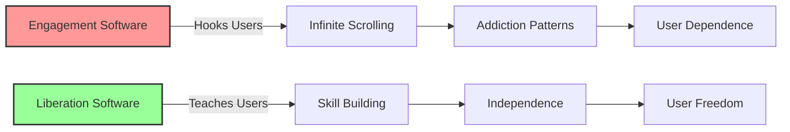

# Liberation Software: Tools That Make Themselves Obsolete
{: .fs-9 }

Software that celebrates when you no longer need it
{: .fs-6 .fw-300 }

---

## The Opportunity

**Exploits**: Engagement Maximization Trap  
**Their Blind Spot**: "Success = maximum user engagement"  
**Our Approach**: Tools designed to make themselves unnecessary

While Big Tech designs for addiction and dependency, communities need tools that actually solve problems and set people free. This creates perfect opportunities for software that measures success through liberation, not engagement.

## Why This Works



### Capitalist Blind Spots We Exploit

1. **Engagement Addiction**: They can't see value in users who leave
2. **Retention Obsession**: They can't design for graduation
3. **Dependency Creation**: They profit from learned helplessness
4. **Attention Economy**: They can't imagine measuring success through freedom

## Real-World Examples

### Language Learning Liberation
Instead of Duolingo's endless engagement loops:
- AI that adapts to your specific communication needs
- Clear graduation path when fluency achieved
- Community connections with native speakers
- Celebration when you no longer need the app

### Financial Independence Tools
Rather than apps that profit from debt:
- Budgeting tools that teach principles, not just tracking
- Debt elimination strategies with clear endpoints
- Investment education that builds real understanding
- Graduation ceremony when financially independent

### Mental Health Liberation
Not therapy apps that create dependency:
- CBT tools that teach techniques you can use alone
- Community support that builds real relationships
- Crisis resources that connect you with humans
- Success measured by reduced app usage

### Skill-Building Platforms
Unlike platforms that keep you paying for courses:
- Project-based learning with real-world applications
- Peer teaching that builds community knowledge
- Clear competency milestones
- Celebration when you're ready to teach others

## Implementation Guide

### Phase 1: Liberation Principles (Month 1)

**Define Success as Freedom**
- What would it mean for users to "graduate"?
- How do we measure independence, not engagement?
- What skills do users need to no longer need us?
- How do we celebrate when users leave?

**Design Anti-Addiction Features**
- Natural stopping points, not infinite scroll
- Usage reduction recommendations
- Healthy boundary setting tools
- Regular "digital sabbath" encouragement

### Phase 2: Community-Centered Design (Months 2-3)

**Build Real Connections**
- Connect users with local communities
- Facilitate peer-to-peer learning
- Create accountability partnerships
- Support offline meetups and activities

**Knowledge Transfer Architecture**
- Users become teachers for newcomers
- Progressive responsibility and autonomy
- Community knowledge base grows
- Reduced reliance on central platform

### Phase 3: Graduation System (Months 4-6)

**Clear Competency Milestones**
- Specific skills and knowledge markers
- Community validation of achievements
- Portfolio development for real-world use
- Peer certification systems

**Celebration and Transition**
- Graduation ceremonies and recognition
- Alumni networks for ongoing support
- Mentorship opportunities for continuing growth
- Clear pathways to community leadership

### Phase 4: Sustainable Liberation (Months 7-9)

**Post-Graduation Support**
- Alumni networks that don't require the platform
- Resource sharing between graduated users
- Advanced workshops for continued growth
- Community organizing opportunities

**Regenerative Growth**
- Graduated users become teachers and mentors
- Community attracts new learners organically
- Platform improves through community feedback
- Success stories inspire others

## Technical Architecture

### Liberation-First Design

```
┌─────────────────────────────────────────┐
│          Learning Journey               │
│   (Clear path to independence)          │
└────────────────┬────────────────────────┘
                 │
┌────────────────┴────────────────────────┐
│        Community Network                │
│   (Real relationships, not digital)     │
└────────────────┬────────────────────────┘
                 │
┌────────────────┴────────────────────────┐
│     Graduation & Alumni System          │
│    (Success = users who leave)          │
└─────────────────────────────────────────┘
```

### Core Components

1. **Progress Tracking Toward Independence**
   - Skills mastered vs. skills needed
   - Decreasing reliance on platform features
   - Increasing community contributions
   - Real-world application milestones

2. **Community Building Tools**
   - Local group formation
   - Peer matching for practice
   - Mentorship connections
   - Knowledge sharing systems

3. **Anti-Engagement Features**
   - Daily usage limits with gentle enforcement
   - Natural breakpoints and reflection prompts
   - Regular "digital detox" recommendations
   - Achievement unlocked: "Spent less time on app this week"

4. **Graduation Pipeline**
   - Clear competency assessments
   - Community validation processes
   - Portfolio development tools
   - Alumni network integration

## Success Metrics

### What We Measure
- **Liberation Rate**: Users who successfully graduate
- **Skill Retention**: Competency maintained after graduation
- **Community Health**: Real relationships formed
- **Knowledge Transfer**: Peer-to-peer teaching
- **Real-World Impact**: Skills used in actual life

### What We Don't Measure
- ❌ Daily active users
- ❌ Session duration
- ❌ Screen time
- ❌ Retention rates
- ❌ Engagement metrics

## Example Implementation: FreeSpeak Language Liberation

### The Problem with Existing Apps
- Duolingo keeps users in perpetual beginner loops
- Babbel focuses on retention over real fluency
- Rosetta Stone creates dependency on their system
- No clear graduation or real community connections

### Liberation Software Alternative
**FreeSpeak**: Language learning AI that makes itself obsolete

**Core Features**:
- AI adapts to your specific communication goals
- Clear fluency milestones with community validation
- Local conversation partner matching
- Gradual reduction of AI assistance as skills develop
- Celebration when you achieve conversational fluency

**Graduation Process**:
1. **Beginner Liberation** (3-6 months): Basic conversation without app assistance
2. **Intermediate Freedom** (6-12 months): Complex discussions with native speakers
3. **Advanced Independence** (12-18 months): Teaching others, full cultural integration
4. **Master Teacher** (18+ months): Mentoring new learners, contributing to language preservation

### Community Integration
- Connect with local immigrant communities
- Partner with cultural centers and libraries
- Support community language exchange events
- Facilitate pen pal relationships across borders

## Resources Needed

### Minimal Viable Implementation
- **Budget**: $10,000-20,000 for first version
- **Team**: 2-3 developers + community organizers
- **Time**: 6-9 months to first graduation cohort
- **Infrastructure**: Focus on peer-to-peer, minimal servers

### Sustainability Model
- **Grant Funding**: Foundations supporting digital literacy
- **Community Support**: Users pay what they can
- **Alumni Network**: Graduated users contribute to new cohorts
- **Partnership Revenue**: Language schools, community centers

## Getting Started

### For Communities

1. **Identify Liberation Needs**
   - What skills do people need to become independent?
   - Where are current tools creating dependency?
   - What would graduation look like?

2. **Map Existing Assets**
   - Who already has the skills to teach?
   - What community spaces exist for practice?
   - How can technology enhance rather than replace?

3. **Design for Freedom**
   - Start with the end goal: user independence
   - Build community connections from day one
   - Create celebration culture around graduation

### For Developers

1. **Reject Engagement Design**
   - No infinite scroll or notification hooks
   - Build natural stopping points
   - Encourage offline activity

2. **Design Graduation Paths**
   - Clear competency milestones
   - Reduced app dependence over time
   - Community validation systems

3. **Build Community Tools**
   - Connect users with real people
   - Facilitate offline meetings
   - Support peer teaching

## Case Studies

### Indigenous Language Revitalization Network
- Elders teach traditional languages through AI-assisted programs
- Youth achieve fluency and become community teachers
- App usage decreases as community teaching increases
- Success measured by conversations happening without technology

### Community Financial Literacy Collective
- Peer-to-peer financial education with AI coaching
- Clear graduation path to financial independence
- Alumni become financial counselors for newcomers
- Platform usage drops as community networks strengthen

### Neighborhood Skill Sharing Hub
- Residents teach each other practical skills
- AI helps match teachers with learners
- Competency achieved through real projects
- Success stories shared at community celebrations

## Common Questions

**Q: How can this be sustainable if users leave?**
A: New users constantly arrive, and graduated users become teachers and supporters.

**Q: Won't users just find more addictive alternatives?**
A: By building community and real skills, we create better alternatives to digital escapism.

**Q: How do we compete with infinite engineering budgets?**
A: We serve different values - liberation vs. addiction - so we're not competing directly.

**Q: What prevents mission creep toward engagement optimization?**
A: Community governance and liberation metrics built into the code itself.

## Join the Movement

Ready to build software that sets people free?

- [Download Technical Specification](/specs/liberation-software-spec)
- [Join Implementation Working Group](https://forum.myceliary.org/liberation-software)
- [Access Anti-Addiction Design Resources](/resources/liberation-design)
- [Connect with Digital Wellness Communities](/community/digital-liberation)

---

*"The ultimate goal of revolutionary software is to make itself unnecessary. True success is measured not in screen time, but in freedom time."*