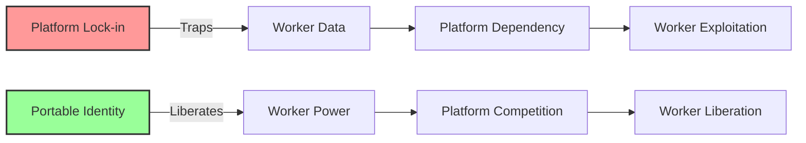

# Portable Identity & Reputation Commons: Worker Power Through Data Mobility
{: .fs-9 }

What if your reputation and work history belonged to you, not your employer?
{: .fs-6 .fw-300 }

---

## The Opportunity

**Exploits**: Platform Lock-in Strategy  
**Their Blind Spot**: "Control the platform, control the value"  
**Our Approach**: Worker-owned identity and reputation that travels between platforms

While platforms profit by trapping workers' reputations and relationships, communities can build commons where workers own their identity, reputation, and professional relationships. This exploits capitalism's structural dependence on worker immobility and platform dependency.

## Why This Works



### Capitalist Blind Spots We Exploit

1. **Lock-in Dependency**: They can't compete when workers control their own data
2. **Network Effects**: They lose power when networks become portable
3. **Data Monopoly**: They can't extract value from data they don't control
4. **Worker Mobility**: They profit from immobile workers who can't easily switch

## Real-World Applications

### Gig Worker Reputation Commons
- Drivers, delivery workers, and freelancers own their ratings and work history
- Reputation travels between Uber, Lyft, DoorDash, and community alternatives
- Worker cooperatives can compete with corporate platforms using shared reputation
- Bad actors (exploitative platforms/customers) get community-generated ratings too

### Portable Professional Networks
- Healthcare workers, teachers, and other professionals own their connections
- Skills verification and continuing education records follow workers
- Professional networks become resources for worker organizing and mutual support
- Communities can identify and support excellent professionals regardless of employer

### Community Care Networks
- Childcare providers, elder care workers, and home health aides own their reputation
- Families and communities build trust through portable, verified track records
- Care work receives appropriate recognition and compensation
- Community standards protect both care workers and care recipients

### Artistic and Creative Commons
- Artists, musicians, and creators own their audience relationships and reputation
- Creative work and collaboration history travels between platforms
- Community support for artists doesn't depend on platform algorithms
- Creative cooperatives can compete with extractive platforms

## Implementation Guide

### Phase 1: Worker Community Organizing (Months 1-3)

**Identify Target Worker Communities**
- Workers trapped by platform lock-in and low wages
- Communities with shared interests in worker power and mobility
- Existing worker organizations, cooperatives, or mutual aid networks
- Workers with skills and experience in digital organizing

**Build Worker Power Base**
- Worker education about platform exploitation and data ownership
- Leadership development within worker communities
- Coalition building between different types of platform workers
- Connection with broader labor organizing and cooperative development

### Phase 2: Technical Commons Development (Months 4-9)

**Worker-Controlled Infrastructure**
- Decentralized identity systems owned by worker cooperatives
- Portable reputation and rating systems with community governance
- Professional network tools that workers control
- Privacy protection that prevents employer surveillance and discrimination

**Interoperability Standards**
- Open protocols that allow reputation to move between platforms
- API standards that platforms must adopt to access worker commons
- Community-controlled verification and authentication systems
- Federation protocols allowing different worker communities to cooperate

### Phase 3: Platform Integration (Months 10-15)

**Worker Power Through Data Control**
- Existing platforms integrate with worker-owned identity commons
- Workers can move their reputation and connections between platforms
- Platform competition increases as worker switching costs decrease
- Community platforms can compete with corporate alternatives

**Community Platform Development**
- Worker cooperatives launch their own platforms using shared reputation
- Community-owned alternatives to Uber, TaskRabbit, Upwork, etc.
- Shared infrastructure reduces startup costs for cooperative platforms
- Worker commons enables platform diversity and competition

### Phase 4: Economic Transformation (Months 16-24)

**Cooperative Economy Development**
- Worker-owned platforms compete successfully with corporate alternatives
- Community wealth building through cooperative ownership
- Platform profits shared among worker-owners rather than extracted by capital
- Economic power shifted from platform owners to platform workers

**Movement Scaling and Replication**
- Successful models replicated in other industries and communities
- International cooperation between worker identity commons
- Integration with broader cooperative economy and solidarity economy movements
- Policy advocacy for worker rights and platform regulation

## Technical Architecture

### Worker Sovereignty Principles
- **Worker Ownership**: Workers collectively own and control their data
- **Portability**: Identity and reputation travel between platforms
- **Community Governance**: Democratic decision-making by worker communities
- **Interoperability**: Open standards enable platform competition

### Commons Infrastructure

```
┌─────────────────────────────────────────┐
│        Worker Identity Commons           │
│    (Collectively owned by workers)       │
└────────────────┬────────────────────────┘
                 │ Portable Data
┌─────────────────────────────────────────┐
│    Platform A    │    Platform B    │    Platform C
│  (Uber/Lyft)     │  (DoorDash)      │  (Worker Co-op)
│                  │                  │
│ ◄─── Worker ─────┼──── Reputation ──┼──── Travels ───►
│      Control     │     & Network    │     Freely
└─────────────────────────────────────────┘
```

### Key Technical Components

1. **Decentralized Identity Management**
   - Self-sovereign identity owned by workers
   - Multi-platform authentication and authorization
   - Privacy-preserving identity verification
   - Community-controlled identity recovery and support

2. **Portable Reputation Systems**
   - Cross-platform rating and review aggregation
   - Community governance of reputation standards
   - Protection against manipulation and gaming
   - Bidirectional rating (workers rate platforms and customers too)

3. **Professional Network Commons**
   - Social connections owned by workers, not platforms
   - Professional development and skill verification
   - Mutual aid and organizing tools
   - Integration with cooperative development resources

4. **Platform Interoperability Layer**
   - APIs enabling reputation portability
   - Standards for platform integration with worker commons
   - Economic incentives for platform participation
   - Community enforcement mechanisms

## Success Metrics

### What We Measure
- **Worker Power**: Ability to move between platforms and negotiate better conditions
- **Reputation Portability**: Ease of transferring professional identity between systems
- **Platform Competition**: Number of platforms integrating with worker commons
- **Cooperative Development**: Worker-owned platforms launched using shared infrastructure
- **Economic Impact**: Increased worker earnings and reduced platform exploitation

### What We Don't Measure
- ❌ Platform user engagement
- ❌ Data collection volume
- ❌ Corporate platform profits
- ❌ Worker surveillance metrics
- ❌ Platform dependency rates

## Example Implementation: GigWorker Commons

### The Challenge
Gig economy workers face:
- Reputation trapped on individual platforms (Uber, DoorDash, TaskRabbit)
- Inability to leverage experience when switching platforms
- Exploitation by platforms that control access to work
- No worker power or collective bargaining capacity

### The Portable Identity Solution
**GigWorker Commons**: Worker-owned reputation and identity system

**How It Works**:
1. **Worker Enrollment**: Drivers and delivery workers join cooperative commons
2. **Reputation Aggregation**: Ratings from all platforms combined in worker-controlled profile
3. **Platform Integration**: Platforms can access worker reputation through API
4. **Worker Mobility**: Workers can easily switch between platforms or start cooperatives

**Key Features**:
- Workers own their complete work history and professional reputation
- Ratings travel between Uber, Lyft, DoorDash, and community alternatives
- Bidirectional rating system allows workers to rate platforms and customers
- Community governance sets standards for fair rating and dispute resolution
- Privacy protection prevents platform surveillance and worker discrimination

**Cooperative Structure**:
- Worker members own and govern the commons democratically
- Platform integration fees fund commons operation and worker benefits
- Surplus used for worker organizing, cooperative development, and mutual aid
- Community enforcement ensures platform compliance with worker rights

**Results After 18 Months**:
- 25,000 gig workers joined commons across 8 cities
- Average worker earnings increased 15% due to improved platform competition
- 3 worker-owned platform cooperatives launched using shared reputation
- Workers report increased bargaining power and workplace dignity
- Model being replicated for freelancers, care workers, and creative professionals

### Platform Integration Model
- Platforms pay modest fee to access worker commons reputation data
- Workers control which platforms can access their data
- Community governance sets standards for platform behavior and worker treatment
- Platforms that exploit workers lose access to commons and worker talent

## Resources Needed

### Minimal Viable Commons
- **Budget**: $150,000-300,000 for initial development and worker organizing
- **Team**: Worker organizers + cooperative developers + technical team
- **Time**: 12-18 months from organizing to functioning commons
- **Community**: 1,000+ committed worker members for platform leverage

### Scaling Considerations
- Network effects strengthen commons as more workers join
- Platform integration becomes more valuable as commons grows
- Cross-industry expansion possible once model proven
- International federation possible for global worker mobility

## Getting Started

### For Worker Communities

1. **Assess Platform Exploitation**
   - How do platforms trap your reputation and relationships?
   - What would portable identity mean for worker power?
   - Which platforms could workers leave if alternatives existed?
   - What shared interests exist across different types of platform workers?

2. **Build Worker Organization**
   - Connect workers interested in collective ownership and control
   - Develop leadership for democratic governance of commons
   - Build alliances with existing worker organizations and cooperatives
   - Create shared vision for worker-owned digital infrastructure

3. **Start Technical Development**
   - Partner with technologists who understand worker organizing
   - Design systems that prioritize worker control and community governance
   - Build interoperability standards that platforms must adopt
   - Create economic incentives for platform participation

### For Developers and Technologists

1. **Understand Worker Organizing**
   - Learn about platform labor and gig economy exploitation
   - Study cooperative development and worker-owned business models
   - Understand digital organizing and community building
   - Connect with existing worker justice organizations

2. **Design for Worker Power**
   - Decentralized systems that workers collectively own and control
   - Interoperability standards that increase platform competition
   - Privacy technologies that protect workers from surveillance
   - Economic models that benefit workers rather than platform owners

3. **Build Movement Infrastructure**
   - Technical tools that support worker organizing and cooperative development
   - Standards and protocols that enable platform worker solidarity
   - Integration with broader cooperative economy and solidarity economy movements
   - International cooperation for global worker mobility

## Case Studies

### Domestic Worker Dignity Commons (California)
- House cleaners and nannies own their reputation and client relationships
- Workers can move between platforms and direct hiring
- Community standards protect both workers and families
- Cooperative alternatives compete with corporate platforms

### Creative Professional Federation (Brooklyn)
- Artists, designers, and freelancers own their creative reputation and networks
- Portfolio and collaboration history travels between platforms
- Community support for creative work doesn't depend on algorithmic promotion
- Creative cooperatives compete with extractive platforms

### Healthcare Worker Commons (Rural Network)
- Traveling nurses and home health aides own their professional credentials
- Reputation and relationships travel between healthcare systems
- Community governance ensures professional standards and worker dignity
- Rural communities access high-quality care through worker mobility

## Common Questions

**Q: Why would platforms integrate with worker-owned commons?**
A: They need access to skilled workers, and workers won't work for platforms that don't integrate.

**Q: How do we prevent corporate capture of worker commons?**
A: Worker cooperative ownership and democratic governance provide structural protection.

**Q: What about privacy and worker surveillance concerns?**
A: Workers control their own data and can protect privacy better than corporate platforms.

**Q: How do we compete with platform network effects?**
A: Portable reputation eliminates network effects by making worker networks platform-independent.

## Join the Movement

Ready to build worker power through portable identity and reputation?

- [Download Technical Specification](/specs/portable-identity-commons-spec)
- [Join Implementation Working Group](https://forum.myceliary.org/portable-identity)
- [Access Worker Organizing Resources](/resources/platform-worker-organizing)
- [Connect with Cooperative Platform Networks](/community/platform-cooperatives)

---

*"When workers own their reputation and relationships, platforms become tools rather than masters. Portable identity is portable power."*